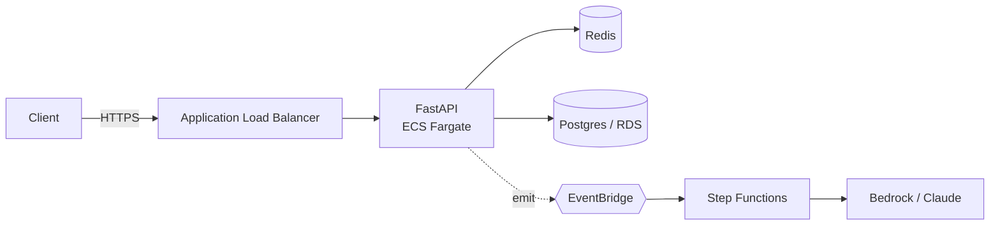
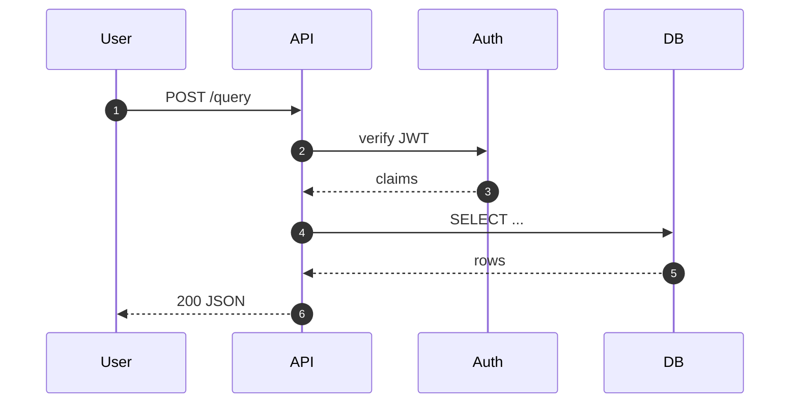

# Architecture Diagram Skill

## Purpose

Produce architecture diagrams as **code**, not images. Diagrams-as-code are diffable, reviewable in PRs, render in GitHub / Confluence / IDEs, and survive future edits.

**Every diagram request always produces TWO output files** (see **Step 4**):

| File | Format | Purpose |
|---|---|---|
| `<name>.md` | Markdown + Mermaid | Renders in GitHub / Confluence / chat; no tooling required |
| `<name>.drawio` | DrawIO XML | Opens in app.diagrams.net; uses proper AWS / cloud provider icons |

Do not return either output only as an inline chat response — both files are the deliverable.

## Step 0: Clarify before drawing

Do not start generating a diagram until the following are clear. If any are missing and can't be reasonably inferred, ask **one** targeted question — not four.

1. **Audience** — engineers, ops, execs? Determines abstraction level.
2. **Abstraction level (C4)** — Context (system-in-the-world), Container (deployable units), Component (inside one service), or Code (class-level)?
3. **Dynamic or static** — is this a request flow (sequence / flowchart) or a structural view (component / deployment)?
4. **Scope boundary** — what is owned vs external? What's in-VPC vs public internet?

If the user says something vague like "draw my system", pick the most useful default (usually C4 Container-level, static, engineer audience) and state the assumption in one line before producing output. Don't ping-pong.

## Step 1: Pick the right toolexit

Pick one tool. Do not mix in a single diagram.

| Intent | Tool | Why |
|---|---|---|
| Inline in Markdown / GitHub / chat | Mermaid | Native GitHub render, zero deps |
| UML (sequence, class, state, ERD) | Mermaid or PlantUML | PlantUML for richer UML semantics |
| Cloud architecture with provider icons (AWS / GCP / Azure / K8s) | Python `diagrams` | Icons match the console, looks professional |
| Clean auto-layout, not cloud-specific | D2 | Better layout engine than Graphviz |
| Low-level graphs, DAGs, full control | Graphviz (dot) | Most control, ugliest defaults |
| C4 model | Mermaid C4 or Structurizr DSL | C4 is a methodology; pick the rendering tool |
| Multi-zone reference architecture (Client / Cloud / On-Prem / External) | DrawIO XML | Explicit named zone containers, AWS icons, cross-zone edges, legend — open in app.diagrams.net |

**Default picks when the user hasn't specified:**
- Target is a GitHub README or chat → **Mermaid** (for the .md file)
- Target is AWS / cloud architecture → **Python `diagrams`** (do NOT use; superseded by DrawIO dual-output — see Step 4)
- Multi-zone enterprise reference architecture (cloud + on-prem + external + client) → **DrawIO XML** using the five-zone template
- Anything else → **D2** (for the .md file) + DrawIO XML (for the .drawio file)

> **Note:** The `Python diagrams` library is retired from this skill's default workflow. DrawIO XML with `mxgraph.aws4.*` icons is the canonical visual format for all AWS / cloud diagrams. Mermaid remains the canonical text/code format.

## Step 2: Generate the diagram

Follow the tool-specific conventions below. Then run the **Step 3 sanity checks** before writing the file.

### Mermaid — flowchart



Conventions:
- `flowchart LR` for request flow; `TD` for hierarchy.
- Shapes carry meaning: `[rect]` = service, `([stadium])` = ingress / edge, `[(cylinder)]` = datastore, `{{hexagon}}` = event bus / broker, `{diamond}` = decision.
- Edges: solid = sync, `-.->` dotted = async, `==>` thick = critical path.
- **Every edge must be labeled** with a protocol or event name. Unlabeled edges are noise.

### Mermaid — sequence



Use `autonumber` once the diagram has more than 3 steps. If the sequence has more than ~12 arrows, split it — a wall of arrows is unreadable.

### Python `diagrams` (cloud infrastructure)

```python
from diagrams import Diagram, Cluster, Edge
from diagrams.aws.compute import Fargate
from diagrams.aws.network import ALB, Route53
from diagrams.aws.database import RDS, ElastiCache
from diagrams.aws.integration import Eventbridge, StepFunctions
from diagrams.aws.ml import Bedrock

with Diagram("RAG inference pipeline", show=False, direction="LR",
             filename="rag_arch"):
    dns = Route53("api.example.com")
    with Cluster("VPC / private subnets"):
        lb = ALB("ALB")
        with Cluster("Inference tier"):
            api = Fargate("FastAPI (ECS)")
        cache = ElastiCache("Query cache")
        db = RDS("Metadata (Postgres)")
    with Cluster("Async pipeline"):
        eb = Eventbridge("Events")
        sf = StepFunctions("Ingest")
        llm = Bedrock("Claude")

    dns >> lb >> api
    api >> cache
    api >> db
    api >> Edge(style="dashed", label="emit") >> eb >> sf >> llm
```

Rules:
- Use `Cluster` for **every** trust boundary (VPC, account, environment). Do not imply boundaries.
- Prefer concrete icons (`Fargate`) over generic (`ECS`) when the compute type is known.
- `Edge(style="dashed", label=...)` for async hops. No edge goes unlabeled.
- Always set `show=False` and a `filename` so the output is deterministic.

Install: `pip install diagrams` and the Graphviz system binary (`brew install graphviz` on macOS, `apt-get install graphviz` on Debian / Ubuntu).

### D2

```d2
client -> alb: HTTPS
alb -> api: HTTP
api -> cache: GET
api -> db: SQL
api -> events: emit {style.stroke-dash: 3}
events -> worker: consume
```

Render: `d2 arch.d2 arch.svg` (add `--sketch` for a hand-drawn look that reads as "draft, open to feedback").

### DrawIO XML — multi-zone reference architecture

Use DrawIO XML when the audience needs to see **all four trust boundaries at once**: client / edge, cloud account, external third parties, and on-prem systems. The canonical five-zone layout is defined in `references/reference-architecture.drawio` and must be used as the base template.

#### Zone layout (always in this order)

```
┌──────────────┐ ┌────────────────────────────────────────┐ ┌──────────────────┐
│              │ │           AWS Account                  │ │                  │
│    Client    │ │  ┌──────────────────────────────────┐  │ │ External Systems │
│              │ │  │  VPC — region                    │  │ │                  │
│  • User      │ │  │  ┌─────────────┐ ┌────────────┐  │  │ │ • Identity       │
│  • Route 53  │ │  │  │Public subnet│ │Private app │  │  │ │   Provider       │
│  • CloudFront│ │  │  │  ALB        │ │  Fargate x2│  │  │ │ • 3rd Party API  │
│  • WAF       │ │  │  └─────────────┘ └────────────┘  │  │ │ • Payment GW     │
│              │ │  │  ┌──────────────────────────────┐ │  │ │                  │
│              │ │  │  │Private data: RDS/Cache/S3     │ │  │ │                  │
│              │ │  │  └──────────────────────────────┘ │  │ │                  │
│              │ │  │  ┌──────────────────────────────┐ │  │ │                  │
│              │ │  │  │Async pipeline: EB/SFN/Bedrock │ │  │ │                  │
│              │ │  │  └──────────────────────────────┘ │  │ │                  │
│              │ │  └──────────────────────────────────┘  │ │                  │
│              │ │  ┌──────────────┐                      │ │                  │
│              │ │  │Global Svc    │  CloudWatch           │ │                  │
│              │ │  │IAM/Secrets   │  Secrets / IAM        │ │                  │
│              │ │  └──────────────┘                      │ │                  │
└──────────────┘ └────────────────────────────────────────┘ └──────────────────┘
┌─────────────────────────────────────────────────────────────────────────────┐
│  On-Prem Systems   LDAP/AD  │  Legacy App  │  On-Prem DB  │  VPN GW  │  DC  │
└─────────────────────────────────────────────────────────────────────────────┘
┌─────────────────────────────────────────────────────────────────────────────┐
│  Legend   ── sync call   - - async event   · · · observability/cross-cut    │
└─────────────────────────────────────────────────────────────────────────────┘
```

#### Zone definitions

| Zone | Position | Fill color | Border color | Contents |
|---|---|---|---|---|
| **Client** | Left column, full height | `#dae8fc` | `#6c8ebf` (blue) | User, Route 53, CloudFront (CDN), WAF |
| **AWS Account** | Center column, full height | `#fff2cc` | `#FF8000` (orange) | VPC (with subnets) + Global Services sub-container |
| **External Systems** | Right column, full height | `#e1d5e7` | `#9673a6` (purple) | Identity Provider, 3rd Party API, Payment Gateway |
| **On-Prem Systems** | Bottom row, full width | `#f5f5f5` | `#666666` (grey) | LDAP/AD, Legacy App, On-Prem DB, VPN GW, Direct Connect |
| **Legend** | Below On-Prem, full width | `#ffffff` | `#999999` | Edge type swatches + zone colour swatches |

#### VPC sub-zones inside the AWS container

Nest these in order (top → bottom) inside the VPC group (`mxgraph.aws4.group_vpc`):

1. **Public subnet** (`mxgraph.aws4.group_security_group`, green dashed) — ALB
2. **Private subnet — app tier** (green dashed) — ECS Fargate (FastAPI), ECS Fargate (Worker)
3. **Private subnet — data tier** (green dashed) — RDS Postgres, ElastiCache (Redis), S3
4. **Async pipeline** (`mxgraph.aws4.group_account`, pink dashed) — EventBridge, Step Functions, Bedrock

Place a **Global Services** sub-container (orange dashed) beside the VPC (inside AWS Account) for: CloudWatch, Secrets Manager, IAM.

#### DrawIO XML container conventions

```xml
<!-- Zone container (top-level, parent="1") -->
<mxCell id="client-zone" value="Client"
  style="rounded=1;whiteSpace=wrap;html=1;verticalAlign=top;
         container=1;collapsible=0;recursiveResize=0;
         fillColor=#dae8fc;strokeColor=#6c8ebf;strokeWidth=2;
         fontSize=14;fontStyle=1;align=center;"
  vertex="1" parent="1">
  <mxGeometry x="20" y="20" width="300" height="880" as="geometry" />
</mxCell>

<!-- AWS VPC group (parent="aws-zone") — uses AWS4 shape -->
<mxCell id="vpc" value="VPC — us-east-1"
  style="shape=mxgraph.aws4.group;grIcon=mxgraph.aws4.group_vpc;
         strokeColor=#248814;fillColor=none;
         container=1;pointerEvents=0;collapsible=0;recursiveResize=0;
         verticalAlign=top;align=left;spacingLeft=30;fontColor=#248814;"
  vertex="1" parent="aws-zone">
  <mxGeometry x="20" y="50" width="1080" height="800" as="geometry" />
</mxCell>
```

Key rules:
- All zone containers use `container=1;collapsible=0;recursiveResize=0;`.
- VPC and subnet groups use `pointerEvents=0` (background annotation, not interactive).
- Child cell coordinates are **relative** to the parent container.
- All edges are parented to `"1"` (root layer); DrawIO routes them across containers automatically.
- **Sync edges**: `strokeColor=#545B64;dashed=0` — solid grey.
- **Async edges**: `strokeColor=#CD2264;dashed=1` — dashed pink.
- **Observability / cross-cutting**: `strokeColor=#879196;dashed=1;fontStyle=2` — dashed light grey, italic label.
- **On-prem → AWS edges**: `strokeColor=#666666` — solid dark grey.
- **External System edges**: `strokeColor=#9673a6` — purple.
- Every edge carries a label (protocol or event name). Unlabeled edges are rejected.

#### Canvas dimensions for the five-zone layout

| Attribute | Value |
|---|---|
| `pageWidth` | `2000` |
| `pageHeight` | `1500` |
| Client zone | `x=20, y=20, w=300, h=880` |
| AWS Account zone | `x=340, y=20, w=1340, h=880` |
| External Systems zone | `x=1700, y=20, w=280, h=880` |
| On-Prem Systems zone | `x=20, y=920, w=1960, h=280` |
| Legend zone | `x=20, y=1220, w=1960, h=200` |

#### Reference file

The canonical template lives at:
`references/reference-architecture.drawio`

Open it in [app.diagrams.net](https://app.diagrams.net) (File → Open from → Device). Never write a new multi-zone DrawIO diagram from scratch — always copy and adapt the reference file.

## Step 3: Sanity checks (run before writing the file)

Reject your own draft if any of these fail. A sloppy diagram is worse than no diagram — it misleads reviewers.

- [ ] Every edge is labeled with a protocol or event name.
- [ ] No more than ~12 nodes. Over that, split by concern or group inside clusters.
- [ ] Datastores are visually distinct from services (cylinder / DB icon).
- [ ] Trust boundaries (VPC, account, public / private) are drawn as explicit clusters, not implied.
- [ ] Direction is consistent — do not mix LR and TB in one diagram.
- [ ] External / third-party systems are visually distinguished from owned systems.
- [ ] Sync vs async edges are visually different (solid vs dashed).
- [ ] The diagram matches **one** C4 level. It does not mix "user's browser" with "libpq driver".

## Step 4: Write the output files (always TWO)

Every diagram request produces exactly two files written to the working directory. Do not skip either.

### Filename rule

Pick the base name first, then apply it to both extensions:

1. **Source file or service name drives the base** — use it without the extension.
   - `order_processor.py` → `order_processor.md` + `order_processor.drawio`
   - `payments-service/` → `payments-service.md` + `payments-service.drawio`
2. **Multiple diagrams in one request** — suffix each pair with a descriptive slug.
   - `ar-diagram-context.md` + `ar-diagram-context.drawio`
   - `ar-diagram-sequence.md` + `ar-diagram-sequence.drawio`
3. **Default (everything else)** — `ar-diagram.md` + `ar-diagram.drawio`.

Never overwrite an existing file with a different diagram. If `ar-diagram.md` already exists and the new diagram is different, use rule 2 and pick a disambiguating suffix for both files.

### File location

Write both files to the user's working directory. State both absolute paths in the chat response.

---

### Output 1 — `<name>.md` (Mermaid)

Structure:

~~~markdown
# <Short descriptive title>

<One-line description: what the diagram shows and at which C4 level.>

## Diagram

```mermaid
<flowchart or sequence code>
```

## Notes

- **Scope**: what's included.
- **Deliberate omissions**: what was left out and why.
- **Assumptions**: inferred details the user should verify.
- **DrawIO file**: open `<name>.drawio` in app.diagrams.net for the icon version.
~~~

---

### Output 2 — `<name>.drawio` (DrawIO XML with AWS icons)

The `.drawio` file contains the same logical diagram as the `.md` file, rendered with proper AWS service icons using the `mxgraph.aws4.*` shape library. Structure it as a flat-layout `mxGraphModel` — no five-zone wrapper needed unless the user asked for a full reference architecture view.

#### AWS icon cell template

Every AWS service node uses this style. Replace `<ICON>` and `<COLOR>` from the table below:

```xml
<mxCell id="<id>" value="<Label>"
  style="sketch=0;
         points=[[0,0,0],[0.25,0,0],[0.5,0,0],[0.75,0,0],[1,0,0],
                 [0,1,0],[0.25,1,0],[0.5,1,0],[0.75,1,0],[1,1,0],
                 [0,0.25,0],[0,0.5,0],[0,0.75,0],
                 [1,0.25,0],[1,0.5,0],[1,0.75,0]];
         outlineConnect=0;fontColor=#232F3E;gradientColor=none;
         fillColor=<COLOR>;strokeColor=#ffffff;dashed=0;
         verticalLabelPosition=bottom;verticalAlign=top;
         align=center;html=1;fontSize=12;fontStyle=0;aspect=fixed;
         shape=mxgraph.aws4.resourceIcon;resIcon=mxgraph.aws4.<ICON>;"
  vertex="1" parent="<parent-id>">
  <mxGeometry x="<x>" y="<y>" width="60" height="60" as="geometry" />
</mxCell>
```

#### AWS icon reference table

Use exactly these `resIcon` values and `fillColor` codes. All icons use `strokeColor=#ffffff`.

| AWS Service | `resIcon` | `fillColor` | Category |
|---|---|---|---|
| S3 | `s3` | `#7AA116` | Storage (green) |
| S3 Glacier | `s3_glacier` | `#7AA116` | Storage |
| EFS | `efs` | `#7AA116` | Storage |
| Lambda | `lambda_function` | `#ED7100` | Compute (orange) |
| EC2 | `ec2` | `#ED7100` | Compute |
| ECS | `ecs` | `#ED7100` | Compute |
| Fargate | `fargate` | `#ED7100` | Compute |
| EKS | `eks` | `#ED7100` | Compute |
| Batch | `batch` | `#ED7100` | Compute |
| RDS | `rds` | `#C925D1` | Database (purple) |
| Aurora | `aurora` | `#C925D1` | Database |
| DynamoDB | `dynamodb` | `#C925D1` | Database |
| ElastiCache | `elasticache` | `#C925D1` | Database |
| Redshift | `redshift` | `#C925D1` | Database |
| Glue | `glue` | `#8C4FFF` | Analytics (purple) |
| Athena | `athena` | `#8C4FFF` | Analytics |
| EMR | `emr` | `#8C4FFF` | Analytics |
| Kinesis | `kinesis` | `#8C4FFF` | Analytics |
| Kinesis Firehose | `kinesis_firehose` | `#8C4FFF` | Analytics |
| Lake Formation | `lake_formation` | `#8C4FFF` | Analytics |
| OpenSearch | `opensearch_service` | `#8C4FFF` | Analytics |
| QuickSight | `quicksight` | `#8C4FFF` | Analytics |
| SageMaker | `sagemaker` | `#01A88D` | ML / AI (teal) |
| Bedrock | `bedrock` | `#01A88D` | ML / AI |
| Comprehend | `comprehend` | `#01A88D` | ML / AI |
| Rekognition | `rekognition` | `#01A88D` | ML / AI |
| Textract | `textract` | `#01A88D` | ML / AI |
| EventBridge | `eventbridge` | `#E7157B` | Integration (pink) |
| Step Functions | `step_functions` | `#E7157B` | Integration |
| SQS | `sqs` | `#E7157B` | Integration |
| SNS | `sns` | `#E7157B` | Integration |
| API Gateway | `api_gateway` | `#E7157B` | Integration |
| AppSync | `appsync` | `#E7157B` | Integration |
| ALB | `application_load_balancer` | `#8C4FFF` | Networking (purple) |
| CloudFront | `cloudfront` | `#8C4FFF` | Networking |
| Direct Connect | `direct_connect` | `#8C4FFF` | Networking |
| VPC | `vpc` | `#8C4FFF` | Networking |
| Route 53 | `route_53` | `#E7157B` | Networking |
| WAF | `waf` | `#DD344C` | Security (red) |
| IAM | `identity_and_access_management_iam` | `#DD344C` | Security |
| Secrets Manager | `secrets_manager` | `#DD344C` | Security |
| KMS | `key_management_service` | `#DD344C` | Security |
| Cognito | `cognito` | `#DD344C` | Security |
| CloudWatch | `cloudwatch_2` | `#E7157B` | Management |
| CloudTrail | `cloudtrail` | `#E7157B` | Management |
| CodePipeline | `code_pipeline` | `#C7131F` | Developer Tools |
| CodeBuild | `codebuild` | `#C7131F` | Developer Tools |

#### Group / container shapes (for subnets, pipelines, zones)

```xml
<!-- VPC boundary -->
<mxCell id="vpc" value="VPC — us-east-1"
  style="shape=mxgraph.aws4.group;grIcon=mxgraph.aws4.group_vpc;
         strokeColor=#248814;fillColor=none;fontColor=#248814;
         container=1;pointerEvents=0;collapsible=0;recursiveResize=0;
         verticalAlign=top;align=left;spacingLeft=30;"
  vertex="1" parent="<parent>">
  <mxGeometry x="..." y="..." width="..." height="..." as="geometry" />
</mxCell>

<!-- Subnet / security group -->
<mxCell id="subnet" value="Private subnet — data tier"
  style="shape=mxgraph.aws4.group;grIcon=mxgraph.aws4.group_security_group;
         strokeColor=#7AA116;fillColor=none;fontColor=#7AA116;dashed=1;
         container=1;pointerEvents=0;collapsible=0;recursiveResize=0;
         verticalAlign=top;align=left;spacingLeft=30;"
  vertex="1" parent="<vpc-id>">
  <mxGeometry x="..." y="..." width="..." height="..." as="geometry" />
</mxCell>

<!-- Generic pipeline / async group -->
<mxCell id="pipeline" value="Async pipeline"
  style="shape=mxgraph.aws4.group;grIcon=mxgraph.aws4.group_account;
         strokeColor=#CD2264;fillColor=none;fontColor=#CD2264;dashed=1;
         container=1;pointerEvents=0;collapsible=0;recursiveResize=0;
         verticalAlign=top;align=left;spacingLeft=30;"
  vertex="1" parent="<parent>">
  <mxGeometry x="..." y="..." width="..." height="..." as="geometry" />
</mxCell>

<!-- External system (no AWS icon) -->
<mxCell id="ext" value="3rd Party API"
  style="rounded=1;whiteSpace=wrap;html=1;verticalAlign=middle;
         fillColor=#e1d5e7;strokeColor=#9673a6;fontSize=11;"
  vertex="1" parent="<parent>">
  <mxGeometry x="..." y="..." width="160" height="60" as="geometry" />
</mxCell>
```

#### Edge conventions in DrawIO

```xml
<!-- Sync call (solid grey) -->
<mxCell id="e1" value="REST API (HTTPS)"
  style="edgeStyle=orthogonalEdgeStyle;rounded=0;html=1;
         endArrow=block;endFill=1;strokeColor=#545B64;fontSize=11;"
  edge="1" parent="1" source="<src>" target="<dst>">
  <mxGeometry relative="1" as="geometry" />
</mxCell>

<!-- Async / event (dashed pink) -->
<mxCell id="e2" value="emit event"
  style="edgeStyle=orthogonalEdgeStyle;rounded=0;html=1;
         endArrow=block;endFill=1;strokeColor=#CD2264;fontSize=11;dashed=1;"
  edge="1" parent="1" source="<src>" target="<dst>">
  <mxGeometry relative="1" as="geometry" />
</mxCell>

<!-- Observability / cross-cutting (dashed grey, italic label) -->
<mxCell id="e3" value="logs / metrics"
  style="edgeStyle=orthogonalEdgeStyle;rounded=0;html=1;
         endArrow=block;endFill=1;strokeColor=#879196;fontSize=10;
         dashed=1;fontStyle=2;"
  edge="1" parent="1" source="<src>" target="<dst>">
  <mxGeometry relative="1" as="geometry" />
</mxCell>
```

#### DrawIO XML skeleton

```xml
<mxfile host="app.diagrams.net" version="24.0.0" type="device">
  <diagram id="<slug>" name="<Title>">
    <mxGraphModel dx="1600" dy="900" grid="1" gridSize="10"
                  pageWidth="1600" pageHeight="1000" math="0" shadow="0">
      <root>
        <mxCell id="0" />
        <mxCell id="1" parent="0" />
        <!-- zone containers, service nodes, edges go here -->
      </root>
    </mxGraphModel>
  </diagram>
</mxfile>
```

**Layout rules:**
- Set `pageWidth` / `pageHeight` to fit content — 1600×1000 for simple pipelines; 2000×1500 for full five-zone reference architecture.
- All edges are parented to `"1"` (root layer) so DrawIO routes them automatically across nested containers.
- Child cell `x`/`y` are **relative** to their parent container.
- Icon nodes: always `width="60" height="60"` with `aspect=fixed`.
- Label text uses `&#xa;` for newlines inside a `value` attribute.

---

### Chat response (after writing both files)

After writing both files, in the chat:

1. State both filenames and their absolute paths.
2. Echo the **Mermaid diagram** inline (from the `.md` file) so the user sees it without opening a file.
3. Flag deliberate omissions in one sentence.
4. Remind the user to open the `.drawio` file in [app.diagrams.net](https://app.diagrams.net) for the icon view.

Do not embed a rasterised PNG or SVG. The two code files are the source of truth.

## Common failure modes (anti-patterns to avoid)

- **Everything in one picture.** Deployment + data flow + sequence crammed together. Split by concern, one diagram per question the reader is trying to answer.
- **Unlabeled arrows.** "A → B" tells the reader nothing. Every edge carries a protocol, event name, or verb.
- **Implied boundaries.** No VPC box, no "public internet" label, no auth perimeter. Reviewers can't reason about security or blast radius.
- **Mixed abstraction.** A box labeled "AWS" next to a box labeled "JSON parser". Pick a C4 level and stay there.
- **Icon soup without structure.** A dozen AWS icons with no clustering and no labels. Icons are not a substitute for grouping and annotation.
- **Diagrams for things that are lists.** If the content is "5 independent steps", a numbered list is clearer than a diagram. Only draw when relationships matter.
- **Writing only inline, no file.** The file is the deliverable. A diagram that lives only in a chat message is lost after the session.
- **Overwriting `ar-diagram.md` silently.** When a second diagram is requested in the same working directory, suffix the filename instead of clobbering.

## Examples of when to trigger

**Trigger:**
- "Can you draw the architecture for my RAG pipeline?" → writes `ar-diagram.md` + `ar-diagram.drawio`
- "Sketch a sequence diagram for the auth flow." → writes `auth-flow.md` + `auth-flow.drawio`
- "Show me how `order_processor.py` works." → writes `order_processor.md` + `order_processor.drawio`
- "I need a C4 container diagram for the payments service." → writes `payments-service.md` + `payments-service.drawio`
- "Draw context + container + component views of my API." → writes `ar-diagram-context.md/.drawio`, `ar-diagram-container.md/.drawio`, `ar-diagram-component.md/.drawio`

**Do not trigger:**
- "Explain how attention works in transformers." (Conceptual explanation, not a system architecture.)
- "What's the difference between ECS and EKS?" (Comparative prose, no system to diagram.)
- "Write the Terraform for an ALB + Fargate service." (Code generation, not visualization — unless they then ask to diagram it.)

## Reference files

(Optional follow-up reading, load only when relevant.)

- `references/mermaid.md` — full Mermaid syntax cheatsheet, including gantt, ER, state
- `references/diagrams-icon-index.md` — exhaustive list of AWS / GCP / Azure / K8s icon imports for the Python `diagrams` library
- `references/c4-model.md` — when to use Context vs Container vs Component, with worked examples
- `assets/templates/` — starter files for common patterns (3-tier web app, event-driven pipeline, RAG stack)
