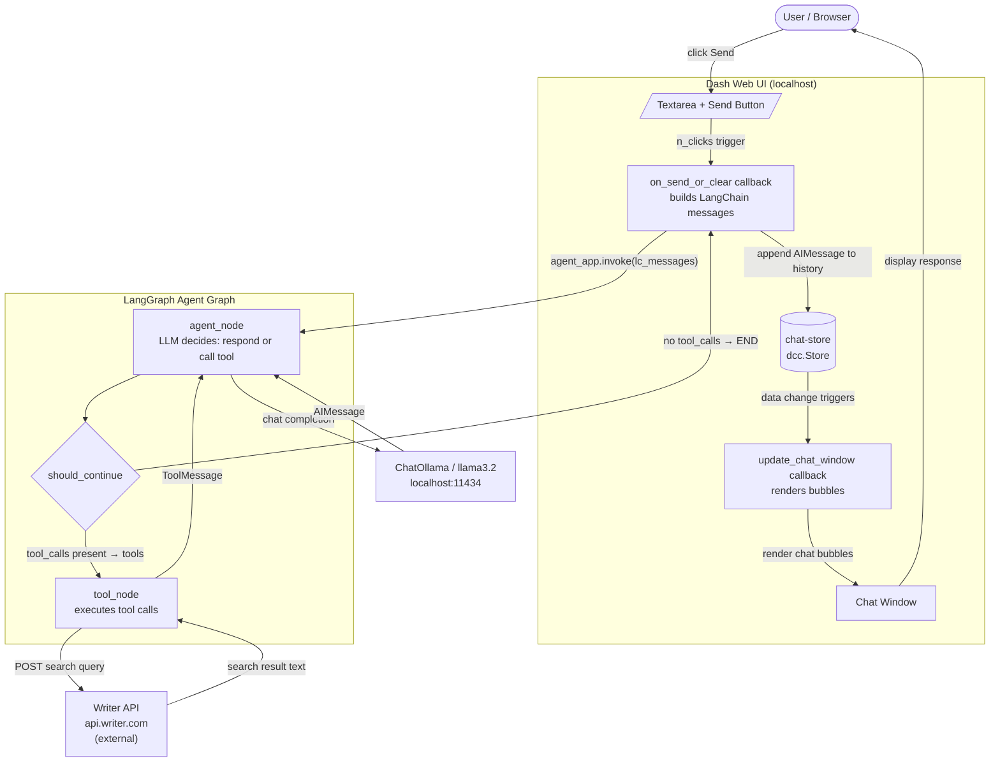

# LCOllamaDashChatbot — Component Architecture

C4 Component-level request-flow view of the Dash + LangGraph + Ollama chatbot.

## Diagram



## Notes

- **Scope**: Full request path from user input through the LangGraph ReAct loop to rendered response.
- **Deliberate omissions**: Error path (`[ERROR] …` fallback in the callback) and the Clear button flow are not shown; they bypass the agent entirely and reset `chat-store` to `[]`.
- **Assumptions**: Ollama runs locally at `localhost:11434`; `WRITER_API_KEY` env var is set. The tool loop can cycle multiple times (tools → agent → tools…) before reaching END — the diagram shows one cycle for clarity.
- **State**: `chat-store` accumulates the full conversation history as plain dicts; the callback reconstructs `HumanMessage` / `AIMessage` objects on every turn before invoking the graph.
```