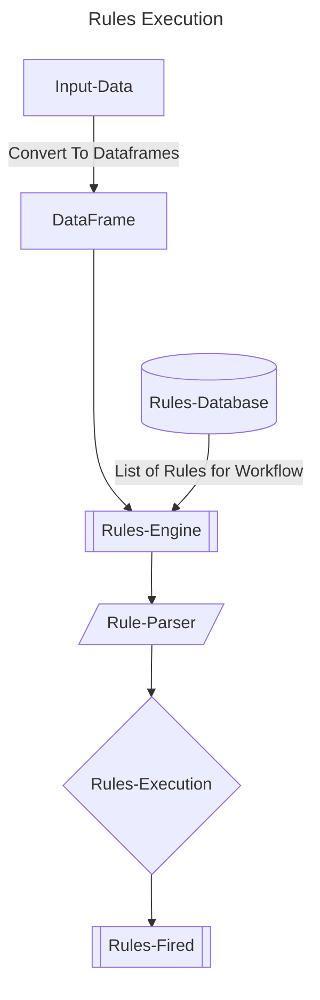

# AI-ML-Learnings-Exemplars
This repository hosts all the possible exemplars of data structures in python, polars, pandas, machine learning models etc

----

## README Tech Docs/ Tech Materials
- [GenAI Data Scientist](docs/markdowns/awesome-generative-ai-data-scientist-links.md)
- [Coding Interview Prep](docs/markdowns/coding-interview-prep.md)
- [File Type ID](docs/markdowns/file-type-id.md)
- [Programming Language Resources](docs/markdowns/programming-language-resources.md)
- [System Design](docs/markdowns/system-design-101-notes.md)

----
## Environment Variables
Run the below script once to set the environment variables 

```shell
dotenv set dbhost ""
dotenv set dbname ""
dotenv set dbuser ""
dotenv set dbcred ""
dotenv set aws_access_key_id ""
dotenv set aws_secret_access_key ""
```
----

## Mermaid Diagram

**[Mermaid-Docs](https://mermaid.js.org/syntax/flowchart.html)**

### Rules Engine WorkFlow Diagram 



----

### Important URL's

- [Coding-Interview-University](https://github.com/jwasham/coding-interview-university)

- [AWS-SageMaker-Examples](https://github.com/aws/amazon-sagemaker-examples)

- [Kaggle-Datasets](https://www.kaggle.com/datasets?fileType=csv)


```shell
streamlit run src/streamlit-exemplars/file_search_chatbot.py
```
