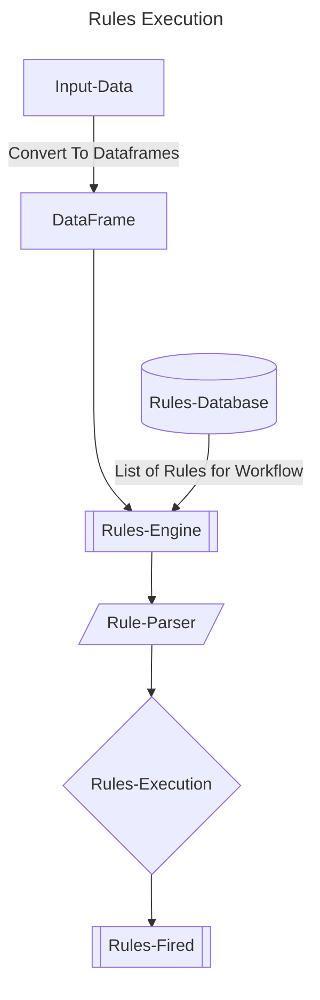

# ai-ml-learnings-exemplars
This repository hosts all the possible exemplars of data structures in python, polars, pandas, machine learning models etc

----

## Environment Variables
Run the below script once to set the environment variables 

```shell
dotenv set dbhost ""
dotenv set dbname ""
dotenv set dbuser ""
dotenv set dbcred ""
```
----

## Mermaid Diagram

**[Mermaid-Docs](https://mermaid.js.org/syntax/flowchart.html)**

### Rules Engine WorkFlow Diagram 



----

### Important URL's

[coding-interview-university](https://github.com/jwasham/coding-interview-university)
