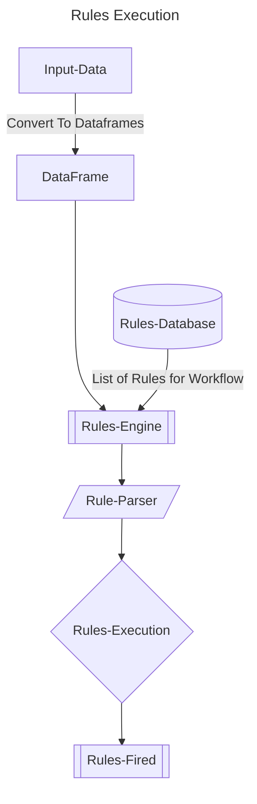

### Repository Overview and Exemplar Scope

This repository is a curated educational sandbox, designed as a comprehensive resource library for modern AI/ML and Data Engineering best practices. It showcases best-practice exemplars across the entire ML lifecycle, from raw data ingestion to advanced LLM-powered applications.

**Key Focus Areas (Exemplars):**
*   **Generative AI & LLM Applications:** Implementing advanced conversational AI (e.g., file search chatbots) and leveraging Retrieval-Augmented Generation (RAG).
*   **Data Engineering Pipelines:** Examples focusing on robust ETL/ELT processes, data validation, and executing complex business rules via a Rules Engine.
*   **High-Performance Data Manipulation:** Best practices using leading data science libraries, primarily **Polars** and **Pandas**.
*   **System Architecture:** Showcasing blueprints for end-to-end ML systems, as seen in the linked documentation.

The included notebooks, `src/`, and `docs/` form a learning continuum, allowing users to study specific components or build entire systems.

----

## README Tech Docs/ Tech Materials
- [GenAI Data Scientist](docs/markdowns/awesome-generative-ai-data-scientist-links.md)
- [Coding Interview Prep](docs/markdowns/coding-interview-prep.md)
- [File Type ID](docs/markdowns/file-type-id.md)
- [Programming Language Resources](docs/markdowns/programming-language-resources.md)
- [System Design](docs/markdowns/system-design-101-notes.md)

----
## Environment Variables
Run the below script once to set the environment variables 

```shell
dotenv set dbhost ""
dotenv set dbname ""
dotenv set dbuser ""
dotenv set dbcred ""
dotenv set aws_access_key_id ""
dotenv set aws_secret_access_key ""
```
----

## Mermaid Diagram

**[Mermaid-Docs](https://mermaid.js.org/syntax/flowchart.html)**

### Rules Engine WorkFlow Diagram 



```mermaid
---
title: Rules Execution
---

flowchart TB
    Rules-DB[(Rules-Database)]
    Rules-Engine[[Rules-Engine]]
    Rules-Parser[/Rule-Parser/]
    Input-Data[Input-Data]
    Dataframes[DataFrame]
    Rules-Execution{Rules-Execution}
    Rules-Fired[[Rules-Fired]]
    
    Input-Data --Convert To Dataframes --> Dataframes ----> Rules-Engine
    Rules-DB --List of Rules for Workflow--> Rules-Engine --> Rules-Parser --> Rules-Execution --> Rules-Fired
```
----

### Important URL's

- [Coding-Interview-University](https://github.com/jwasham/coding-interview-university)

- [AWS-SageMaker-Examples](https://github.com/aws/amazon-sagemaker-examples)

- [Kaggle-Datasets](https://www.kaggle.com/datasets?fileType=csv)


```shell
streamlit run src/streamlit-exemplars/file_search_chatbot.py
```

### Github Pages

[LDDasRagchatbot Documentation](https://yuvarajd85.github.io/ai-ml-learnings-exemplars/)