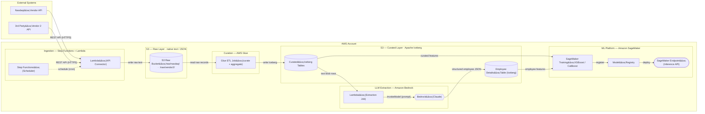

# Data Lake + ML Pipeline Architecture

C4 Container-level data-flow view: Nasdaq and 3rd-party vendor API ingestion → S3 Raw → Glue curation → S3 Curated (Iceberg) → Bedrock LLM employee extraction → SageMaker XGBoost/CatBoost training and real-time inference endpoint.

## Diagram

## Notes

- **Scope**: Two external vendor API sources; Lambda-based pull ingestion scheduled by Step Functions; two-tier S3 data lake (raw text → curated Apache Iceberg); Bedrock Claude LLM extraction from a text-blob column into a structured employee table; SageMaker XGBoost/CatBoost classification + rating model training, model registry, and a real-time inference endpoint.
- **Deliberate omissions**: Glue Data Catalog table registration, S3 event notifications (alternative ingest trigger), IAM roles and KMS encryption, CloudWatch alarms and SageMaker Model Monitor, retraining pipeline, and Feature Store — ask for an ops/failure-path view to add these.
- **Assumptions**: Ingestion is pull-based (Lambda scheduled via Step Functions cron); Glue writes Parquet-backed Iceberg tables registered in the Glue Catalog; LLM extraction runs as a separate batch Lambda (not inline with curation); SageMaker training reads directly from S3 (no Feature Store assumed — verify if feature reuse across models is needed).
- **DrawIO file**: open `data-lake-ml-pipeline.drawio` in [app.diagrams.net](https://app.diagrams.net) for the full AWS-icon version.
