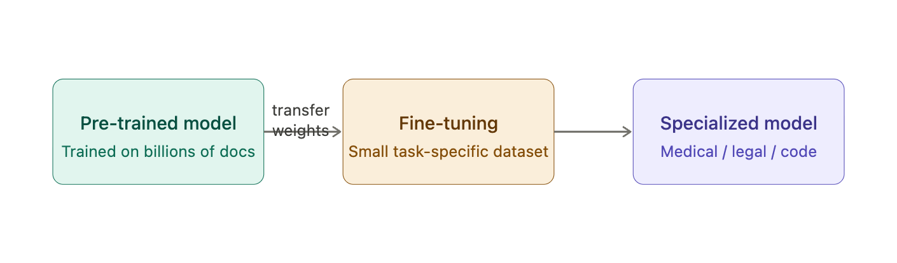
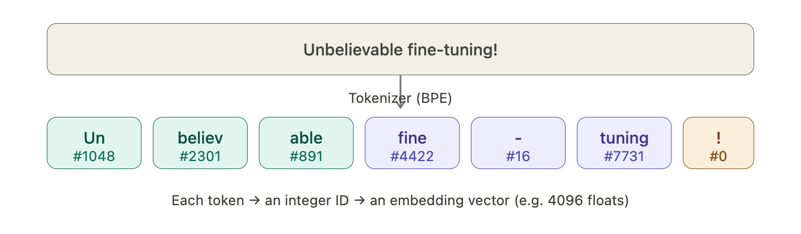
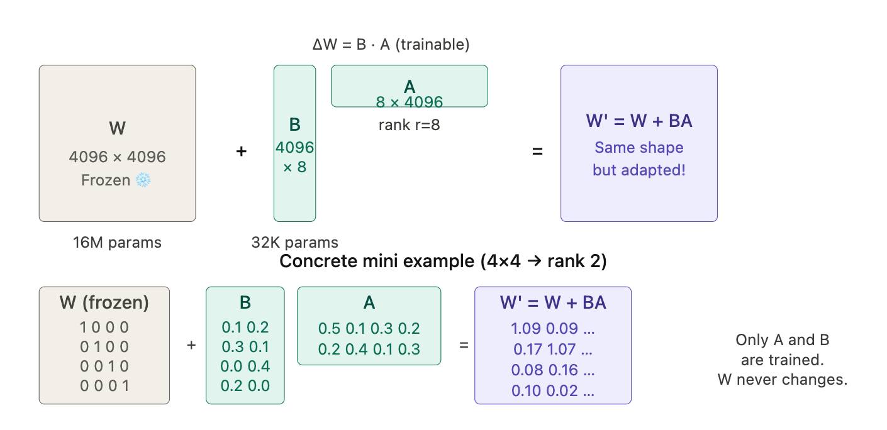
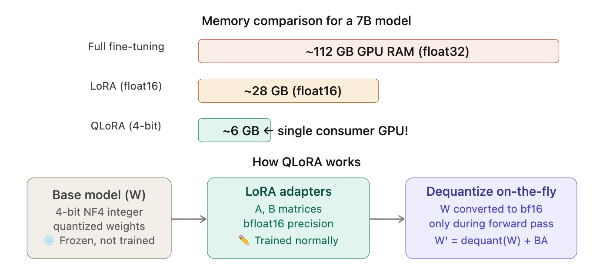
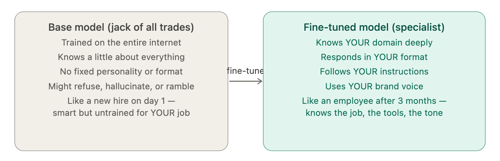
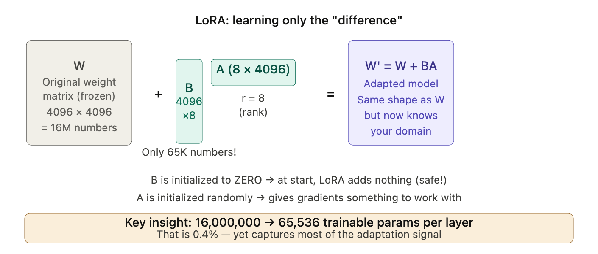

# <u> <center> GenAI Under the Hood: Fine-Tuning LLMs with LoRA & Quantization </u> </center>

----

## Module 1: Welcome & Workshop Overview
- Introductions and learning objectives
- Agenda walkthrough
- Tools setup check (Colab GPU availability)
- Overview: Fine-tune a 1B parameter LLM using LoRA with quantization

## Module 2: Why Fine-Tune LLMs?
- Understanding the limitations of base models and need for customization
- Generic vs domain-specific responses
- Customization needs in real applications
- Traditional fine-tuning challenges

## Module 3: Parameter Efficient Fine-Tuning (PEFT) & LoRA
- Full fine-tuning vs PEFT
- Adapters and prefix tuning
- LoRA overview & Low-rank decomposition intuition
- Understanding LoRA hyperparameters (rank, alpha, dropout)

## Module 4: Quantization for LLMs
- Precision formats (FP32, FP16)
- 8-bit and 4-bit quantization
- Memory savings from quantization
- Introduction to bitsandbytes

## Module 5: Model & Environment Setup
- Overview of TinyLlama
- Chat-optimized LLMs and causal language modeling
- Setting up environment in Google Colab
- Installing dependencies and verifying GPU availability

## Module 6: Loading Quantized LLM & Configuring LoRA
- Load tokenizer and model
- Apply 4-bit quantization
- Inspect model structure and GPU memory usage
- Configure LoRA adapters & Identify trainable parameters

## Module 7: Dataset Preparation, Training & Evaluation
- Prepare the Stanford Alpaca dataset
- Tokenize and filter training data
- Generate baseline model outputs
- Run LoRA fine-tuning using Hugging Face Trainer API
- Compare responses before and after training

## Module 8: Wrap-Up & Live Q&A
- Key takeaways from LoRA and quantization
- Industry use cases and deployment considerations
- Career paths in LLM engineering

-----

## Notes: 

- Transfer Learning 
- Feed forward 
- Back Propagation 
- Parameters &rarr; Weights ??
- Tokens
- Parameter Efficient Fine Tuning - LoRA 
- PEFT - QLoRA (Quantized LoRA) 

Let's go through each concept one by one, building up your intuition from the ground up.

---

## 1. Transfer Learning

Imagine you already know how to ride a bicycle. When you want to learn to ride a motorcycle, you don't start from scratch — you *transfer* your balance skills. That's transfer learning.

In AI, a model pre-trained on billions of examples (like GPT or LLaMA) has already learned general patterns: grammar, logic, facts. Fine-tuning *transfers* that knowledge to a specific task (e.g., customer support, medical Q&A) by training on a small, specialized dataset.



**The math**: the pre-trained model has weights **W**. Fine-tuning continues gradient descent starting from **W** instead of random weights. The loss function only uses your small dataset:

> **W_new = W_pretrained − η · ∇L(W_pretrained)**

---

## 2. Feed Forward (Forward Pass)

This is how data flows *through* a neural network to make a prediction. Think of it like an assembly line — raw input goes in, and a prediction comes out.

Each layer does two things: **multiply inputs by weights**, then apply a **non-linear function** (called an activation):

> **z = W · x + b** ← linear transformation
> **a = ReLU(z) = max(0, z)** ← activation

 

**Concrete example**: Predicting house price.
- Input: `x = [size=1500sqft, bedrooms=3]`
- Weights: `W = [0.5, 20]`, bias `b = 10`
- `z = (0.5 × 1500) + (20 × 3) + 10 = 820` → that's the predicted price (×$1000 = $820k)

---

## 3. Back Propagation

The forward pass gives a *wrong* answer at first. Backpropagation is how the model **learns from its mistake** — it flows the error *backwards* through the network and adjusts every weight a tiny bit.

Think of it like this: you throw a dart, miss the bullseye, and mentally trace back *which arm angle* caused the miss, then correct it. The key tool is the **chain rule** from calculus:

> **∂L/∂W₁ = (∂L/∂a) × (∂a/∂z) × (∂z/∂W₁)**

"How much did the loss change because of W₁?" is the product of how each step affected the next.


**Intuition on the weight update**: if the gradient `∂L/∂W = +5`, the weight is making the error *bigger* in the positive direction, so we subtract a small amount. The learning rate **η** (like 0.001) controls how big each step is — too big and you overshoot, too small and training takes forever.

---

## 4. Parameters → Weights

"Parameters" and "weights" are often used interchangeably. Here's the precise breakdown:

| Term | What it is | Example |
|---|---|---|
| **Weight (W)** | A number on each connection between neurons | `W = 0.73` |
| **Bias (b)** | An offset added to shift the output | `b = -0.2` |
| **Parameter** | Any learnable number (weights + biases) | All W's and b's together |

A model with "7 billion parameters" literally has 7,000,000,000 individual floating-point numbers. Training = finding the best values for all of them. During fine-tuning, we adjust these to fit the new task.

> **Total parameters = Σ (W_layer + b_layer) for all layers**

For a simple layer with 1000 inputs → 500 outputs: `(1000 × 500) weights + 500 biases = 500,500 parameters`.

---

## 5. Tokens

A model doesn't read words — it reads **tokens**, which are chunks of text. Tokenization splits text into subword units so the model can handle any word, even ones it's never seen.

Each token ID is then looked up in an **embedding table** — a giant matrix where each row is a vector of floats representing that token's meaning. A LLaMA 7B model's embedding has 4096 numbers per token.

> **~1 token ≈ ¾ of an English word. 100 tokens ≈ 75 words.**

---

## 6. LoRA — Low-Rank Adaptation (the heart of PEFT)

Here's the problem: fine-tuning a 7B parameter model updates all 7 billion weights — extremely expensive in GPU memory and compute.

**LoRA's insight**: the *change* needed to adapt a model is low-rank — meaning you don't need to update the full weight matrix **W** (e.g. 4096×4096 = 16M numbers). Instead, you approximate the update as two *tiny* matrices multiplied together.

### The Matrix Math

Let **W** be a weight matrix of shape `(d × d)` — say `4096 × 4096`.

Instead of computing **ΔW** (4096×4096 = 16M parameters), LoRA says:

> **ΔW ≈ B · A** where A is `(d × r)` and B is `(r × d)`, and **r << d** (e.g. r=8)

So instead of 16M numbers, you only train `4096×8 + 8×4096 = 65,536` numbers — **244× fewer parameters!**

The new effective weight during inference is:

> **W' = W + B · A**

 

**Why does low-rank work?** Research shows that the *meaningful changes* needed to adapt a model to a new task live in a low-dimensional subspace. You don't need to rotate every dimension — just a few "directions" account for most of the adaptation signal.

**The rank `r`** is a hyperparameter you choose:
- `r = 4` → very few parameters, faster but less expressive
- `r = 64` → more expressive, approaching full fine-tuning
- Common sweet spot: `r = 8` or `r = 16`

> **Trainable params with LoRA** = `2 × d × r` per layer (both A and B matrices)
>
> For d=4096, r=8: `2 × 4096 × 8 = 65,536` vs `4096² = 16,777,216` — that's **0.4% of original!**

---

## 7. QLoRA — Quantized LoRA

QLoRA = LoRA + **Quantization**. It solves the memory problem even further.

**Quantization** means storing weights in lower precision:
- Normal model: weights stored as 32-bit floats (`float32`)
- Quantized model: weights stored as **4-bit integers** (`int4`)
- Memory savings: **8× less memory** than float32, **4× less** than float16



**The quantization math** — mapping float32 → int4:

Given a weight tensor with values in range `[-2.5, 2.5]`, NF4 quantization maps them onto 16 fixed "buckets" (4-bit = 2⁴ = 16 levels):

> `q = round((w - min) / (max - min) × 15)`
>
> To recover: `w̃ = q / 15 × (max - min) + min`

The precision loss is small because the LoRA adapters (in full float16) compensate for any rounding errors.

---

## Putting It All Together---


## Summary Cheatsheet

| Concept | Core idea | Key formula |
|---|---|---|
| **Transfer learning** | Reuse pretrained weights | Start from W_pretrained |
| **Feed forward** | Data flows input → output through layers | `a = ReLU(Wx + b)` |
| **Backprop** | Errors flow backwards, weights updated via chain rule | `W ← W − η·∂L/∂W` |
| **Parameters/weights** | The learnable numbers of the model | W (connections) + b (biases) |
| **Tokens** | Subword chunks; each → integer ID → embedding vector | ~¾ word per token |
| **LoRA** | Approximate ΔW as two tiny matrices B·A | `W' = W + BA`, rank r ≪ d |
| **QLoRA** | LoRA on top of 4-bit quantized base model | `W' = dequant(W) + BA` |

The elegance of QLoRA is that it combines all of these ideas: tokens feed forward through a near-frozen, memory-efficient quantized model, backprop updates only the tiny LoRA matrices, and you end up with a specialized model that fits on a laptop GPU.

------

# Complete QLoRA Fine-Tuning Course — Layman's Guide

Let me build this up like a story. Each module is a chapter, and by the end you'll have a complete, runnable notebook.

---

## Module 2: Why Fine-Tune LLMs?


Think of a base LLM like a brilliant university graduate who has read every book ever written. They're incredibly knowledgeable — but they've never worked at your company, don't know your products, can't follow your internal processes, and don't speak in your brand's voice. Fine-tuning is the onboarding process.

```python
# ============================================================
# MODULE 2 — Why Fine-Tune?
# Demonstrates the gap between base model and what we need
# ============================================================

# pip install transformers torch

from transformers import AutoTokenizer, AutoModelForCausalLM
import torch

# ----------------------------------------------------------
# DEMO 1: The "wrong format" problem
# Base models don't consistently produce structured output
# ----------------------------------------------------------

# Imagine you're building a customer support classifier.
# You need clean JSON every time. Base models are unreliable.

BAD_PROMPT = "Is this review positive or negative? Reply with JSON.\nReview: The battery dies in 2 hours."

# What a base model might return (unpredictable):
base_outputs = [
    '{"sentiment": "negative"}',           # sometimes correct ✓
    'The review is negative.',              # sometimes plain text ✗
    'Based on my analysis, this is...',    # sometimes verbose ✗
    '{"sentiment": "negative", "score":... # sometimes incomplete ✗
]

print("Base model output is unpredictable:")
for i, o in enumerate(base_outputs):
    ok = "✓" if o.startswith("{") and o.endswith("}") else "✗"
    print(f"  Run {i+1}: {ok} {o[:60]}")

# After fine-tuning on 500 labeled examples, the model
# ALWAYS returns exactly: {"sentiment": "negative", "confidence": 0.95}

print("\nFine-tuned model output: consistent, every time")
print('  → {"sentiment": "negative", "confidence": 0.95}')


# ----------------------------------------------------------
# DEMO 2: The "domain knowledge" problem
# ----------------------------------------------------------

# A medical chatbot needs to know clinical guidelines.
# A base model will hallucinate dosages, drug names, contraindications.

medical_questions = [
    "What is the first-line treatment for uncomplicated UTI in adults?",
    "What is the maximum daily dose of acetaminophen for adults?",
    "Which antibiotic is contraindicated in pregnancy due to kernicterus risk?",
]

# Base model answer (likely wrong or dangerously vague):
base_medical_answer = """
  "You should consult a doctor. Common treatments include antibiotics
   like amoxicillin or ciprofloxacin. Always follow medical advice."
   → Generic, no specific guidelines, potentially harmful
"""

# Fine-tuned on clinical guidelines:
finetuned_medical_answer = """
  "Per IDSA 2023 guidelines: nitrofurantoin 100mg ER twice daily × 5 days
   OR trimethoprim-sulfamethoxazole 160/800mg twice daily × 3 days
   (if local resistance <20%). Fluoroquinolones reserved for complicated cases."
   → Specific, guideline-referenced, actionable
"""

print("DOMAIN KNOWLEDGE GAP:")
print("Base model:", base_medical_answer)
print("Fine-tuned:", finetuned_medical_answer)


# ----------------------------------------------------------
# DEMO 3: Why traditional full fine-tuning is expensive
# ----------------------------------------------------------

def calculate_finetuning_cost(model_size_billions: float) -> None:
    """
    Full fine-tuning requires storing:
    1. The model weights themselves
    2. A copy of gradients (same size as weights)
    3. Optimizer states — Adam needs TWO momentum terms per weight
       plus a full-precision copy = 3x the weight size in fp32

    Rule of thumb: ~16–20 bytes per parameter for full fine-tuning
    """
    params = model_size_billions * 1_000_000_000

    weights_gb   = (params * 2) / 1e9   # fp16: 2 bytes each
    grads_gb     = (params * 2) / 1e9   # fp16 gradients
    # Adam: fp32 param copy (4B) + momentum (4B) + variance (4B) = 12B
    optimizer_gb = (params * 12) / 1e9

    total_gb     = weights_gb + grads_gb + optimizer_gb
    a100_count   = total_gb / 80         # A100 has 80GB VRAM

    print(f"\n{'─'*50}")
    print(f"  Full fine-tuning: {model_size_billions}B parameter model")
    print(f"{'─'*50}")
    print(f"  Model weights:   {weights_gb:6.1f} GB")
    print(f"  Gradients:       {grads_gb:6.1f} GB")
    print(f"  Optimizer (Adam):{optimizer_gb:6.1f} GB")
    print(f"  ─────────────────────────")
    print(f"  TOTAL:           {total_gb:6.1f} GB")
    print(f"  A100 GPUs needed:{a100_count:6.1f}  (each costs ~$2/hr)")

    monthly_cost = a100_count * 2 * 24 * 30  # rough AWS estimate
    print(f"  ~Monthly cost:   ${monthly_cost:,.0f}")

for size in [7, 13, 70]:
    calculate_finetuning_cost(size)

# Output shows why full fine-tuning a 70B model costs $50k+/month
# This is the EXACT problem PEFT (Module 3) solves
```

---

## Module 3: PEFT & LoRA

The core idea of PEFT is: **you don't need to change everything to teach something new**. Imagine you've already learned to drive a car. To drive a truck, you don't re-learn steering, braking, and traffic rules — you just learn the differences (wider turns, air brakes). LoRA is the "just learn the differences" approach.



```python

# ============================================================
# MODULE 3 — PEFT & LoRA
# Build LoRA from scratch so you understand every line
# ============================================================

import torch
import torch.nn as nn
import math

# ----------------------------------------------------------
# PART A: What IS a weight matrix, visually
# ----------------------------------------------------------

# Every connection in a neural network is a number (weight).
# A "linear layer" is just a grid of these numbers.
# When input flows through, it gets multiplied by this grid.

# Let's make a tiny example
W = torch.tensor([
    [0.5,  0.2, -0.1],   # how much each input affects output 1
    [0.1, -0.3,  0.8],   # how much each input affects output 2
], dtype=torch.float32)

x = torch.tensor([1.0, 2.0, 3.0])   # input: 3 numbers

output = W @ x   # matrix multiply = weighted sum
print("Input x:", x.tolist())
print("Weight W shape:", W.shape, "← (2 outputs) × (3 inputs)")
print("Output W@x:", output.tolist())
# Each output is a dot product: e.g., output[0] = 0.5*1 + 0.2*2 + (-0.1)*3 = 0.6


# ----------------------------------------------------------
# PART B: LoRA decomposition — the math made simple
# ----------------------------------------------------------

# The insight: we don't update W directly.
# Instead we say: W_new = W_frozen + B @ A
# Where B and A are two SMALL matrices whose product approximates
# the change we want.

# Why does this save parameters?
# W is (4096 × 4096) = 16,777,216 numbers
# A is (8    × 4096) =     32,768 numbers   ← rank r=8
# B is (4096 × 8   ) =     32,768 numbers
# A+B total          =     65,536 numbers   ← 0.39% of original!

def show_lora_savings(d: int, r: int) -> None:
    full   = d * d
    lora   = 2 * d * r
    pct    = lora / full * 100
    print(f"  d={d:5d}, r={r:2d} → "
          f"Full: {full:>12,}  LoRA: {lora:>8,}  "
          f"Saving: {100-pct:.1f}%")

print("\nParameter savings at different ranks:")
for d in [1024, 2048, 4096]:
    for r in [4, 8, 16]:
        show_lora_savings(d, r)


# ----------------------------------------------------------
# PART C: LoRA from scratch — fully commented
# ----------------------------------------------------------

class LoRALayer(nn.Module):
    """
    A LoRA adapter that wraps any nn.Linear layer.

    The forward pass does:
        output = W(x) + scaling * B(A(dropout(x)))
                 ↑              ↑
              frozen          trained

    Think of it as: base answer + small correction
    """

    def __init__(
        self,
        original_layer: nn.Linear,  # the layer we're wrapping
        r: int   = 8,               # rank: how many "directions" to learn
        alpha: float = 16.0,        # scaling: how loud the correction is
        dropout: float = 0.05,      # randomly zero some inputs during training
    ):
        super().__init__()

        self.original = original_layer
        self.r        = r
        self.scaling  = alpha / r   # the α/r formula

        in_dim  = original_layer.in_features
        out_dim = original_layer.out_features

        # ── Freeze the original weights ──────────────────────────
        # These will NEVER be updated during training
        for param in self.original.parameters():
            param.requires_grad = False

        # ── Create the two small LoRA matrices ───────────────────
        # A: shape (r × in_dim) — compresses input to r dimensions
        # B: shape (out_dim × r) — expands back to output dimensions
        #
        # Why initialize B to zero?
        # At the start of training, B@A = zeros, so we add nothing
        # to W. Training starts from exactly the pretrained model.
        # This is crucial — if B was random, we'd immediately corrupt
        # the base model's carefully learned representations.
        self.A = nn.Parameter(torch.empty(r, in_dim))
        self.B = nn.Parameter(torch.zeros(out_dim, r))  # ← zeros!

        # A gets small random values (kaiming = good for ReLU networks)
        nn.init.kaiming_uniform_(self.A, a=math.sqrt(5))

        # Dropout prevents overfitting on small datasets
        self.drop = nn.Dropout(p=dropout)

    def forward(self, x: torch.Tensor) -> torch.Tensor:
        # Path 1: original frozen computation
        base = self.original(x)           # W @ x + bias

        # Path 2: LoRA correction
        # x → dropout → A (compress) → B (expand) → scale
        correction = self.drop(x) @ self.A.T @ self.B.T
        correction = correction * self.scaling

        # Add them together
        return base + correction

    def count_params(self) -> None:
        frozen    = sum(p.numel() for p in self.original.parameters())
        trainable = self.A.numel() + self.B.numel()
        print(f"  Frozen:    {frozen:>10,} params")
        print(f"  Trainable: {trainable:>10,} params  "
              f"({trainable/frozen*100:.2f}% of layer)")


# Demo with a realistic size
original = nn.Linear(4096, 4096)
lora_wrapped = LoRALayer(original, r=8, alpha=16, dropout=0.05)

print("\nLoRA wrapping a 4096×4096 linear layer (r=8, α=16):")
lora_wrapped.count_params()

x = torch.randn(2, 64, 4096)   # batch=2, seq=64, dim=4096
out = lora_wrapped(x)
print(f"\nInput:  {x.shape}")
print(f"Output: {out.shape}")


# ----------------------------------------------------------
# PART D: LoRA hyperparameters — intuition with numbers
# ----------------------------------------------------------

print("\n\nLoRA hyperparameter intuition:")
print("="*55)

# ── Rank r ───────────────────────────────────────────────
print("\n1. RANK (r) — how many 'directions' can we adjust?")
print("   Think of rank like the number of knobs on an equalizer.")
print("   Low rank = few broad adjustments. High rank = fine-grained control.")
print()
for r in [2, 4, 8, 16, 32, 64]:
    params = 2 * 4096 * r
    print(f"   r={r:3d} → {params:>8,} trainable params per layer  "
          + ("← sweet spot" if r == 8 else ""))

# ── Alpha α ──────────────────────────────────────────────
print("\n2. ALPHA (α) — how loudly does the adapter speak?")
print("   The adapter output is multiplied by α/r before adding to W.")
print("   Low α/r → subtle nudge. High α/r → strong override.")
print()
print(f"   {'r':>4}  {'α':>4}  {'α/r':>6}  Interpretation")
print("   " + "─"*45)
for r, alpha in [(8,4),(8,8),(8,16),(8,32),(16,16),(16,32)]:
    ratio = alpha / r
    note = ""
    if ratio < 1:   note = "← conservative"
    elif ratio == 1: note = "← neutral"
    elif ratio == 2: note = "← recommended default"
    elif ratio > 2: note = "← aggressive"
    print(f"   {r:>4}  {alpha:>4}  {ratio:>6.1f}  {note}")

# ── Dropout ──────────────────────────────────────────────
print("\n3. DROPOUT — regularization to prevent memorization")
print("   During each training step, randomly zero out some adapter inputs.")
print("   This forces the adapter to learn robust patterns, not memorize examples.")
print()
print("   dropout=0.00  → no regularization (use for large datasets)")
print("   dropout=0.05  → mild regularization (default, works for most cases)")
print("   dropout=0.10  → strong regularization (small datasets <1000 examples)")
print("   dropout=0.20  → very strong (tiny datasets, risk of underfitting)")
```

---

## Module 4: Quantization for LLMs

Imagine storing a photo. A raw camera photo takes 30MB. A JPEG takes 3MB with almost identical visual quality — because JPEG throws away information your eye can't perceive. Quantization does the same thing to neural network weights.

```python
# ============================================================
# MODULE 4 — Quantization
# Understand how weights get compressed from 32-bit to 4-bit
# ============================================================

import numpy as np
import struct

# ----------------------------------------------------------
# PART A: What "precision" actually means
# ----------------------------------------------------------

# Every weight in a neural network is stored as a floating-point number.
# Different formats use different amounts of space:

print("Floating point formats:")
print("─" * 60)

# FP32: 32 bits = 1 sign + 8 exponent + 23 mantissa
# Range: ±3.4 × 10^38   Precision: ~7 decimal digits
fp32_val = np.float32(3.14159265358979)
print(f"  FP32:  {fp32_val}  ({fp32_val.nbytes} bytes, {fp32_val.nbytes*8} bits)")

# FP16: 16 bits = 1 sign + 5 exponent + 10 mantissa
# Range: ±65504         Precision: ~3 decimal digits
fp16_val = np.float16(3.14159265358979)
print(f"  FP16:  {fp16_val}  ({fp16_val.nbytes} bytes, {fp16_val.nbytes*8} bits)")

# BF16: 16 bits = 1 sign + 8 exponent + 7 mantissa
# Same range as FP32 but less precision — better for ML
import torch
bf16_val = torch.tensor(3.14159265358979, dtype=torch.bfloat16)
print(f"  BF16:  {bf16_val.item():.4f}  (2 bytes, 16 bits, same range as FP32)")

# INT8: integer, range -128 to 127
int8_val = np.int8(3)   # 3.14 → 3 (loses decimal!)
print(f"  INT8:  {int8_val}    (1 byte, 8 bits, loses decimal precision)")

print("\nMemory for a 7B parameter model:")
for dtype, bytes_per in [("FP32",4),("FP16/BF16",2),("INT8",1),("INT4",0.5)]:
    gb = (7e9 * bytes_per) / 1e9
    print(f"  {dtype:12s}: {gb:5.1f} GB")


# ----------------------------------------------------------
# PART B: How quantization works — step by step
# ----------------------------------------------------------

def quantize_to_int8(weights: np.ndarray) -> tuple:
    """
    8-bit quantization: map float weights → integers in [-127, 127]

    The trick: find the scale factor that maps the weight range
    onto the integer range, then round.

    It's like converting meters to centimeters:
    you multiply by 100, round to the nearest integer, store it.
    To get back, divide by 100.
    """
    # Step 1: find the absolute maximum value (sets the scale)
    abs_max = np.abs(weights).max()

    # Step 2: compute scale factor
    scale = abs_max / 127.0   # maps [-abs_max, abs_max] → [-127, 127]

    # Step 3: quantize (divide by scale, round to integer)
    quantized = np.round(weights / scale).astype(np.int8)

    # Step 4: dequantize (for inference, multiply back)
    dequantized = quantized.astype(np.float32) * scale

    # Measure the error introduced
    error = np.abs(weights - dequantized)
    return quantized, dequantized, scale, error

# Simulate a real weight distribution (neural networks have bell-curve weights)
np.random.seed(42)
weights_fp32 = np.random.normal(0, 0.02, 1000).astype(np.float32)

q8, dq8, scale8, err8 = quantize_to_int8(weights_fp32)

print("\nINT8 Quantization Demo (1000 weights):")
print(f"  Original range:     [{weights_fp32.min():.4f}, {weights_fp32.max():.4f}]")
print(f"  Scale factor:        {scale8:.6f}")
print(f"  Quantized range:    [{q8.min()}, {q8.max()}]  ← integers!")
print(f"  Max absolute error:  {err8.max():.6f}")
print(f"  Mean absolute error: {err8.mean():.6f}  ← tiny!")
print(f"  Memory: {weights_fp32.nbytes} bytes → {q8.nbytes} bytes "
      f"({weights_fp32.nbytes/q8.nbytes:.0f}× compression)")


# ----------------------------------------------------------
# PART C: NF4 — the QLoRA secret weapon
# ----------------------------------------------------------

def explain_nf4():
    """
    NF4 = NormalFloat 4-bit

    Regular INT4 spaces its 16 levels EVENLY across the value range.
    But neural network weights are NOT evenly distributed —
    they cluster near zero (bell curve / normal distribution).

    NF4 places its 16 levels at the QUANTILES of the normal distribution.
    This means more buckets where weights are dense (near zero)
    and fewer where they're sparse (at extremes).

    Analogy: a parking lot near a stadium.
    Regular: spread spaces evenly across the whole city.
    NF4:     put most spaces near the stadium (where people actually park).
    """

    # NF4 levels from the QLoRA paper — NOT evenly spaced!
    nf4_levels = np.array([
        -1.0000, -0.6962, -0.5251, -0.3949, -0.2844,
        -0.1848, -0.0911,  0.0000,  0.0796,  0.1609,
         0.2461,  0.3379,  0.4407,  0.5626,  0.7230,  1.0000
    ])

    # Regular INT4 levels — evenly spaced
    int4_levels = np.linspace(-1, 1, 16)

    print("\nNF4 vs INT4 level placement (16 levels each):")
    print(f"  {'Level':>5}  {'INT4 (even)':>14}  {'NF4 (quantile)':>16}  Difference")
    print("  " + "─"*55)
    for i, (i4, nf) in enumerate(zip(int4_levels, nf4_levels)):
        diff = abs(i4 - nf)
        print(f"  {i:>5}  {i4:>14.4f}  {nf:>16.4f}  {diff:.4f}")

    # Show why NF4 is better for normal distributions
    test_weights = np.random.normal(0, 0.3, 10000)
    test_weights = test_weights / np.abs(test_weights).max()  # normalize to [-1,1]

    def quantize_with_levels(w, levels):
        indices = np.argmin(np.abs(w[:, None] - levels), axis=1)
        return levels[indices]

    q_int4 = quantize_with_levels(test_weights, int4_levels)
    q_nf4  = quantize_with_levels(test_weights, nf4_levels)

    err_int4 = np.mean((test_weights - q_int4)**2)
    err_nf4  = np.mean((test_weights - q_nf4)**2)

    print(f"\n  MSE with INT4: {err_int4:.6f}")
    print(f"  MSE with NF4:  {err_nf4:.6f}  "
          f"← {err_int4/err_nf4:.1f}× less error for normal distributions!")

explain_nf4()


# ----------------------------------------------------------
# PART D: Memory savings — the full picture
# ----------------------------------------------------------

def memory_comparison(model_name: str, params_B: float) -> None:
    params = params_B * 1e9
    print(f"\nMemory breakdown: {model_name} ({params_B}B params)")
    print("─" * 55)

    scenarios = {
        "Full fine-tune (FP32)":  {"model":4, "grad":4, "optim":12},
        "Full fine-tune (FP16)":  {"model":2, "grad":2, "optim":12},
        "LoRA (FP16)":            {"model":2, "grad":0, "optim":2},
        # with LoRA, gradients only flow through tiny A,B matrices
        # optimizer states only for A,B (negligible)
        "QLoRA (4-bit + LoRA)":   {"model":0.5,"grad":0,"optim":0.1},
    }

    for name, bytes_per in scenarios.items():
        total_bytes = params * (bytes_per["model"] +
                                bytes_per["grad"] +
                                bytes_per["optim"])
        total_gb = total_bytes / 1e9
        fits_t4  = "✓ T4 (16GB)" if total_gb < 16 else \
                   "✓ A100 (80GB)" if total_gb < 80 else "✗ Multi-GPU"
        print(f"  {name:<30} {total_gb:6.1f} GB  {fits_t4}")

memory_comparison("TinyLlama", 1.1)
memory_comparison("LLaMA-3 7B", 7)
memory_comparison("LLaMA-3 70B", 70)
```

---

## Module 5: Model & Environment Setup

```python
# ============================================================
# MODULE 5 — Environment Setup
# Run these cells in order in Google Colab
# ============================================================

# ── CELL 1: Install everything ─────────────────────────────
# Paste this as the FIRST cell in your Colab notebook

!pip install -q \
    transformers>=4.41.0 \
    accelerate \
    bitsandbytes \
    peft \
    datasets \
    trl \
    sentencepiece \
    scipy

print("Installation complete!")


# ── CELL 2: Verify your GPU ────────────────────────────────
import torch

def check_gpu():
    print("=" * 50)
    print("  GPU Check")
    print("=" * 50)

    if not torch.cuda.is_available():
        print("""
  NO GPU DETECTED!

  Fix in Colab:
    1. Click Runtime (top menu)
    2. Click "Change runtime type"
    3. Set Hardware accelerator = T4 GPU
    4. Click Save
    5. Re-run this cell
        """)
        return False

    gpu = torch.cuda.get_device_properties(0)
    total_gb  = gpu.total_memory / 1e9
    free_gb   = (gpu.total_memory - torch.cuda.memory_allocated(0)) / 1e9

    print(f"  GPU:         {gpu.name}")
    print(f"  Total VRAM:  {total_gb:.1f} GB")
    print(f"  Free VRAM:   {free_gb:.1f} GB")
    print(f"  CUDA:        {torch.version.cuda}")

    if "T4" in gpu.name:
        print(f"\n  Colab free T4 — good for models up to 7B with QLoRA")
    elif "A100" in gpu.name:
        print(f"\n  A100 — excellent, can handle 13B+ comfortably")

    return True

gpu_ok = check_gpu()


# ── CELL 3: Verify all package imports ─────────────────────
if gpu_ok:
    import transformers
    import peft
    import bitsandbytes
    import datasets

    print("\nPackage versions:")
    print(f"  transformers:  {transformers.__version__}")
    print(f"  peft:          {peft.__version__}")
    print(f"  bitsandbytes:  {bitsandbytes.__version__}")
    print(f"  datasets:      {datasets.__version__}")
    print(f"  torch:         {torch.__version__}")


# ── CELL 4: What is TinyLlama? ─────────────────────────────
"""
TinyLlama-1.1B-Chat overview:

  Architecture:   Llama 2 (same as Meta's 7B, just smaller)
  Parameters:     1.1 billion
  Training data:  3 trillion tokens (same as Llama 2 7B!)
  Context window: 2048 tokens
  Hidden size:    2048 (vs 4096 in 7B)
  Layers:         22  (vs 32 in 7B)
  Attention heads:32 query, 4 key-value (grouped query attention)

Why TinyLlama for learning?
  ✓ Fits in free Colab T4 (16GB) with QLoRA
  ✓ Fine-tunes in ~20 minutes on Colab
  ✓ Same architecture as production models (Llama 2/3)
  ✓ "Chat" variant already knows how to follow instructions

Chat format (ChatML) — the template the model expects:
  <|system|>
  You are a helpful assistant.
  </s>
  <|user|>
  What is 2+2?
  </s>
  <|assistant|>
  4
  </s>

Causal Language Modeling:
  The model predicts ONE token at a time, left to right.
  It sees: "<|system|>\nYou are..." and predicts the next token.
  Then it sees: "<|system|>\nYou are a" and predicts the next...
  This is how ALL GPT-style models work.
"""
print("TinyLlama overview printed above.")
```

---

## Module 6: Loading Quantized Model & Configuring LoRA

```python
# ============================================================
# MODULE 6 — Load Model + Configure LoRA
# This is the core setup you'll use in every fine-tuning run
# ============================================================

import torch
from transformers import (
    AutoTokenizer,
    AutoModelForCausalLM,
    BitsAndBytesConfig,
)
from peft import (
    LoraConfig,
    get_peft_model,
    prepare_model_for_kbit_training,
    TaskType,
)

MODEL_NAME = "TinyLlama/TinyLlama-1.1B-Chat-v1.0"


# ── STEP 1: Configure quantization ─────────────────────────
# Think of this as choosing how to "compress" the model
# before loading it into GPU memory

bnb_config = BitsAndBytesConfig(
    # Use 4-bit storage (the QLoRA way)
    load_in_4bit=True,

    # NF4 = best quantization format for normal-distributed weights
    # (all neural network weights follow roughly normal distributions)
    bnb_4bit_quant_type="nf4",

    # After loading the 4-bit weights, when we actually DO math
    # during forward/backward pass, use bfloat16 precision
    # (bfloat16 has the same range as float32 but uses half the memory)
    bnb_4bit_compute_dtype=torch.bfloat16,

    # Also compress the quantization "scale factors" themselves
    # Saves an extra ~0.4 bits per weight — worth it, free lunch
    bnb_4bit_use_double_quantization=True,
)

print("Quantization config created:")
print(f"  Storage dtype:   4-bit NF4")
print(f"  Compute dtype:   bfloat16")
print(f"  Double quant:    True")
print(f"  Estimated VRAM:  ~0.7 GB for TinyLlama 1.1B")


# ── STEP 2: Load the tokenizer ──────────────────────────────
# The tokenizer converts text → numbers (and back)
# It's separate from the model and has no weights

tokenizer = AutoTokenizer.from_pretrained(MODEL_NAME)

# TinyLlama uses </s> as EOS but has no dedicated PAD token
# We set pad_token = eos_token so batching works correctly
tokenizer.pad_token    = tokenizer.eos_token
tokenizer.padding_side = "right"   # pad on right for causal LM training

# Let's see what tokenization looks like
sample = "The quick brown fox"
tokens    = tokenizer.encode(sample)
back      = tokenizer.decode(tokens)
print(f"\nTokenization demo:")
print(f"  Text:   '{sample}'")
print(f"  Tokens: {tokens}")
print(f"  Back:   '{back}'")
print(f"  Vocab size: {tokenizer.vocab_size:,}")


# ── STEP 3: Load the quantized model ───────────────────────
print("\nLoading TinyLlama in 4-bit quantization...")
print("(This takes ~1-2 minutes and downloads ~2GB)")

model = AutoModelForCausalLM.from_pretrained(
    MODEL_NAME,
    quantization_config=bnb_config,
    # "auto" automatically places layers on available GPU/CPU
    # If you have one GPU, all layers go there
    # If VRAM is full, it spills to CPU RAM automatically
    device_map="auto",
    trust_remote_code=False,
)

print("Model loaded successfully!")


# ── STEP 4: Inspect the model structure ────────────────────
def inspect_model_structure(model) -> None:
    """
    Look inside the model to understand what LoRA will target.
    A transformer has two main blocks per layer:
      1. Attention block: q, k, v, o projections
      2. Feed-forward block: gate, up, down projections
    """
    print("\n── Model Architecture ──")
    print(f"  Type: {type(model).__name__}")

    # Count layers
    n_layers = len(model.model.layers)
    print(f"  Transformer layers: {n_layers}")

    # Show one layer's structure
    print(f"\n── Layer 0 (representative of all {n_layers}) ──")
    layer = model.model.layers[0]

    print(f"  Attention:")
    print(f"    q_proj: {layer.self_attn.q_proj.weight.shape}  ← queries")
    print(f"    k_proj: {layer.self_attn.k_proj.weight.shape}  ← keys")
    print(f"    v_proj: {layer.self_attn.v_proj.weight.shape}  ← values")
    print(f"    o_proj: {layer.self_attn.o_proj.weight.shape}  ← output")

    print(f"\n  Feed-forward (MLP):")
    print(f"    gate_proj: {layer.mlp.gate_proj.weight.shape}  ← gating")
    print(f"    up_proj:   {layer.mlp.up_proj.weight.shape}  ← expand")
    print(f"    down_proj: {layer.mlp.down_proj.weight.shape}  ← compress")

    # GPU memory after loading
    print(f"\n── GPU Memory After Loading ──")
    if torch.cuda.is_available():
        allocated = torch.cuda.memory_allocated(0) / 1e9
        reserved  = torch.cuda.memory_reserved(0)  / 1e9
        total     = torch.cuda.get_device_properties(0).total_memory / 1e9
        print(f"  Allocated: {allocated:.2f} GB")
        print(f"  Reserved:  {reserved:.2f}  GB")
        print(f"  Free:      {total - reserved:.2f}  GB")
        print(f"  Total:     {total:.2f}  GB")

inspect_model_structure(model)


# ── STEP 5: Prepare for QLoRA training ─────────────────────
# This does two critical things:
#   1. Converts layer norms to float32 (they MUST be full precision
#      or gradients become NaN — a common training bug)
#   2. Enables gradient computation for the embedding layer

model = prepare_model_for_kbit_training(model)
print("\nModel prepared for k-bit training:")
print("  ✓ Layer norms cast to float32")
print("  ✓ Embedding layer gradient enabled")


# ── STEP 6: Configure LoRA adapters ─────────────────────────
lora_config = LoraConfig(
    # ── Core hyperparameters ──────────────────────────────
    r=16,           # rank — number of "directions" to learn
                    # 8 = fewer params, faster; 16 = more expressive
                    # Start with 16, reduce if you have limited data

    lora_alpha=32,  # scaling factor. Effective scale = alpha/r = 2.0
                    # Rule of thumb: set alpha = 2 × r

    lora_dropout=0.05,  # 5% dropout = mild regularization
                        # Increase to 0.1 if dataset < 5000 examples

    # ── What to target ───────────────────────────────────
    # These are the weight matrices inside each transformer layer
    # that LoRA will learn to adjust.
    # More targets = more expressive but more params to train.
    target_modules=[
        # Attention projections (most impactful for instruction following)
        "q_proj",   # how the model forms "questions" about context
        "v_proj",   # what information to extract from context
        "k_proj",   # what to match questions against
        "o_proj",   # how to combine the attention results

        # Feed-forward projections (helps with factual/domain knowledge)
        "gate_proj",  # controls information flow (SwiGLU activation)
        "up_proj",    # expands to high-dimensional space
        "down_proj",  # compresses back down
    ],

    bias="none",              # don't modify bias terms (not needed)
    task_type=TaskType.CAUSAL_LM,   # we're doing text generation
)

# Apply LoRA to the model
model = get_peft_model(model, lora_config)


# ── STEP 7: Verify trainable parameters ────────────────────
def show_trainable_params(model) -> None:
    all_params       = sum(p.numel() for p in model.parameters())
    trainable_params = sum(p.numel() for p in model.parameters()
                          if p.requires_grad)
    frozen_params    = all_params - trainable_params

    print("\n── Parameter Summary ──")
    print(f"  Total parameters:      {all_params:>15,}")
    print(f"  Frozen (base model):   {frozen_params:>15,}  "
          f"({frozen_params/all_params*100:.2f}%)")
    print(f"  Trainable (LoRA A+B):  {trainable_params:>15,}  "
          f"({trainable_params/all_params*100:.2f}%)")
    print(f"\n  Adapter storage: ~{trainable_params*4/1e6:.1f} MB  "
          f"(vs {all_params*2/1e9:.1f} GB for full model)")

    print("\n── Trainable layers (LoRA matrices only) ──")
    for name, param in model.named_parameters():
        if param.requires_grad:
            # Show just the layer name + shape, truncated for readability
            short_name = name.replace("base_model.model.model.", "")
            print(f"  {short_name:<55} {list(param.shape)}")

show_trainable_params(model)
```

---

## Module 7: Dataset Preparation, Training & Evaluation

```python
# ============================================================
# MODULE 7 — Dataset, Training, Evaluation
# The complete training pipeline end to end
# ============================================================

from datasets import load_dataset
from transformers import (
    TrainingArguments,
    Trainer,
    DataCollatorForSeq2Seq,
)

# ════════════════════════════════════════════════════════════
# PART A — DATASET PREPARATION
# ════════════════════════════════════════════════════════════

# ── Load Alpaca ─────────────────────────────────────────────
# Stanford Alpaca: 52,000 instruction-following examples
# Each example has: instruction, optional input, expected output
# Generated by GPT-3.5-turbo — high quality, diverse tasks

print("Loading Stanford Alpaca dataset...")
raw_data = load_dataset("tatsu-lab/alpaca", split="train")

print(f"\nDataset loaded: {len(raw_data):,} examples")
print("\nExample entry:")
example = raw_data[0]
for key, val in example.items():
    print(f"  {key}: {val[:100] if val else '(empty)'}")


# ── Format into TinyLlama chat template ─────────────────────
SYSTEM_PROMPT = (
    "You are a helpful, respectful and honest assistant. "
    "Always answer clearly and concisely."
)

def format_as_chat(example: dict) -> dict:
    """
    Convert Alpaca's format to TinyLlama's chat format.

    Alpaca format:
      instruction: "Summarize the following text"
      input:       "The quick brown fox..."
      output:      "A fox jumps over a dog."

    TinyLlama ChatML format:
      <|system|>
      You are a helpful assistant.</s>
      <|user|>
      Summarize the following text

      The quick brown fox...</s>
      <|assistant|>
      A fox jumps over a dog.</s>

    Why this format matters:
      The model was pre-trained to expect this exact structure.
      Using a different format = the model won't understand
      where the instruction ends and where it should respond.
    """
    # Combine instruction + input (if input exists)
    if example["input"].strip():
        user_part = f"{example['instruction']}\n\n{example['input']}"
    else:
        user_part = example["instruction"]

    # Build the full formatted string
    full_text = (
        f"<|system|>\n{SYSTEM_PROMPT}</s>\n"
        f"<|user|>\n{user_part}</s>\n"
        f"<|assistant|>\n{example['output']}</s>"
    )

    return {"text": full_text}

# Apply formatting to all examples
dataset = raw_data.map(
    format_as_chat,
    remove_columns=raw_data.column_names,  # remove original columns
    desc="Formatting prompts",
)

print("\nFormatted example:")
print(dataset[0]["text"][:400])


# ── Tokenize ─────────────────────────────────────────────────
MAX_SEQ_LEN = 512

def tokenize_example(example: dict) -> dict:
    """
    Convert text → token IDs that the model can process.

    Key concept: LOSS MASKING
    During training, we compute loss ONLY on the assistant's response.
    We don't want the model to "get credit" for repeating the instruction
    — we only want it to learn to generate the correct response.

    We do this by setting label = -100 for all instruction tokens.
    The loss function ignores positions where label = -100.

    Visualization:
      Tokens:  [<|system|>, You, are, ..., <|assistant|>, A, fox, jumps, ...]
      Labels:  [  -100,    -100, -100, ...,    -100,      A, fox, jumps, ...]
                ←────────── ignored ─────────────────→←── loss computed here ──→
    """
    tokenized = tokenizer(
        example["text"],
        truncation=True,
        max_length=MAX_SEQ_LEN,
        padding=False,          # pad later in the data collator (more efficient)
        return_tensors=None,    # return plain Python lists
    )

    # Copy input_ids as labels (standard for causal LM)
    labels = tokenized["input_ids"].copy()

    # Find the assistant token position and mask everything before it
    # "<|assistant|>\n" marks where the response begins
    assistant_tokens = tokenizer.encode(
        "<|assistant|>\n", add_special_tokens=False
    )
    n = len(assistant_tokens)

    # Scan through labels to find the assistant marker
    masked = False
    for i in range(len(labels) - n):
        if labels[i:i+n] == assistant_tokens:
            # Mask everything up to AND INCLUDING the marker itself
            labels[:i+n] = [-100] * (i + n)
            masked = True
            break

    # If we didn't find the marker (truncation cut it off), mask everything
    if not masked:
        labels = [-100] * len(labels)

    tokenized["labels"] = labels
    return tokenized

tokenized = dataset.map(
    tokenize_example,
    remove_columns=["text"],
    desc="Tokenizing",
)

# Remove very short examples (less than 32 tokens = probably garbage)
tokenized = tokenized.filter(
    lambda x: len(x["input_ids"]) >= 32,
    desc="Filtering short examples",
)

# Split into train and evaluation sets
splits = tokenized.train_test_split(test_size=0.02, seed=42)
train_data = splits["train"]
eval_data  = splits["test"]

# Print stats
all_lengths = [len(x["input_ids"]) for x in train_data]
print(f"\nDataset ready:")
print(f"  Train:    {len(train_data):,} examples")
print(f"  Eval:     {len(eval_data):,} examples")
print(f"  Avg tokens per example: {sum(all_lengths)//len(all_lengths)}")
print(f"  Max tokens:             {max(all_lengths)}")


# ════════════════════════════════════════════════════════════
# PART B — GENERATE BASELINE RESPONSES (before training)
# ════════════════════════════════════════════════════════════

SYSTEM = "You are a helpful, respectful and honest assistant. Always answer clearly and concisely."

def chat(model, tokenizer, instruction: str, context: str = "",
         max_new_tokens: int = 200) -> str:
    """
    Send an instruction to the model and get a response back.
    This is the standard inference loop for chat models.
    """
    user_msg = f"{instruction}\n\n{context}" if context else instruction

    prompt = (
        f"<|system|>\n{SYSTEM}</s>\n"
        f"<|user|>\n{user_msg}</s>\n"
        f"<|assistant|>\n"
    )

    # Tokenize
    inputs = tokenizer(prompt, return_tensors="pt").to(model.device)
    prompt_length = inputs["input_ids"].shape[1]

    # Generate
    with torch.no_grad():
        outputs = model.generate(
            **inputs,
            max_new_tokens=max_new_tokens,
            do_sample=True,         # use sampling (not greedy)
            temperature=0.7,        # controls randomness: 0=deterministic, 1=random
            top_p=0.9,              # nucleus sampling: only consider top 90% probability mass
            repetition_penalty=1.1, # penalise repeating the same tokens
            pad_token_id=tokenizer.eos_token_id,
        )

    # Decode only the NEW tokens (not the prompt)
    new_tokens = outputs[0][prompt_length:]
    return tokenizer.decode(new_tokens, skip_special_tokens=True).strip()


# Test prompts — we'll run these BEFORE and AFTER training
TEST_CASES = [
    {
        "name":        "Explanation task",
        "instruction": "Explain what machine learning is in simple terms",
        "context":     "",
    },
    {
        "name":        "Code task",
        "instruction": "Write a Python function that checks if a number is prime",
        "context":     "",
    },
    {
        "name":        "Classification task",
        "instruction": "What is the sentiment of this review? Reply with: Positive, Negative, or Neutral.",
        "context":     "The hotel room was clean but the service was extremely slow and the staff were rude.",
    },
    {
        "name":        "Creative task",
        "instruction": "Write a one-sentence product description for wireless headphones",
        "context":     "",
    },
]

print("\n" + "═"*65)
print("  BASELINE RESPONSES (BEFORE fine-tuning)")
print("═"*65)

baseline_results = {}
for tc in TEST_CASES:
    response = chat(model, tokenizer, tc["instruction"], tc["context"])
    baseline_results[tc["name"]] = response
    print(f"\n[{tc['name']}]")
    print(f"Instruction: {tc['instruction']}")
    if tc["context"]:
        print(f"Context:     {tc['context']}")
    print(f"Response:    {response[:300]}")


# ════════════════════════════════════════════════════════════
# PART C — TRAINING
# ════════════════════════════════════════════════════════════

# The data collator handles padding within each batch dynamically.
# "Dynamic padding" = pad each batch to the longest example IN that batch,
# not to a fixed global max. This is much more efficient.
data_collator = DataCollatorForSeq2Seq(
    tokenizer=tokenizer,
    model=model,
    padding=True,
    pad_to_multiple_of=8,       # pad to multiples of 8 → efficient on tensor cores
    label_pad_token_id=-100,    # padding positions in labels get -100 (ignored in loss)
)

training_args = TrainingArguments(
    output_dir="./tinyllama-finetuned",

    # ── How long to train ─────────────────────────────────
    num_train_epochs=3,
    # 3 epochs = the model sees every training example 3 times
    # More epochs = more learning, but risk of overfitting

    # ── Batch size configuration ──────────────────────────
    per_device_train_batch_size=4,
    per_device_eval_batch_size=4,
    gradient_accumulation_steps=8,
    # Effective batch = 4 × 8 = 32 examples per weight update
    # We use accumulation because T4 can't fit 32 examples at once
    # So we run 8 mini-batches of 4, accumulate gradients, then update

    # ── Optimizer settings ────────────────────────────────
    optim="paged_adamw_32bit",
    # "paged" = optimizer states can page to CPU RAM if GPU fills up
    # adamw = Adam with weight decay (standard for transformers)
    # 32bit = the optimizer's internal state uses full precision

    learning_rate=2e-4,         # step size: how big each update is
    weight_decay=0.001,         # L2 regularization: prevents weights from growing too large
    max_grad_norm=1.0,          # clip gradients to prevent explosive updates

    # ── Learning rate schedule ────────────────────────────
    warmup_ratio=0.03,
    # For the first 3% of steps, LR ramps from 0 → 2e-4
    # Prevents instability at the very start when gradients are noisy

    lr_scheduler_type="cosine",
    # After warmup, LR follows a cosine curve down toward 0
    # Gentle decay near the end = fine-grained refinement

    # ── Precision ─────────────────────────────────────────
    bf16=True,   # use bfloat16 for faster training
    # If on T4 GPU (doesn't support bf16 natively), use: fp16=True

    # ── Evaluation and saving ─────────────────────────────
    eval_strategy="steps",
    eval_steps=100,             # evaluate on eval set every 100 steps
    logging_steps=25,           # print loss to console every 25 steps
    save_strategy="steps",
    save_steps=200,
    save_total_limit=2,         # keep only the 2 best checkpoints

    load_best_model_at_end=True,        # restore best checkpoint when done
    metric_for_best_model="eval_loss",  # "best" = lowest eval loss

    # ── Memory optimization ───────────────────────────────
    gradient_checkpointing=True,
    # Instead of storing ALL intermediate activations during forward pass
    # (memory-hungry), recompute them during backward pass (slightly slower
    # but uses ~60% less VRAM — essential for long sequences)

    dataloader_pin_memory=False,  # avoids RAM issues in Colab
    report_to="none",             # don't send to WandB/TensorBoard
    seed=42,
)

# Required when using gradient_checkpointing with PEFT
model.enable_input_require_grads()

trainer = Trainer(
    model=model,
    args=training_args,
    train_dataset=train_data,
    eval_dataset=eval_data,
    tokenizer=tokenizer,
    data_collator=data_collator,
)

# ── Print what's about to happen ──────────────────────────
effective_batch = (training_args.per_device_train_batch_size *
                   training_args.gradient_accumulation_steps)
steps_per_epoch = len(train_data) // effective_batch
total_steps     = steps_per_epoch * training_args.num_train_epochs

print(f"\n{'═'*55}")
print(f"  Training configuration summary")
print(f"{'═'*55}")
print(f"  Training examples:    {len(train_data):,}")
print(f"  Effective batch size: {effective_batch}")
print(f"  Steps per epoch:      {steps_per_epoch:,}")
print(f"  Total steps:          {total_steps:,}")
print(f"  Eval every:           {training_args.eval_steps} steps")
print(f"  Estimated time:       ~20-30 minutes on T4")
print(f"{'═'*55}")

# ── TRAIN ──────────────────────────────────────────────────
print("\nStarting training...\n")
train_result = trainer.train()

print(f"\nTraining complete!")
print(f"  Final training loss: {train_result.training_loss:.4f}")
print(f"  Total time:          {train_result.metrics['train_runtime']:.0f}s")
print(f"  Samples/second:      {train_result.metrics['train_samples_per_second']:.1f}")

# ── Save the adapter ───────────────────────────────────────
SAVE_PATH = "./tinyllama-finetuned/final"
model.save_pretrained(SAVE_PATH)
tokenizer.save_pretrained(SAVE_PATH)
print(f"\nAdapter saved to: {SAVE_PATH}")
print(f"Size: only ~{sum(p.numel() for p in model.parameters() if p.requires_grad)*4/1e6:.0f} MB")
print(f"(The full model stays on HuggingFace — you only saved the small adapter!)")


# ════════════════════════════════════════════════════════════
# PART D — COMPARE BEFORE vs AFTER
# ════════════════════════════════════════════════════════════

print("\n" + "═"*65)
print("  AFTER fine-tuning responses")
print("═"*65)

for tc in TEST_CASES:
    after_response = chat(model, tokenizer, tc["instruction"], tc["context"])

    print(f"\n{'─'*65}")
    print(f"[{tc['name']}]")
    print(f"Instruction: {tc['instruction']}")
    if tc["context"]:
        print(f"Context: {tc['context']}")
    print(f"\nBEFORE: {baseline_results[tc['name']][:250]}")
    print(f"\nAFTER:  {after_response[:250]}")
```

---

## Module 8: Wrap-Up & Deployment

```python
# ============================================================
# MODULE 8 — Wrap-Up, Deployment & Key Takeaways
# ============================================================

from peft import PeftModel

# ── PATTERN 1: Reload adapter for inference ─────────────────
# This is how you use your trained adapter in production
# You load the base model fresh + attach the saved adapter

def load_finetuned_model(base_model_name: str, adapter_path: str):
    """
    Load a fine-tuned model for inference.
    The base model is quantized (cheap) and the adapter is tiny.
    """
    print("Loading base model (4-bit)...")
    bnb_config = BitsAndBytesConfig(
        load_in_4bit=True,
        bnb_4bit_quant_type="nf4",
        bnb_4bit_compute_dtype=torch.bfloat16,
        bnb_4bit_use_double_quantization=True,
    )
    tokenizer = AutoTokenizer.from_pretrained(adapter_path)
    base = AutoModelForCausalLM.from_pretrained(
        base_model_name,
        quantization_config=bnb_config,
        device_map="auto",
    )
    print("Attaching LoRA adapter...")
    model = PeftModel.from_pretrained(base, adapter_path)
    model.eval()
    print("Ready for inference!")
    return model, tokenizer


# ── PATTERN 2: Merge adapter into base model ────────────────
# For deployment with llama.cpp / Ollama, you need a single
# merged model file, not a base + adapter pair.

def merge_adapter_into_model(base_model_name: str, adapter_path: str,
                              save_path: str):
    """
    Permanently bake the LoRA adapter INTO the base model weights.
    Result: W_merged = W_frozen + B @ A  (stored as one matrix)

    Use this when:
      ✓ Deploying to Ollama (needs merged GGUF)
      ✓ Serving with vLLM (single model file)
      ✓ Sharing the model (one file, no adapter dependency)

    Don't use this when:
      ✗ You need to switch between multiple adapters at runtime
      ✗ You want to keep training (merge is irreversible)
    """
    print("Loading base model in fp16 for merging...")
    # IMPORTANT: merge in fp16, NOT 4-bit
    # Mathematical merging requires full precision
    base = AutoModelForCausalLM.from_pretrained(
        base_model_name,
        torch_dtype=torch.float16,
        device_map="cpu",          # merge on CPU to save VRAM
    )
    model = PeftModel.from_pretrained(base, adapter_path)

    print("Merging W' = W + B@A for every layer...")
    merged = model.merge_and_unload()
    # merge_and_unload() does:
    #   for each layer: layer.weight = layer.weight + B @ A
    #   then removes A, B matrices entirely
    # Result is a standard HuggingFace model with NO peft dependency

    merged.save_pretrained(save_path)
    print(f"Merged model saved to: {save_path}")
    print("Next: convert to GGUF with llama.cpp for Ollama")
    return merged


# ── PATTERN 3: Multi-adapter serving ────────────────────────
# The most cost-effective production pattern:
# ONE base model, MANY adapters, switch per request

def demonstrate_adapter_switching():
    print("""
  Multi-adapter production pattern:
  ─────────────────────────────────────────────────────────

  # Load base model ONCE (stays in VRAM the whole time)
  base = load_quantized_base_model()   # ~3.5 GB VRAM

  # Load multiple task-specific adapters (each ~10-50 MB)
  base.load_adapter("adapters/support",  adapter_name="support")
  base.load_adapter("adapters/coding",   adapter_name="coding")
  base.load_adapter("adapters/medical",  adapter_name="medical")

  # Route each request to the right adapter
  def handle_request(query, task_type):
      base.set_adapter(task_type)    # switch in microseconds!
      return generate(base, query)

  # Cost comparison (7B model, 3 tasks):
  # Without adapters: 3 × 14 GB = 42 GB VRAM (needs 2× A100)
  # With adapters:    14 GB + 3 × 50 MB ≈ 14.15 GB VRAM (one A100)
  # Saving: 66% VRAM reduction
    """)

demonstrate_adapter_switching()


# ── PRODUCTION CHECKLIST ────────────────────────────────────
checklist = """
Pre-deployment checklist:
══════════════════════════════════════════════════════════

DATA QUALITY
  [ ] Training examples use the EXACT same prompt format as inference
  [ ] Eval set is diverse, not just variations of training examples
  [ ] No personally identifiable information (PII) in training data
  [ ] Dataset is deduplicated (duplicates cause overfitting)

TRAINING HEALTH
  [ ] Training loss decreasing consistently (not stuck or spiking)
  [ ] Eval loss tracks training loss (divergence = overfitting)
  [ ] Ran baseline evaluation BEFORE training for comparison
  [ ] Saved checkpoints periodically (not just final model)

QUANTIZATION
  [ ] bnb_4bit_quant_type = "nf4"  (not "fp4")
  [ ] double_quantization = True   (free memory saving)
  [ ] compute_dtype = bfloat16     (Ampere+ GPUs)
          OR fp16                  (T4 / V100 GPUs)

DEPLOYMENT
  [ ] Test inference latency under expected load
  [ ] Set max_new_tokens limit (prevents infinite generation)
  [ ] Test with adversarial/edge-case inputs
  [ ] Have a fallback if model produces malformed output

══════════════════════════════════════════════════════════
"""
print(checklist)


# ── INDUSTRY USE CASES SUMMARY ──────────────────────────────
print("Real-world QLoRA fine-tuning applications:\n")

use_cases = [
    {
        "domain":   "Customer support",
        "data":     "Support tickets + FAQs + resolution notes",
        "rank_r":   8,
        "examples": "5K–50K",
        "win":      "Brand voice, product knowledge, escalation routing",
        "gotcha":   "Keep eval set from RECENT tickets (distribution shift)"
    },
    {
        "domain":   "Medical Q&A",
        "data":     "Clinical guidelines, drug references, case notes",
        "rank_r":   16,
        "examples": "20K–100K",
        "win":      "Accurate dosages, contraindications, guideline citations",
        "gotcha":   "Always add disclaimer — not a substitute for physician"
    },
    {
        "domain":   "Code assistant",
        "data":     "Internal codebase, PRs, docstrings, code reviews",
        "rank_r":   32,
        "examples": "50K+",
        "win":      "Company conventions, internal APIs, coding style",
        "gotcha":   "Sanitize secrets/keys from training code"
    },
    {
        "domain":   "Document extraction",
        "data":     "Annotated contracts, invoices, forms",
        "rank_r":   8,
        "examples": "1K–10K",
        "win":      "Consistent JSON output, schema compliance",
        "gotcha":   "Test on unseen document layouts (not just training formats)"
    },
    {
        "domain":   "Language translation",
        "data":     "Domain-specific parallel sentences",
        "rank_r":   16,
        "examples": "10K–100K",
        "win":      "Technical terminology, industry jargon accuracy",
        "gotcha":   "Evaluate with BLEU score, not just human impression"
    },
]

for uc in use_cases:
    print(f"  {uc['domain']}")
    print(f"    Data:      {uc['data']}")
    print(f"    Rank r:    {uc['rank_r']}  |  Dataset: {uc['examples']} examples")
    print(f"    Key win:   {uc['win']}")
    print(f"    Watch out: {uc['gotcha']}")
    print()


# ── FINAL SUMMARY ───────────────────────────────────────────
summary = """
What we covered — the full mental model:

  1. Base models are brilliant generalists trained on the internet.
     They need "onboarding" (fine-tuning) for specific jobs.

  2. Full fine-tuning means updating ALL 7B+ weights.
     That needs 84GB+ VRAM and costs thousands of dollars.

  3. LoRA says: instead of changing W (huge), learn a small
     correction B@A (tiny). W' = W + B@A.
     Only 0.1–1% of parameters need gradients.

  4. Quantization (QLoRA) compresses W from 32-bit to 4-bit.
     NF4 format is optimal for normal-distributed weights.
     A 7B model shrinks from 28GB → 3.5GB.

  5. Together: quantize the base (4-bit) + train tiny adapters (bf16).
     A 7B model fine-tune fits on a single T4 GPU (16GB).

  6. Save only the adapter (~50MB).
     Merge for Ollama/llama.cpp deployment.
     Switch adapters at runtime for multi-task serving.
"""
print(summary)
```

The entire pipeline — from a raw base model to a specialized, deployed fine-tuned model — runs on a single free Colab T4 GPU and produces an adapter file smaller than most profile pictures. That's the power of QLoRA.


