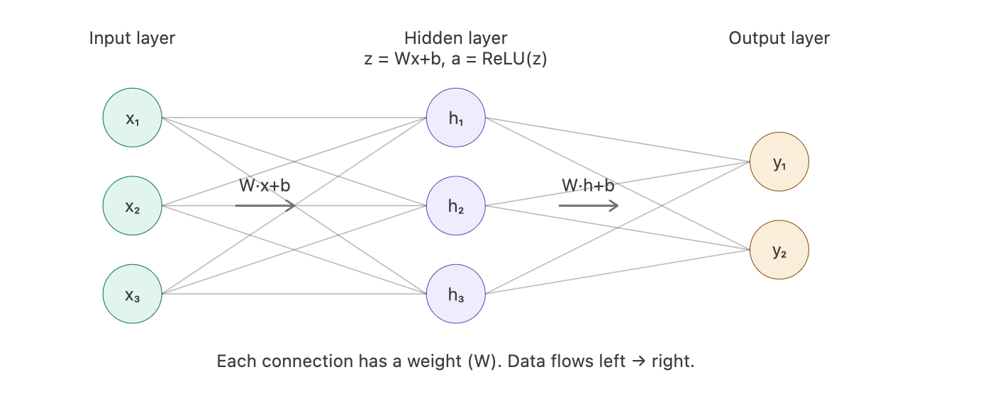
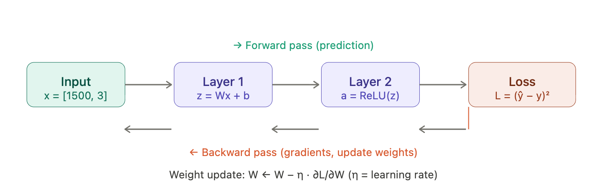
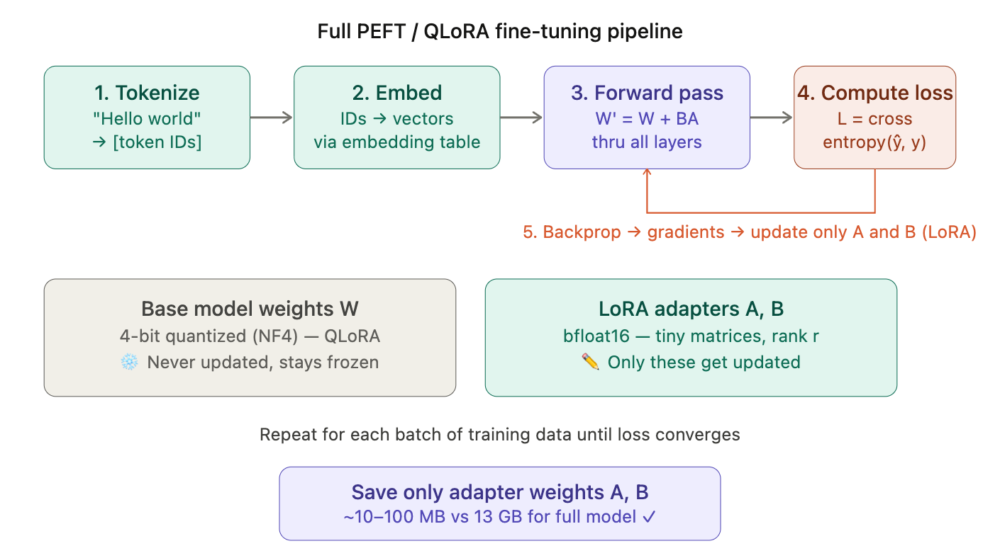

# <u> 
 GenAI Under the Hood: Fine-Tuning LLMs with LoRA & Quantization </u> 

----

## Module 1: Welcome & Workshop Overview
- Introductions and learning objectives
- Agenda walkthrough
- Tools setup check (Colab GPU availability)
- Overview: Fine-tune a 1B parameter LLM using LoRA with quantization

## Module 2: Why Fine-Tune LLMs?
- Understanding the limitations of base models and need for customization
- Generic vs domain-specific responses
- Customization needs in real applications
- Traditional fine-tuning challenges

## Module 3: Parameter Efficient Fine-Tuning (PEFT) & LoRA
- Full fine-tuning vs PEFT
- Adapters and prefix tuning
- LoRA overview & Low-rank decomposition intuition
- Understanding LoRA hyperparameters (rank, alpha, dropout)

## Module 4: Quantization for LLMs
- Precision formats (FP32, FP16)
- 8-bit and 4-bit quantization
- Memory savings from quantization
- Introduction to bitsandbytes

## Module 5: Model & Environment Setup
- Overview of TinyLlama
- Chat-optimized LLMs and causal language modeling
- Setting up environment in Google Colab
- Installing dependencies and verifying GPU availability

## Module 6: Loading Quantized LLM & Configuring LoRA
- Load tokenizer and model
- Apply 4-bit quantization
- Inspect model structure and GPU memory usage
- Configure LoRA adapters & Identify trainable parameters

## Module 7: Dataset Preparation, Training & Evaluation
- Prepare the Stanford Alpaca dataset
- Tokenize and filter training data
- Generate baseline model outputs
- Run LoRA fine-tuning using Hugging Face Trainer API
- Compare responses before and after training

## Module 8: Wrap-Up & Live Q&A
- Key takeaways from LoRA and quantization
- Industry use cases and deployment considerations
- Career paths in LLM engineering

-----

## Notes: 

- Transfer Learning 
- Feed forward 
- Back Propagation 
- Parameters &rarr; Weights ??
- Tokens
- Parameter Efficient Fine Tuning - LoRA 
- PEFT - QLoRA (Quantized LoRA) 

Let's go through each concept one by one, building up your intuition from the ground up.

---

## 1. Transfer Learning

Imagine you already know how to ride a bicycle. When you want to learn to ride a motorcycle, you don't start from scratch — you *transfer* your balance skills. That's transfer learning.

In AI, a model pre-trained on billions of examples (like GPT or LLaMA) has already learned general patterns: grammar, logic, facts. Fine-tuning *transfers* that knowledge to a specific task (e.g., customer support, medical Q&A) by training on a small, specialized dataset.

**The math**: the pre-trained model has weights **W**. Fine-tuning continues gradient descent starting from **W** instead of random weights. The loss function only uses your small dataset:

> **W_new = W_pretrained − η · ∇L(W_pretrained)**

---

## 2. Feed Forward (Forward Pass)

This is how data flows *through* a neural network to make a prediction. Think of it like an assembly line — raw input goes in, and a prediction comes out.

Each layer does two things: **multiply inputs by weights**, then apply a **non-linear function** (called an activation):

> **z = W · x + b** ← linear transformation
> **a = ReLU(z) = max(0, z)** ← activation

 

**Concrete example**: Predicting house price.
- Input: `x = [size=1500sqft, bedrooms=3]`
- Weights: `W = [0.5, 20]`, bias `b = 10`
- `z = (0.5 × 1500) + (20 × 3) + 10 = 820` → that's the predicted price (×$1000 = $820k)

---

## 3. Back Propagation

The forward pass gives a *wrong* answer at first. Backpropagation is how the model **learns from its mistake** — it flows the error *backwards* through the network and adjusts every weight a tiny bit.

Think of it like this: you throw a dart, miss the bullseye, and mentally trace back *which arm angle* caused the miss, then correct it. The key tool is the **chain rule** from calculus:

> **∂L/∂W₁ = (∂L/∂a) × (∂a/∂z) × (∂z/∂W₁)**

"How much did the loss change because of W₁?" is the product of how each step affected the next.

**Intuition on the weight update**: if the gradient `∂L/∂W = +5`, the weight is making the error *bigger* in the positive direction, so we subtract a small amount. The learning rate **η** (like 0.001) controls how big each step is — too big and you overshoot, too small and training takes forever.

---

## 4. Parameters → Weights

"Parameters" and "weights" are often used interchangeably. Here's the precise breakdown:

| Term | What it is | Example |
|---|---|---|
| **Weight (W)** | A number on each connection between neurons | `W = 0.73` |
| **Bias (b)** | An offset added to shift the output | `b = -0.2` |
| **Parameter** | Any learnable number (weights + biases) | All W's and b's together |

A model with "7 billion parameters" literally has 7,000,000,000 individual floating-point numbers. Training = finding the best values for all of them. During fine-tuning, we adjust these to fit the new task.

> **Total parameters = Σ (W_layer + b_layer) for all layers**

For a simple layer with 1000 inputs → 500 outputs: `(1000 × 500) weights + 500 biases = 500,500 parameters`.

---

## 5. Tokens

A model doesn't read words — it reads **tokens**, which are chunks of text. Tokenization splits text into subword units so the model can handle any word, even ones it's never seen.

Each token ID is then looked up in an **embedding table** — a giant matrix where each row is a vector of floats representing that token's meaning. A LLaMA 7B model's embedding has 4096 numbers per token.

> **~1 token ≈ ¾ of an English word. 100 tokens ≈ 75 words.**

---

## 6. LoRA — Low-Rank Adaptation (the heart of PEFT)

Here's the problem: fine-tuning a 7B parameter model updates all 7 billion weights — extremely expensive in GPU memory and compute.

**LoRA's insight**: the *change* needed to adapt a model is low-rank — meaning you don't need to update the full weight matrix **W** (e.g. 4096×4096 = 16M numbers). Instead, you approximate the update as two *tiny* matrices multiplied together.

### The Matrix Math

Let **W** be a weight matrix of shape `(d × d)` — say `4096 × 4096`.

Instead of computing **ΔW** (4096×4096 = 16M parameters), LoRA says:

> **ΔW ≈ B · A** where A is `(d × r)` and B is `(r × d)`, and **r << d** (e.g. r=8)

So instead of 16M numbers, you only train `4096×8 + 8×4096 = 65,536` numbers — **244× fewer parameters!**

The new effective weight during inference is:

> **W' = W + B · A**

 

**Why does low-rank work?** Research shows that the *meaningful changes* needed to adapt a model to a new task live in a low-dimensional subspace. You don't need to rotate every dimension — just a few "directions" account for most of the adaptation signal.

**The rank `r`** is a hyperparameter you choose:
- `r = 4` → very few parameters, faster but less expressive
- `r = 64` → more expressive, approaching full fine-tuning
- Common sweet spot: `r = 8` or `r = 16`

> **Trainable params with LoRA** = `2 × d × r` per layer (both A and B matrices)
>
> For d=4096, r=8: `2 × 4096 × 8 = 65,536` vs `4096² = 16,777,216` — that's **0.4% of original!**

---

## 7. QLoRA — Quantized LoRA

QLoRA = LoRA + **Quantization**. It solves the memory problem even further.

**Quantization** means storing weights in lower precision:
- Normal model: weights stored as 32-bit floats (`float32`)
- Quantized model: weights stored as **4-bit integers** (`int4`)
- Memory savings: **8× less memory** than float32, **4× less** than float16

**The quantization math** — mapping float32 → int4:

Given a weight tensor with values in range `[-2.5, 2.5]`, NF4 quantization maps them onto 16 fixed "buckets" (4-bit = 2⁴ = 16 levels):

> `q = round((w - min) / (max - min) × 15)`
>
> To recover: `w̃ = q / 15 × (max - min) + min`

The precision loss is small because the LoRA adapters (in full float16) compensate for any rounding errors.

---

## Putting It All Together---

## Summary Cheatsheet

| Concept | Core idea | Key formula |
|---|---|---|
| **Transfer learning** | Reuse pretrained weights | Start from W_pretrained |
| **Feed forward** | Data flows input → output through layers | `a = ReLU(Wx + b)` |
| **Backprop** | Errors flow backwards, weights updated via chain rule | `W ← W − η·∂L/∂W` |
| **Parameters/weights** | The learnable numbers of the model | W (connections) + b (biases) |
| **Tokens** | Subword chunks; each → integer ID → embedding vector | ~¾ word per token |
| **LoRA** | Approximate ΔW as two tiny matrices B·A | `W' = W + BA`, rank r ≪ d |
| **QLoRA** | LoRA on top of 4-bit quantized base model | `W' = dequant(W) + BA` |

The elegance of QLoRA is that it combines all of these ideas: tokens feed forward through a near-frozen, memory-efficient quantized model, backprop updates only the tiny LoRA matrices, and you end up with a specialized model that fits on a laptop GPU.

