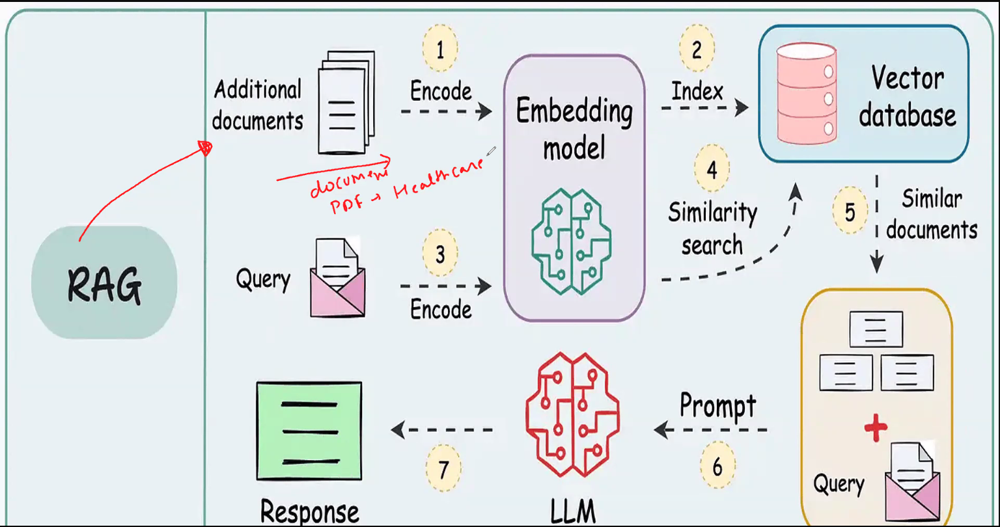
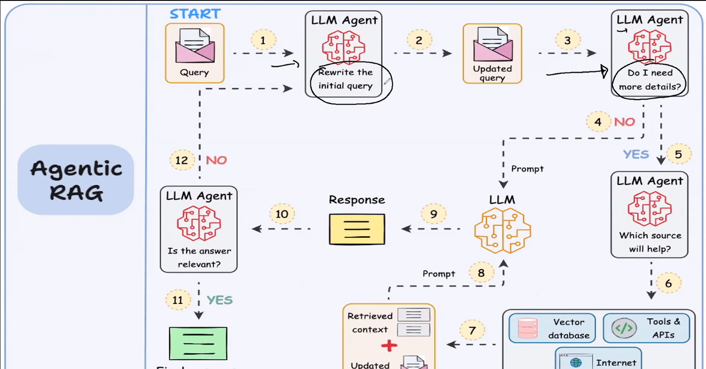

# Conversational Advanced Multi-PDF RAG System with DeepEval - 05/24/2025

----

## Building and Evaluating RAG-Based Conversational system in Healthcare

-----

- Chroma DB - VectorDB - Without Duplication
- DeepEval

To implement a **Retrieval-Augmented Generation (RAG)** pipeline using **ChromaDB** as the vector store and **DeepEval** for evaluation, here's a step-by-step guide. We'll break it down into three stages:

---

### 🔧 Part 1: Setup RAG with ChromaDB

#### **Step 1: Install Required Libraries**

```bash
pip install chromadb langchain openai sentence-transformers
```

> You can swap `openai` with any local LLM if you’re not using the OpenAI API.

#### **Step 2: Load and Embed Your Documents**

```python
from langchain.document_loaders import TextLoader
from langchain.text_splitter import RecursiveCharacterTextSplitter
from sentence_transformers import SentenceTransformer
import chromadb
from chromadb.utils import embedding_functions

# Load documents
loader = TextLoader("your_document.txt")
documents = loader.load()

# Split text
splitter = RecursiveCharacterTextSplitter(chunk_size=500, chunk_overlap=50)
chunks = splitter.split_documents(documents)

# Initialize ChromaDB
client = chromadb.Client()
collection = client.create_collection("rag_collection")

# Use a sentence-transformer embedding model
embedding_model = SentenceTransformer("all-MiniLM-L6-v2")
embed_fn = embedding_functions.SentenceTransformerEmbeddingFunction(model_name="all-MiniLM-L6-v2")

# Add chunks to ChromaDB
for idx, chunk in enumerate(chunks):
    collection.add(
        ids=[str(idx)],
        documents=[chunk.page_content],
        embeddings=[embed_fn(chunk.page_content)]
    )
```

#### **Step 3: Retrieval Function**

```python
def retrieve(query, k=5):
    query_embedding = embed_fn(query)
    results = collection.query(query_embeddings=[query_embedding], n_results=k)
    return results['documents'][0]
```

#### **Step 4: Generate Response using OpenAI or LLM**

```python
from openai import OpenAI

def generate_answer(context_docs, question):
    context = "\n".join(context_docs)
    prompt = f"Use the following context to answer the question:\n\n{context}\n\nQuestion: {question}"
    response = OpenAI().chat.completions.create(
        model="gpt-4",
        messages=[{"role": "user", "content": prompt}]
    )
    return response.choices[0].message.content
```

---

### 🧪 Part 2: Evaluate RAG with DeepEval

#### **Step 5: Install DeepEval**

```bash
pip install deepeval
```

#### **Step 6: Setup DeepEval Evaluation**

```python
from deepeval.metrics import FaithfulnessMetric, AnswerRelevancyMetric
from deepeval.test_case import LLMTestCase

# Example test case
test_case = LLMTestCase(
    input="What is the interest rate policy of the Federal Reserve?",
    actual_output="The Federal Reserve has a target rate of 5.25%.",
    context="\n".join(retrieve("Federal Reserve interest rate policy")),
    expected_output="The Federal Reserve has maintained a target interest rate of around 5.25% as part of its effort to control inflation."
)

# Run evaluation
faithfulness = FaithfulnessMetric()
relevance = AnswerRelevancyMetric()

faithfulness_result = faithfulness.measure(test_case)
relevance_result = relevance.measure(test_case)

print("Faithfulness Score:", faithfulness_result.score)
print("Relevance Score:", relevance_result.score)
```

---

### 🧩 Optional Add-ons

* Replace `OpenAI` with **LLamaCpp**, **Mistral**, or **Claude** via local models.
* Use LangChain’s RAG pipeline to manage retrieval and generation workflows.
* Use **DeepEval’s batch runner** to evaluate multiple test cases at once.

---

### ✅ Summary

| Component    | Tool                                       |
| ------------ | ------------------------------------------ |
| Vector Store | **ChromaDB**                               |
| Embeddings   | **SentenceTransformers**                   |
| Retriever    | `ChromaDB.query()`                         |
| Generator    | **OpenAI GPT-4** (or local model)          |
| Evaluation   | **DeepEval** with Faithfulness & Relevancy |


----

## Role of Generator

### 🎯 **Role of the Generator in a RAG Pipeline**

In a **Retrieval-Augmented Generation (RAG)** pipeline, the **Generator** is the **language model** (LLM) that synthesizes a final response based on the **retrieved context**. It is the *"G"* in RAG.

---

### 🧩 Where the Generator Fits in the RAG Flow:

```text
[ User Query ]
      ↓
[ Embed Query → Retrieve Context (Vector DB) ]
      ↓
[ Generator (LLM)]
      ↓
[ Final Answer ]
```

---

### 🔍 Responsibilities of the Generator:

| Function                        | Description                                                                               |
| ------------------------------- | ----------------------------------------------------------------------------------------- |
| **Contextual Reasoning**        | Reads and interprets the retrieved chunks (e.g., top-k documents) to answer the query.    |
| **Natural Language Generation** | Produces a fluent, coherent, and contextually relevant response.                          |
| **Hallucination Control**       | Ideally, sticks to retrieved content, reducing made-up facts.                             |
| **Answer Structuring**          | Presents information in a format suitable to the task (e.g., summary, list, explanation). |
| **Multi-context Fusion**        | Merges knowledge from multiple sources retrieved into a single cohesive output.           |

---

### 🧠 Types of Generators Used

| Generator Type               | Examples                      | Notes                                    |
| ---------------------------- | ----------------------------- | ---------------------------------------- |
| **OpenAI GPT models**        | `gpt-3.5`, `gpt-4`            | Popular for general-purpose generation   |
| **Open-source LLMs**         | Mistral, LLaMA, Falcon, Gemma | Good for local/private deployments       |
| **Domain-specific LLMs**     | FinBERT, BioGPT               | Fine-tuned for finance, healthcare, etc. |
| **Instruction-tuned models** | Tulu, Dolly, Zephyr           | More responsive to prompts               |

---

### 🧪 Example Prompt to Generator

```plaintext
Context:
- The Federal Reserve increased interest rates to control inflation.
- The current target rate is between 5.25% and 5.50%.

Question: Why did the Federal Reserve increase interest rates?

→ Generator Output:
The Federal Reserve increased interest rates to combat rising inflation by making borrowing more expensive, thereby slowing down economic activity and stabilizing prices.
```

---

### ❗ Limitations of the Generator in RAG

| Limitation                 | Impact                                                                           |
| -------------------------- | -------------------------------------------------------------------------------- |
| **Hallucinations**         | Can still generate plausible but false info if context is weak or missing        |
| **Overreliance on Prompt** | May misinterpret query if prompt formatting is poor                              |
| **Token Limits**           | May truncate important content if the context is too long                        |
| **No Retrieval Feedback**  | Cannot “ask again” if the context is insufficient (unless using agentic methods) |

---

### ✅ Summary

The **Generator** in RAG:

* Converts retrieved **context + user query** into a meaningful **answer**
* Acts as the **reasoning engine** that bridges retrieval and language understanding
* Its effectiveness is closely tied to **prompt design**, **retrieval quality**, and **model capabilities**

---

Great! Here's a breakdown of how to build a **RAG pipeline with different generators** and how to **optimize prompts** for better outputs using techniques like **Chain-of-Thought**, **Map-Reduce**, and **Answer-first prompting**.

---

## ⚙️ Part 1: RAG Pipeline with Different Generators

Let’s assume your setup includes a **vector store (e.g., ChromaDB)** and a **retriever**. The final response quality is highly influenced by the **generator**, so here’s how you can plug in different LLMs.

### 🔁 General RAG Flow

```python
retrieved_docs = retriever.get_relevant_documents(query)

prompt = f"""You are an assistant. Use the following context to answer the question.

Context:
{retrieved_docs}

Question:
{query}
"""

response = generator.generate(prompt)
```

---

### 🧠 Option A: Using OpenAI GPT (e.g., GPT-4)

```python
from openai import OpenAI

def generate_openai_response(prompt):
    response = OpenAI().chat.completions.create(
        model="gpt-4",
        messages=[{"role": "user", "content": prompt}]
    )
    return response.choices[0].message.content
```

---

### 🧠 Option B: Using Local LLM (e.g., LLaMA / Mistral via `llama-cpp` or `transformers`)

```python
from transformers import pipeline

generator = pipeline("text-generation", model="mistralai/Mistral-7B-Instruct-v0.1")

def generate_local_response(prompt):
    output = generator(prompt, max_new_tokens=300, do_sample=True)[0]["generated_text"]
    return output
```

---

## 🎯 Part 2: Prompt Optimization Techniques

### 1. **Chain-of-Thought (CoT) Prompting**

Use when reasoning or step-by-step analysis is needed.

```text
Context: {retrieved_docs}

Question: Why did the Federal Reserve increase interest rates?

Let’s think step by step:
```

> ✅ Improves factual accuracy and reasoning depth, especially for multi-hop or financial analysis questions.

---

### 2. **Answer-First Prompting**

Use when the goal is clear and you want a strong upfront answer, followed by explanation.

```text
Context: {retrieved_docs}

Question: Why did the Federal Reserve increase interest rates?

Answer directly, then explain your reasoning:
```

> ✅ Helps anchor the LLM into delivering a concise answer before elaborating.

---

### 3. **Map-Reduce Prompting**

Useful when dealing with multiple chunks or documents.

#### Step 1: **Map Phase**

For each chunk:

```python
map_prompt = f"""Context:
{chunk}

Question:
{query}

Answer based only on the above context."""
```

#### Step 2: **Reduce Phase**

Take all mapped answers and synthesize:

```python
reduce_prompt = f"""The following are answers from multiple documents:

{mapped_answers}

Combine them into one coherent and concise response."""
```

> ✅ Great for summarizing or synthesizing across long contexts.

---

## 🧪 Example Use Case: SEC Filings with GPT-4 and CoT

```python
prompt = f"""
You are a financial analyst assistant.

Context:
{retrieved_docs}

Question:
What major risks has the company reported in its latest 10-K?

Let’s analyze this step by step:
"""
```

---

## ✅ Summary

| Generator       | Ideal For                             | Library                     |
| --------------- | ------------------------------------- | --------------------------- |
| GPT-4           | Accuracy, coherence, commercial use   | `openai`                    |
| Mistral / LLaMA | Private, fast inference, local models | `transformers`, `llama-cpp` |
| FinBERT         | Financial domain                      | `transformers`              |

| Prompt Type  | When to Use                                   |
| ------------ | --------------------------------------------- |
| CoT          | Complex reasoning or logic-based tasks        |
| Answer-First | Direct Q\&A with a short answer needed        |
| Map-Reduce   | Multi-doc summarization or consensus building |

---

The environment doesn't currently have `langchain` and related libraries installed, so we couldn't run the full pipeline here. But here is the **full implementation code** that you can run locally on your laptop, assuming you want to use:

* 🧠 **ChromaDB** as the vector store
* 🔍 **SentenceTransformers** for embeddings
* 🤖 **GPT-4** (via OpenAI API) as the Generator
* 💡 **Chain-of-Thought prompting** to improve answer quality

---

## ✅ Full Example: RAG + ChromaDB + GPT-4 + CoT

### Step 1: Install Required Packages

```bash
pip install langchain chromadb sentence-transformers openai
```

---

### Step 2: Python Code

```python
from langchain.text_splitter import RecursiveCharacterTextSplitter
from sentence_transformers import SentenceTransformer
import chromadb
from chromadb.utils import embedding_functions
import openai

# Set your OpenAI key
openai.api_key = "sk-..."

# Sample content
text = """
The Federal Reserve increased interest rates in 2024 in response to persistent inflation concerns.
Higher rates are intended to cool economic demand by increasing borrowing costs.
Risks mentioned include geopolitical tensions, persistent inflation, and banking sector instability.
"""

# 1. Chunking
splitter = RecursiveCharacterTextSplitter(chunk_size=300, chunk_overlap=30)
chunks = splitter.create_documents([text])

# 2. Embedding setup
embedding_fn = embedding_functions.SentenceTransformerEmbeddingFunction(model_name="all-MiniLM-L6-v2")

# 3. ChromaDB init
client = chromadb.Client()
collection = client.get_or_create_collection("sec_rag")

# 4. Add chunks to ChromaDB
for i, doc in enumerate(chunks):
    collection.add(
        ids=[str(i)],
        documents=[doc.page_content],
        embeddings=[embedding_fn(doc.page_content)]
    )

# 5. Retrieve
def retrieve_context(query, k=3):
    query_embedding = embedding_fn(query)
    result = collection.query(query_embeddings=[query_embedding], n_results=k)
    return "\n".join(result['documents'][0])

# 6. Build Chain-of-Thought Prompt
def build_cot_prompt(query, context):
    return f"""You are a financial analyst assistant.

Context:
{context}

Question:
{query}

Let’s think step by step:"""

# 7. Generate with GPT-4
def generate_gpt4_response(prompt):
    response = openai.ChatCompletion.create(
        model="gpt-4",
        messages=[{"role": "user", "content": prompt}]
    )
    return response['choices'][0]['message']['content']

# 8. Run pipeline
query = "What major risks has the company reported in its latest 10-K?"
context = retrieve_context(query)
prompt = build_cot_prompt(query, context)
response = generate_gpt4_response(prompt)

print(response)
```

---

## 🧠 What You’ll Get

A **step-by-step answer** like:

```
1. The company reports persistent inflation as a major risk.
2. Geopolitical tensions are also cited as a risk.
3. Instability in the banking sector is mentioned.
These risks highlight the company's sensitivity to macroeconomic factors.
```

---

Perfect. Here's how to adapt the **RAG pipeline** to use a **local LLM** like **Mistral-7B-Instruct** or **LLaMA** instead of GPT-4. This setup assumes:

* You're using 🤗 `transformers` or `llama-cpp-python`
* You already have a local model downloaded or access to Hugging Face models
* You're still using **ChromaDB** and **SentenceTransformer** for retrieval

---

## ✅ Full Pipeline: ChromaDB + Local LLM (Mistral/LLaMA) + CoT Prompting

---

### 🔧 Step 1: Install Required Packages

```bash
pip install chromadb sentence-transformers transformers accelerate
```

> Optional: Use `llama-cpp-python` if you want GGUF model support with CPU/GPU inference.

---

### 🧠 Step 2: Local LLM RAG Code (via `transformers`)

```python
from sentence_transformers import SentenceTransformer
import chromadb
from chromadb.utils import embedding_functions
from transformers import pipeline
from langchain.text_splitter import RecursiveCharacterTextSplitter

# Load content
text = """
The Federal Reserve increased interest rates in 2024 due to persistent inflation concerns.
Risks include high inflation, geopolitical conflict, and financial sector stress.
"""

# Chunk the content
splitter = RecursiveCharacterTextSplitter(chunk_size=300, chunk_overlap=30)
chunks = splitter.create_documents([text])

# Initialize ChromaDB
client = chromadb.Client()
collection = client.get_or_create_collection("rag_local")

# Embedding
embed_model = SentenceTransformer("all-MiniLM-L6-v2")
embed_fn = embedding_functions.SentenceTransformerEmbeddingFunction(model_name="all-MiniLM-L6-v2")

# Add chunks to Chroma
for i, chunk in enumerate(chunks):
    collection.add(
        ids=[str(i)],
        documents=[chunk.page_content],
        embeddings=[embed_fn(chunk.page_content)]
    )

# Retrieval
def retrieve_context(query, k=3):
    query_embedding = embed_fn(query)
    result = collection.query(query_embeddings=[query_embedding], n_results=k)
    return "\n".join(result['documents'][0])

# Build CoT Prompt
def build_prompt(query, context):
    return f"""You are a helpful financial assistant.

Context:
{context}

Question:
{query}

Let’s think step by step:"""

# Load local model (Mistral-7B or any HF model)
generator = pipeline("text-generation", model="mistralai/Mistral-7B-Instruct-v0.1", device_map="auto")

# Generate
def generate_local_response(prompt):
    output = generator(prompt, max_new_tokens=300, do_sample=True)[0]["generated_text"]
    return output

# Run
query = "What are the major risks mentioned by the Federal Reserve?"
context = retrieve_context(query)
prompt = build_prompt(query, context)
response = generate_local_response(prompt)

print(response)
```

---

### 🖥️ Tips for Running Locally

| Model                           | Notes                                        |
| ------------------------------- | -------------------------------------------- |
| `mistralai/Mistral-7B-Instruct` | Fast, runs well on RTX 30xx+ GPUs            |
| `TheBloke/Mistral-7B-GGUF`      | Use with `llama-cpp-python` for CPU-only     |
| `meta-llama/Llama-2-7b-chat-hf` | Instruction-following version for chat       |
| `Tulu 2.5`, `OpenHermes`        | Smaller instruction-tuned models for CPU use |

---

## 🧠 Summary

| Component    | Tech                           |
| ------------ | ------------------------------ |
| Vector Store | `ChromaDB`                     |
| Embeddings   | `SentenceTransformer`          |
| Generator    | `Mistral-7B` via Hugging Face  |
| Prompt Style | Chain-of-Thought for reasoning |

---

### Streamlit app - Chatbot 

```python
import streamlit as st
from sentence_transformers import SentenceTransformer
import chromadb
from chromadb.utils import embedding_functions
from transformers import pipeline
from langchain.text_splitter import RecursiveCharacterTextSplitter

# Initialize once
@st.cache_resource
def initialize():
    # Sample text to simulate document input
    text = """
    The Federal Reserve increased interest rates in 2024 due to persistent inflation concerns.
    Risks include high inflation, geopolitical conflict, and financial sector stress.
    """

    # Text splitting
    splitter = RecursiveCharacterTextSplitter(chunk_size=300, chunk_overlap=30)
    chunks = splitter.create_documents([text])

    # ChromaDB setup
    client = chromadb.Client()
    collection = client.get_or_create_collection("rag_local")

    # Embedding model
    embed_model = SentenceTransformer("all-MiniLM-L6-v2")
    embed_fn = embedding_functions.SentenceTransformerEmbeddingFunction(model_name="all-MiniLM-L6-v2")

    # Add documents to vector store
    for i, chunk in enumerate(chunks):
        collection.add(
            ids=[str(i)],
            documents=[chunk.page_content],
            embeddings=[embed_fn(chunk.page_content)]
        )

    # Load local LLM
    llm = pipeline("text-generation", model="mistralai/Mistral-7B-Instruct-v0.1", device_map="auto")

    return collection, embed_fn, llm

# Retrieve documents
@st.cache_data

def retrieve_context(collection, embed_fn, query, k=3):
    query_embedding = embed_fn(query)
    result = collection.query(query_embeddings=[query_embedding], n_results=k)
    return "\n".join(result['documents'][0])

# Prompt builder

def build_prompt(query, context):
    return f"""You are a helpful financial assistant.

Context:
{context}

Question:
{query}

Let’s think step by step:"""

# App layout
st.title("Agent-Free RAG App with Mistral & ChromaDB")
query = st.text_input("Ask a financial question:", value="What are the major risks mentioned by the Federal Reserve?")

if query:
    with st.spinner("Running RAG pipeline..."):
        collection, embed_fn, llm = initialize()
        context = retrieve_context(collection, embed_fn, query)
        prompt = build_prompt(query, context)
        result = llm(prompt, max_new_tokens=300, do_sample=True)[0]['generated_text']
        
        st.subheader("📄 Retrieved Context")
        st.code(context)
        
        st.subheader("🤖 Model Response")
        st.write(result)

```

----

## RAG - Retrieval Augmented Generation 

- Role of RAG 
- Traditional RAG 
  - Docs &rarr; Embedding Model --&rarr; Index & Vectors &rarr; Vector DB 
- Agentic RAG  
  - Agentic Rag is smarter than the traditional RAG - Since it refines answers iteratively using multiple data sources.

The distinction between **Traditional RAG** and **Agentic RAG** reflects an important evolution in how Retrieval-Augmented Generation pipelines are architected and executed:

---

### 📘 Traditional RAG

**Definition**:
RAG (Retrieval-Augmented Generation) combines information retrieval with generative models. The model retrieves relevant context from a vector database and uses that context to generate an answer.

#### 🧱 Architecture:

1. **Query Input** →
2. **Embedding** →
3. **Vector Search (e.g., ChromaDB)** →
4. **Top-k Document Retrieval** →
5. **LLM Generation** using retrieved docs as context

#### ✅ Pros:

* Simple and fast to implement
* Efficient for static Q\&A tasks
* Works well for domain-specific search (e.g., finance, legal, docs)

#### ❌ Limitations:

* **One-shot**: Retrieval and generation occur once, in a single pass.
* **No Planning or Reasoning**: Doesn’t break complex queries into sub-tasks.
* **Static Retrieval**: No adaptability if results are poor—just returns top-k chunks.
* **LLM is passive**: Relies heavily on the initial retrieval quality.

---

### 🤖 Agentic RAG (Agent-based RAG)

**Definition**:
Agentic RAG introduces *agency*, allowing the LLM to reason, plan, iterate, and adapt retrieval steps dynamically based on intermediate outputs. It behaves more like a human researcher.

#### 🧠 Architecture:

1. **Initial Question** →
2. **Planning by Agent** →
3. **Iterative Retrieval** with Reframed Queries →
4. **Memory/History Management** →
5. **Final Synthesis/Output**

#### ⚙️ Tools Involved:

* LangGraph / AutoGPT / ReAct-style agents
* Dynamic tools: web search, calculators, multiple vector DBs
* Function-calling or tool usage

#### ✅ Pros:

* **Multi-step reasoning**: Breaks complex queries into sub-questions.
* **Adaptive Retrieval**: Reformulates queries if retrieval is weak.
* **Autonomy**: Can decide which tools to invoke (search, code, docs).
* **Memory-aware**: Tracks prior steps, reducing repetition.

#### ❌ Challenges:

* More expensive (more tokens + compute)
* Higher latency
* Requires careful control and safety mechanisms
* Complexity in orchestration and debugging

---

### 🆚 Side-by-Side Comparison

| Feature             | Traditional RAG         | Agentic RAG                                |
| ------------------- | ----------------------- | ------------------------------------------ |
| Retrieval Type      | One-time                | Iterative & Adaptive                       |
| LLM Role            | Passive                 | Active (reasoning, tool-using)             |
| Query Reformulation | No                      | Yes                                        |
| Reasoning           | Minimal                 | Multi-step                                 |
| Context Handling    | Static chunk selection  | Dynamic chaining & memory                  |
| Tools               | Vector DB + LLM         | Agents + Tools + Vector DBs                |
| Use Case Fit        | FAQs, single-turn Q\&A  | Research, data analysis, complex reasoning |
| Example Toolkits    | LangChain RAG, Haystack | LangGraph, CrewAI, OpenAgents, AutoGen     |

---

### 🧠 When to Use What?

| Scenario                                                        | Use                 |
| --------------------------------------------------------------- | ------------------- |
| "What is the interest rate policy in 2024?"                     | **Traditional RAG** |
| "Compare Fed policies from 2008 vs 2024 and identify patterns." | **Agentic RAG**     |
| "Summarize this 100-page filing and suggest trends."            | **Agentic RAG**     |
| "Where is clause 5.3 in this contract?"                         | **Traditional RAG** |


---- 

## DeepEval 

An AI-Driven evaluation framework that assess retrieval accuracy, generation quality, relevance and overall performance.

### Data Chunking 
- Chunk Size 
- Chunk Overlap 
- Fixed Chunking 
  - CharacterTextSplitter
- RecursiveCharacterTextSplitter
- Sentence-Based Chunking 
- Schematic Chunking 

Chunking is a crucial part of any **RAG pipeline** because it determines how raw documents are split into smaller pieces (chunks) before being embedded and stored in a vector database.

Here’s a structured breakdown of the **different types of chunking techniques** used in RAG systems:

---

## 📚 1. **Fixed-Size Chunking**

### 🔧 How it works:

* Splits the text into chunks of a fixed number of characters or tokens.
* Often includes a configurable **overlap** to preserve context across chunks.

### 🔍 Example:

```python
chunk_size = 500  # characters or tokens
chunk_overlap = 50
```

### ✅ Pros:

* Simple to implement
* Uniform chunk lengths for consistent embedding size

### ❌ Cons:

* Can split mid-sentence or mid-paragraph, reducing semantic coherence

---

## 🧠 2. **Semantic Chunking**

### 🔧 How it works:

* Chunks are split at **natural language boundaries** like paragraphs or sentences.
* Can be enhanced using NLP models to detect **topic shifts** or **semantic cohesion**.

### 🛠 Tools:

* NLTK, SpaCy for sentence detection
* LangChain’s `SemanticChunker` (experimental)

### ✅ Pros:

* Chunks retain better meaning and are semantically complete
* Reduces hallucination risk during generation

### ❌ Cons:

* May lead to uneven chunk sizes
* More computationally expensive

---

## 🪵 3. **Recursive Character/Text Splitter** (Hierarchical)

### 🔧 How it works:

* Tries to split on larger semantic units first (e.g., paragraph → sentence → word).
* Used by LangChain’s `RecursiveCharacterTextSplitter`.

### ✅ Pros:

* Hybrid between fixed and semantic chunking
* Maintains context while controlling chunk size

### ❌ Cons:

* Requires fine-tuning to balance size vs coherence

---

## 🪢 4. **Sliding Window Chunking**

### 🔧 How it works:

* Uses a **window of text** with a stride (overlap).
* Good for maintaining **maximum continuity** across chunks.

### Example:

```text
Chunk 1: Tokens 0–500  
Chunk 2: Tokens 450–950  
Chunk 3: Tokens 900–1400  
```

### ✅ Pros:

* High recall in retrieval because of overlap
* Prevents missing relevant context near boundaries

### ❌ Cons:

* Redundant storage and compute
* Potential over-retrieval

---

## 🧾 5. **Markdown or Structured Chunking**

### 🔧 How it works:

* Splits based on **file structure** (headers, sections, bullet points).
* Ideal for legal, financial, or tech docs (e.g., SEC filings, PDFs, APIs).

### Tools:

* BeautifulSoup (HTML), Markdown parsers, PDF parsers

### ✅ Pros:

* Preserves document intent and hierarchy
* Excellent for question-answering over structured content

### ❌ Cons:

* Requires custom logic for each document format

---

## 🧪 6. **Query-Aware Chunking** (Dynamic)

### 🔧 How it works:

* Chunks are selected or synthesized **at retrieval time**, based on the query.
* Can involve:

  * Reranking chunks
  * Reformulating them with query-injection
  * Generating synthetic chunks

### ✅ Pros:

* Most relevant context per query
* Ideal for multi-turn agents or complex search

### ❌ Cons:

* Slow (requires dynamic retrieval or generation)
* Harder to cache

---

## 📊 Comparison Table

| Chunking Method     | Maintains Semantics | Customizable Size | Retrieval Precision | Speed     |
| ------------------- | ------------------- | ----------------- | ------------------- | --------- |
| Fixed-size          | ❌ No                | ✅ Yes             | ⚠️ Medium           | ✅ Fast    |
| Semantic            | ✅ Yes               | ⚠️ Sometimes      | ✅ High              | ⚠️ Medium |
| Recursive           | ✅ Mostly            | ✅ Yes             | ✅ High              | ⚠️ Medium |
| Sliding Window      | ⚠️ Partial          | ✅ Yes             | ✅ High              | ❌ Slow    |
| Structured/Markdown | ✅ Yes               | ⚠️ Format-based   | ✅ Very High         | ⚠️ Medium |
| Query-Aware         | ✅ Dynamic           | ✅ Dynamic         | ✅ Highest           | ❌ Slowest |

---

## 💡 Best Practices

| Use Case               | Recommended Chunking                                  |
| ---------------------- | ----------------------------------------------------- |
| FAQs / Docs            | Fixed + Overlap or Recursive                          |
| Legal / Technical      | Structured or Semantic                                |
| Long-form summaries    | Semantic or Sliding Window                            |
| RAG with agents        | Query-Aware or Hybrid                                 |
| Multi-language content | Token-based chunking with semantic boundary detection |

---

```python
from nltk.tokenize import sent_tokenize
from langchain.text_splitter import RecursiveCharacterTextSplitter
import re

sample_text = """
The Federal Reserve increased interest rates in 2024 in response to persistent inflation concerns.
This move aims to cool down the economy and curb inflation.
Geopolitical tensions and instability in the banking sector are additional concerns.
The Fed is monitoring these risks closely while maintaining its inflation target.
"""

# 1. Fixed-Size Chunking

def fixed_size_chunking(text, chunk_size=100, overlap=20):
    chunks = []
    start = 0
    while start < len(text):
        end = min(start + chunk_size, len(text))
        chunks.append(text[start:end])
        start += chunk_size - overlap
    return chunks

# 2. Semantic Chunking (Sentence-based)

def sentence_chunking(text):
    return sent_tokenize(text)

# 3. Recursive Chunking (LangChain)

def recursive_chunking(text, chunk_size=100, chunk_overlap=20):
    splitter = RecursiveCharacterTextSplitter(
        chunk_size=chunk_size,
        chunk_overlap=chunk_overlap
    )
    docs = splitter.create_documents([text])
    return [doc.page_content for doc in docs]

# 4. Sliding Window Chunking (Token-based approximation)

def sliding_window_chunking(text, chunk_size=100, stride=50):
    chunks = []
    start = 0
    while start < len(text):
        end = min(start + chunk_size, len(text))
        chunks.append(text[start:end])
        start += stride
    return chunks

# 5. Markdown/Structured Chunking (Simple header split)

def markdown_chunking(text):
    # Simulate markdown headers using sentence starts
    headers = re.split(r'(\n|^)(?=[A-Z])', text)
    return [chunk.strip() for chunk in headers if chunk.strip()]

# 6. Query-Aware Chunking (Simulated - returns whole text with emphasis)

def query_aware_chunking(text, query):
    # Simulate query relevance by appending query emphasis
    return [f"Query: {query}\n{text}"]

# --- Run all chunkers ---

print("\n1. Fixed-Size Chunking:")
for c in fixed_size_chunking(sample_text):
    print(f"- {c}")

print("\n2. Semantic Chunking:")
for c in sentence_chunking(sample_text):
    print(f"- {c}")

print("\n3. Recursive Chunking:")
for c in recursive_chunking(sample_text):
    print(f"- {c}")

print("\n4. Sliding Window Chunking:")
for c in sliding_window_chunking(sample_text):
    print(f"- {c}")

print("\n5. Markdown/Structured Chunking:")
for c in markdown_chunking(sample_text):
    print(f"- {c}")

print("\n6. Query-Aware Chunking:")
for c in query_aware_chunking(sample_text, "What are the Fed's main concerns?"):
    print(f"- {c}")

```


-----

## Vector Database 

- Semantic Search 
- Hybrid Search (BM25 + Semantic)
  - BM25 &rarr; Keyword-based scoring
  - Vector Similarity (Semantic understanding)
- Re-Ranking 

Here's a comprehensive breakdown of **Vector Databases** in the context of **RAG pipelines**, focusing on:

* 🔍 **Semantic Search**
* 🔁 **Hybrid Search (BM25 + Vector Similarity)**
* 🧠 **Re-Ranking (post-retrieval)**

---

## 🔹 1. Semantic Search

### ✅ What it is:

* Uses **dense vector embeddings** of queries and documents.
* Measures similarity via cosine distance, dot product, or Euclidean distance.

### 🧠 How it works:

```python
query_vector = embed_fn("What are the risks reported?")
vector_db.query(query_embeddings=[query_vector], n_results=5)
```

### 📚 Used In:

* ChromaDB, FAISS, Pinecone, Weaviate, Qdrant, Milvus

### ✅ Pros:

* Excellent for understanding **context and meaning**
* Works well on unstructured data and paraphrased queries

### ❌ Cons:

* May miss exact matches for **keywords** (e.g., product codes, law citations)

---

## 🔹 2. Lexical Search (BM25)

### ✅ What it is:

* Uses **term frequency–inverse document frequency (TF-IDF)** scoring
* BM25 is the most popular implementation

### 🔍 Example Tools:

* Elasticsearch, OpenSearch, Weaviate (with keyword modules), Qdrant (with BM25 plugin)

### ✅ Pros:

* Strong for **exact matches**, **named entities**, numbers
* No embeddings required

### ❌ Cons:

* Doesn’t understand semantics or paraphrasing
* Can return irrelevant matches if tokens match but meaning differs

---

## 🔁 3. Hybrid Search (BM25 + Semantic)

### 🧠 What it is:

* Combines the **semantic power** of dense vectors with **exact keyword** matching from BM25.

### ✅ How it works:

* Either:

  * **Late fusion**: retrieve from both sources, merge + rank
  * **Weighted scoring**: combine lexical and vector scores via a formula

### 📘 Example in Weaviate:

```python
client.query.get("Document", ["title"]) \
  .with_near_text({"concepts": ["Federal Reserve policy"]}) \
  .with_bm25({"query": "Federal Reserve"}) \
  .with_hybrid(alpha=0.5) \
  .with_limit(5) \
  .do()
```

### ✅ Pros:

* Improves **recall and precision**
* Retrieves both **fuzzy** and **exact** matches

### ❌ Cons:

* Slightly more complex setup
* May need tuning of `alpha` (BM25 vs vector balance)

---

## 🧠 4. Re-Ranking (Post-retrieval)

### ✅ What it is:

* After top-k documents are retrieved (via semantic or hybrid), a **ranking model** evaluates each chunk's relevance to the query.

### Popular Models:

* **Cohere Rerank** (open API)
* **MS MARCO-trained models** (e.g., `cross-encoder/ms-marco-TinyBERT-L-2-v2`)
* **bge-reranker-large** (BGE reranker)

### Example with Hugging Face Cross-Encoder:

```python
from sentence_transformers import CrossEncoder

reranker = CrossEncoder("cross-encoder/ms-marco-TinyBERT-L-2-v2")
scores = reranker.predict([(query, doc) for doc in top_k_docs])
```

### ✅ Pros:

* Can significantly improve accuracy in top-1 results
* Adds contextual relevance based on query understanding

### ❌ Cons:

* Slower (inference per pair)
* Adds latency in real-time systems

---

## 🔧 Sample Workflow for Optimal RAG Retrieval

```text
[Query]
   ↓
[Hybrid Search (BM25 + Semantic)]  → Top-20 docs
   ↓
[Re-Ranker]                        → Top-3 most relevant
   ↓
[LLM Generator]
```

---

## 🧪 Summary Table

| Technique             | Description                              | Tools                         | Use Case                               |
| --------------------- | ---------------------------------------- | ----------------------------- | -------------------------------------- |
| Semantic Search       | Vector similarity using dense embeddings | ChromaDB, FAISS, Pinecone     | Unstructured Q\&A, paraphrased queries |
| Lexical Search (BM25) | Term frequency-based                     | Elastic, Weaviate, OpenSearch | Legal, product, entity matching        |
| Hybrid Search         | Combines BM25 + Vectors                  | Weaviate, Qdrant              | Complex queries needing balance        |
| Re-Ranking            | ML model ranks top-k documents           | CrossEncoder, Cohere          | Boost top-k accuracy                   |

---

Here’s a **complete working example** of a **ChromaDB + Re-Ranker pipeline** for a RAG system in Python. This shows:

* Using **ChromaDB** for semantic retrieval
* Re-ranking top-k results using a **Hugging Face CrossEncoder** model (e.g., `ms-marco-TinyBERT`)

---

## ✅ Step-by-Step Setup

---

### 🧱 Step 1: Install Dependencies

```bash
pip install chromadb sentence-transformers transformers
```

---

### 📄 Step 2: Sample Data Setup

```python
from sentence_transformers import SentenceTransformer
from chromadb.utils import embedding_functions
import chromadb

# Sample text
docs = [
    "The Federal Reserve raised interest rates to control inflation.",
    "Microsoft announced a new version of Windows.",
    "Inflation is expected to remain high due to energy prices.",
    "Apple released quarterly earnings that beat expectations.",
    "Interest rate hikes may affect borrowing and housing markets."
]

# Initialize ChromaDB
client = chromadb.Client()
collection = client.get_or_create_collection("rerank_demo")

# Use sentence-transformers embedding
embed_fn = embedding_functions.SentenceTransformerEmbeddingFunction(model_name="all-MiniLM-L6-v2")

# Add documents
for i, doc in enumerate(docs):
    collection.add(
        ids=[str(i)],
        documents=[doc],
        embeddings=[embed_fn(doc)]
    )
```

---

### 🔍 Step 3: Semantic Retrieval (Top-k)

```python
query = "How do interest rates impact inflation and housing?"

# Embed query
query_embedding = embed_fn(query)

# Retrieve top-5 docs
results = collection.query(query_embeddings=[query_embedding], n_results=5)
top_docs = results["documents"][0]
```

---

### 🧠 Step 4: Re-Ranking with HuggingFace CrossEncoder

```python
from sentence_transformers import CrossEncoder

# Load a re-ranker model
reranker = CrossEncoder("cross-encoder/ms-marco-TinyBERT-L-2-v2")

# Score each (query, doc) pair
doc_scores = reranker.predict([(query, doc) for doc in top_docs])

# Sort by score
reranked = sorted(zip(top_docs, doc_scores), key=lambda x: x[1], reverse=True)

# Show final ranked docs
print("\n🔝 Top Results After Re-Ranking:\n")
for i, (doc, score) in enumerate(reranked, 1):
    print(f"{i}. Score: {score:.4f} → {doc}")
```

---

## 🎯 Output Example

```text
🔝 Top Results After Re-Ranking:

1. Score: 0.9113 → Interest rate hikes may affect borrowing and housing markets.
2. Score: 0.8841 → The Federal Reserve raised interest rates to control inflation.
3. Score: 0.6509 → Inflation is expected to remain high due to energy prices.
...
```

---

## 📌 Summary

| Component      | Tool / Model                         |
| -------------- | ------------------------------------ |
| Vector DB      | **ChromaDB**                         |
| Embeddings     | **all-MiniLM-L6-v2** (dense vectors) |
| Re-ranker      | **CrossEncoder** (TinyBERT / BGE)    |
| Retrieval Type | **Semantic** + **Re-Ranking**        |

---

## Step by Step - Guide to implement the RAG in local using Langchain, ChromaDB and OpenAI

Here's a **step-by-step guide** to build a **local RAG system** that:

* 📥 Downloads **Apple's SEC filings** (10-K) from the past 10 years
* 🧠 Stores embeddings in **ChromaDB**
* 🔍 Enables semantic search + RAG-style generation using a local or OpenAI model

---

## 🛠️ Prerequisites

### ✅ Install Required Packages

```bash
pip install sec-edgar-downloader chromadb sentence-transformers transformers openai langchain
```

---

## 🚶 Step-by-Step RAG Pipeline: Apple SEC Filings

---

### **Step 1: Download 10-K Filings of Apple (AAPL)**

```python
from sec_edgar_downloader import Downloader
from pathlib import Path

# Set download location
dl = Downloader("sec_data")
dl.get("10-K", "AAPL", amount=10)  # Get last 10 10-Ks

# All filings saved under: sec_data/sec-edgar-filings/AAPL/10-K/
base_path = Path("sec_data/sec-edgar-filings/AAPL/10-K")
```

---

### **Step 2: Read and Preprocess Filings**

```python
import os

def load_filings_text(folder_path):
    documents = []
    for year_dir in os.listdir(folder_path):
        sub_dir = os.path.join(folder_path, year_dir)
        for file in os.listdir(sub_dir):
            if file.endswith(".txt"):
                with open(os.path.join(sub_dir, file), "r", encoding="utf-8", errors="ignore") as f:
                    documents.append(f.read())
    return documents

raw_texts = load_filings_text(base_path)
```

---

### **Step 3: Chunk the Text**

```python
from langchain.text_splitter import RecursiveCharacterTextSplitter

splitter = RecursiveCharacterTextSplitter(chunk_size=1000, chunk_overlap=100)
chunks = splitter.create_documents(raw_texts)
```

---

### **Step 4: Store Embeddings in ChromaDB**

```python
import chromadb
from chromadb.utils import embedding_functions

# Setup ChromaDB
client = chromadb.Client()
collection = client.get_or_create_collection("apple_10k_rag")

# SentenceTransformer Embeddings
embed_fn = embedding_functions.SentenceTransformerEmbeddingFunction(model_name="all-MiniLM-L6-v2")

# Add chunks to Chroma
for i, chunk in enumerate(chunks):
    collection.add(
        ids=[f"doc-{i}"],
        documents=[chunk.page_content],
        embeddings=[embed_fn(chunk.page_content)]
    )
```

---

### **Step 5: Build a Query & Retrieve Top Documents**

```python
def retrieve_context(query, k=5):
    query_embedding = embed_fn(query)
    result = collection.query(query_embeddings=[query_embedding], n_results=k)
    return "\n\n".join(result['documents'][0])
```

---

### **Step 6: Generate Answer Using LLM**

#### Option A: Using OpenAI GPT

```python
import openai
openai.api_key = "sk-..."

def generate_with_openai(query, context):
    prompt = f"""Use the following SEC 10-K context to answer the question.

Context:
{context}

Question: {query}
Answer:"""

    response = openai.ChatCompletion.create(
        model="gpt-4",
        messages=[{"role": "user", "content": prompt}]
    )
    return response['choices'][0]['message']['content']
```

#### Option B: Local Model (e.g., Mistral)

```python
from transformers import pipeline

generator = pipeline("text-generation", model="mistralai/Mistral-7B-Instruct-v0.1", device_map="auto")

def generate_with_local_model(query, context):
    prompt = f"""Context:
{context}

Question: {query}

Let's think step-by-step:"""
    response = generator(prompt, max_new_tokens=300, do_sample=True)[0]["generated_text"]
    return response
```

---

### **Step 7: Test the RAG System**

```python
query = "What are the main risks Apple has identified in the last 10 years?"
context = retrieve_context(query)
answer = generate_with_openai(query, context)  # or generate_with_local_model(...)
print(answer)
```

---

## ✅ Final Folder Structure (after setup)

```
project/
│
├── sec_data/                     ← Downloaded filings
├── chromadb/                     ← Vector store
├── embeddings/                   ← (Optional) saved embedding cache
└── rag_app.py                    ← Python script with all code
```

---

## 🧠 Enhancements You Can Add

* ✅ Re-ranking using `cross-encoder` (as explained earlier)
* ✅ Streamlit UI for question answering
* ✅ PDF parser if you also want 10-Q or proxy filings
* ✅ Save metadata (e.g., filing year, link) in ChromaDB

---

