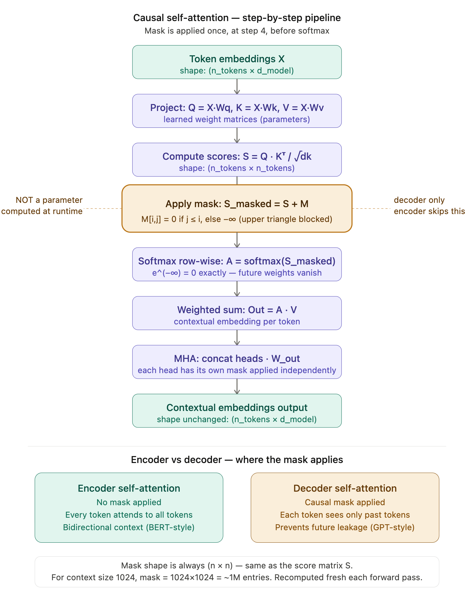
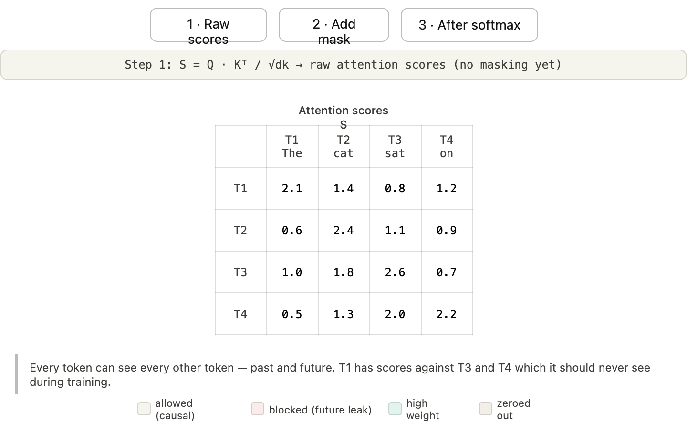
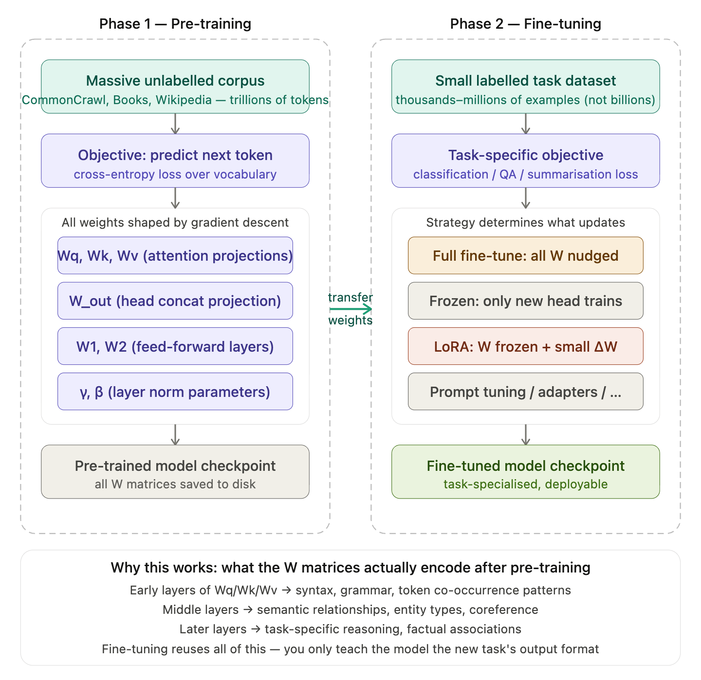
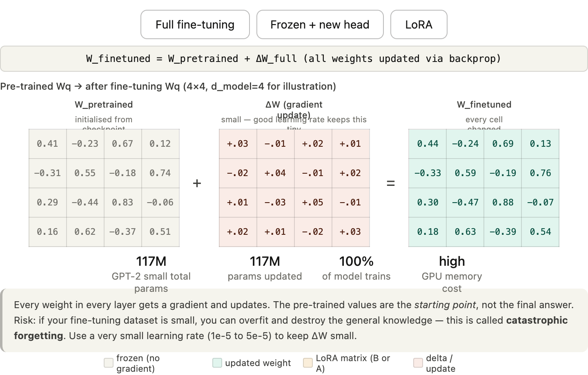

# Decoding - Attention is all you need 

---- 

## Complete Self-Attention - Deep Dive — Math-First, Example-Driven 

#### How Attention Mechanism Works in Transformer Architecture &rarr; https://www.youtube.com/watch?v=KMHkbXzHn7s 

---- 

### Related articles 

- https://arxiv.org/abs/1706.03762

----

### Setup: The Problem Embeddings Alone Can't Solve

The word **"Apple"** has one static embedding vector. But in:
- *"Apple released a new iPhone"* → Apple = tech company
- *"I ate an apple"* → Apple = fruit

Same embedding, wrong context. Self-attention **dynamically adjusts** that embedding based on surrounding tokens. That's the entire job.

---- 

## Step 1: Token Embeddings as Input

Assume we have **3 tokens**: `[Apple, is, great]`
Embedding dimension = **4** (small for illustration).

Each token is a row vector:

```
X (3×4) — Embedding Matrix

         d0    d1    d2    d3
Apple  [ 1.0,  0.5,  0.2,  0.9 ]
is     [ 0.1,  0.8,  0.4,  0.3 ]
great  [ 0.6,  0.2,  0.7,  0.5 ]
```

Shape: **(n_tokens × d_model)** = **(3 × 4)**

---

## Step 2: Deriving Q, K, V via Weight Matrices

You multiply X by three separate **learned** weight matrices:

```
Q = X · Wq
K = X · Wk
V = X · Wv
```

Assume `d_k = 3` (projecting from dim 4 → dim 3 for Q and K), `d_v = 3` for V.

**Weight matrix Wq (4×3) — learned, not PCA:**
```
Wq = [ 0.1,  0.2,  0.3 ]
     [ 0.4,  0.5,  0.1 ]
     [ 0.2,  0.3,  0.4 ]
     [ 0.5,  0.1,  0.2 ]
```

**Matrix Multiplication: X · Wq**

How it works row by row — Q for "Apple":

```
Q_apple = [1.0, 0.5, 0.2, 0.9] · Wq

q0 = 1.0×0.1 + 0.5×0.4 + 0.2×0.2 + 0.9×0.5 = 0.1+0.2+0.04+0.45 = 0.79
q1 = 1.0×0.2 + 0.5×0.5 + 0.2×0.3 + 0.9×0.1 = 0.2+0.25+0.06+0.09 = 0.60
q2 = 1.0×0.3 + 0.5×0.1 + 0.2×0.4 + 0.9×0.2 = 0.3+0.05+0.08+0.18 = 0.61

Q_apple = [0.79, 0.60, 0.61]
```

You do this for all 3 tokens to get the full **Q matrix (3×3)**:

```
Q = [ 0.79,  0.60,  0.61 ]   ← Apple
    [ 0.58,  0.47,  0.28 ]   ← is
    [ 0.65,  0.42,  0.52 ]   ← great
```

Similarly you compute **K (3×3)** and **V (3×3)** using Wk and Wv. These three matrices are **distinct** — different learned transforms, different subspaces.

---

## Step 3: Attention Scores — Q · Kᵀ

**Full formula:**
```
Attention(Q, K, V) = softmax( Q·Kᵀ / √dk ) · V
```

### What is a Transpose?

Transposing a matrix flips rows and columns:

```
K (3×3):                    Kᵀ (3×3):
[ k00, k01, k02 ]           [ k00, k10, k20 ]
[ k10, k11, k12 ]    →      [ k01, k11, k21 ]
[ k20, k21, k22 ]           [ k02, k12, k22 ]
```

Why transpose K? Because you need:
- Q shape: (3 × d_k)
- Kᵀ shape: (d_k × 3)
- Result Q·Kᵀ: (3 × 3) — one score per token pair

### Why dot product gives a similarity score

`Q_apple · K_is = Σ(q_i × k_i)` — large when vectors point in same direction, small when orthogonal. This is the **relevance signal**.

### Computing Q · Kᵀ (simplified numbers):

Use clean numbers to show the mechanics:

```
Q = [ 1, 0, 1 ]   ← Apple
    [ 0, 1, 0 ]   ← is
    [ 1, 1, 0 ]   ← great

Kᵀ = [ 1, 0, 1 ]   (columns are key vectors)
     [ 0, 1, 1 ]
     [ 1, 0, 0 ]
```

**Raw attention scores = Q · Kᵀ:**

```
Score[Apple, Apple] = [1,0,1]·[1,0,1] = 1+0+1 = 2
Score[Apple, is]    = [1,0,1]·[0,1,1] = 0+0+0 = 0  (wait, row of Kᵀ)
```

Let me be precise. Q·Kᵀ where row i of Q dotted with column j of Kᵀ (= row j of K):

```
Scores (3×3):

             Apple  is    great
Apple   →  [  2,    1,    1  ]
is      →  [  0,    1,    1  ]
great   →  [  1,    1,    2  ]
```

Row i = "token i asking all others for relevance."
Cell (i,j) = how much token i should attend to token j.

---

## Step 4: Scale by √dk

**Why this matters — not optional:**

dk = 3 in our example, so √3 ≈ 1.73.

```
Scaled scores:

Apple  → [ 2/1.73,  1/1.73,  1/1.73 ] = [ 1.15,  0.58,  0.58 ]
is     → [ 0/1.73,  1/1.73,  1/1.73 ] = [ 0.00,  0.58,  0.58 ]
great  → [ 1/1.73,  1/1.73,  2/1.73 ] = [ 0.58,  0.58,  1.15 ]
```

**Why √dk specifically?**

If Q and K have components drawn from N(0,1), their dot product has variance = dk. Dividing by √dk brings variance back to 1. Without this, as dk grows (e.g., dk=512 in production), dot products grow large → softmax saturates → gradients vanish. This is a **variance stabilization trick**, not an arbitrary choice.

---

## Step 5: Softmax Row-by-Row

Softmax converts raw scores into weights that **sum to 1 per row**.

```
softmax([x1, x2, x3]) = [e^x1, e^x2, e^x3] / (e^x1 + e^x2 + e^x3)
```

**For Apple → [1.15, 0.58, 0.58]:**

```
e^1.15 = 3.158
e^0.58 = 1.786
e^0.58 = 1.786

Sum = 3.158 + 1.786 + 1.786 = 6.730

Attention weights for Apple:
  → Apple:  3.158/6.730 = 0.469
  → is:     1.786/6.730 = 0.265
  → great:  1.786/6.730 = 0.265
```

**For "is" → [0.00, 0.58, 0.58]:**
```
e^0   = 1.000
e^0.58 = 1.786
e^0.58 = 1.786
Sum = 4.572

Attention weights for is:
  → Apple:  1.000/4.572 = 0.219
  → is:     1.786/4.572 = 0.391
  → great:  1.786/4.572 = 0.391
```

**Full attention weight matrix A (3×3):**

```
           Apple   is    great
Apple  → [ 0.469, 0.265, 0.265 ]
is     → [ 0.219, 0.391, 0.391 ]
great  → [ 0.235, 0.235, 0.530 ]
```

Each row sums to 1. This is the **attention distribution** — how much each token "looks at" every other token.

---

## Step 6: Weighted Sum over Value Matrix

Now you extract information proportional to attention weights:

```
Output = A · V
```

**Value matrix V (3×3):**
```
V = [ 1.0,  0.0,  1.0 ]   ← Apple's value
    [ 0.5,  1.0,  0.5 ]   ← is's value
    [ 0.0,  1.0,  0.0 ]   ← great's value
```

**New contextual embedding for Apple (row 0 of A · V):**

```
Output_Apple = 0.469×[1.0, 0.0, 1.0]
             + 0.265×[0.5, 1.0, 0.5]
             + 0.265×[0.0, 1.0, 0.0]

= [0.469, 0.000, 0.469]
+ [0.133, 0.265, 0.133]
+ [0.000, 0.265, 0.000]

= [0.602, 0.530, 0.602]
```

This new vector for "Apple" is **no longer static**. It has absorbed 46.9% of Apple's own value, 26.5% of "is", 26.5% of "great". In a real model, if "Apple" appears near "iPhone", it would heavily attend to that tech context token and its embedding would shift toward the tech-company region.

---

## Step 7: Causal Masking (Decoder Self-Attention)

### The Problem

In language modeling, token at position `i` must **only see positions 0 to i**. It cannot peek at future tokens — that would be data leakage during training. But raw attention scores are computed for all pairs simultaneously.

### The Mask Matrix

For sequence length 3:

```
Mask (3×3):
[  0,  -∞,  -∞ ]   ← token 0 sees only itself
[  0,   0,  -∞ ]   ← token 1 sees 0 and 1
[  0,   0,   0 ]   ← token 2 sees all
```

Lower triangular = 0 (allowed), upper triangular = −∞ (blocked).

### Apply Before Softmax

```
Masked scores = Raw scores + Mask

Apple  → [2.00 + 0,  1.00 + (-∞),  1.00 + (-∞)] = [ 2.00,  -∞,   -∞  ]
is     → [0.00 + 0,  1.00 +  0,    1.00 + (-∞)] = [ 0.00, 1.00,  -∞  ]
great  → [1.00 + 0,  1.00 +  0,    2.00 +  0  ] = [ 1.00, 1.00, 2.00 ]
```

### Why −∞ and not just 0?

After softmax:
- `e^(-∞) = 0` → that position gets **exactly zero** attention weight
- Setting to 0 before softmax would still get `e^0 = 1` and contribute — **wrong**
- −∞ is the mathematically clean way to zero out a position post-softmax

### After Softmax on Masked Scores:

```
Apple  → softmax([2, -∞, -∞]) = [1.000, 0.000, 0.000]
is     → softmax([0, 1,  -∞]) = [0.269, 0.731, 0.000]
great  → softmax([1, 1,   2]) = [0.211, 0.211, 0.578]
```

**Apple attends only to itself (100%). "is" attends to Apple and itself. "great" can attend to all three.** This is exactly causal — no future leakage.

---

## Step 8: Multi-Head Attention

### Core Idea

Instead of one large attention operation in d_model space, run **h parallel attention heads** in lower-dimensional subspaces, then concatenate.

```
d_model = 512,  h = 4  →  d_k = d_v = 512/4 = 128 per head
```

Each head gets its **own** Wq_i, Wk_i, Wv_i (128-dim projections):

```
head_1 = Attention(X·Wq1, X·Wk1, X·Wv1)   → output: (n × 128)
head_2 = Attention(X·Wq2, X·Wk2, X·Wv2)   → output: (n × 128)
head_3 = Attention(X·Wq3, X·Wk3, X·Wv3)   → output: (n × 128)
head_4 = Attention(X·Wq4, X·Wk4, X·Wv4)   → output: (n × 128)
```

**Concatenate along feature axis:**

```
Concat([head_1, head_2, head_3, head_4])   → (n × 512)
```

**Output projection:**

```
MultiHead(Q, K, V) = Concat(heads) · W_out
```

Where W_out is (512 × 512). This final linear layer **mixes** information across heads — no head's output is isolated.

### Why not just one big head at full dimension?

A single head in 512 dimensions produces **one attention distribution**. It can only focus on one type of relationship per forward pass. Multiple heads can simultaneously capture:

| Head | What it might learn |
|---|---|
| Head 1 | Syntactic dependencies (subject-verb) |
| Head 2 | Semantic similarity (synonyms, co-hyponyms) |
| Head 3 | Positional proximity |
| Head 4 | Coreference (pronouns → nouns) |

These are emergent — not hand-coded. The lower-dimensional projection forces each head into a compressed subspace, which **encourages specialization**.

---

## Complete Formula Reference

```
Self-Attention:
  Attention(Q, K, V) = softmax( Q·Kᵀ / √dk ) · V

Multi-Head Attention:
  head_i  = Attention(X·Wqi, X·Wki, X·Wvi)
  MHA     = Concat(head_1,...,head_h) · W_out

Causal Masking:
  Masked_scores = Q·Kᵀ/√dk  +  M    where M_ij = 0 if j≤i, else -∞
```

---

## What the Video Gets Right vs. What It Glosses Over

| Point | Video | Reality |
|---|---|---|
| Q/K/V derivation | Correct | Also: these are the **column spaces** of Wq/Wk/Wv |
| √dk scaling | Says "beyond our discussion" | Variance stabilization — fully explainable |
| Softmax saturation problem | Mentions it | The gradient vanishing consequence is the real danger |
| Masking = add −∞ | Correct | Implementation uses `torch.finfo(dtype).min` not literal −∞ |
| MHA concatenation | Correct | W_out is non-trivial — it learns cross-head mixing, not just reshaping |
| Quadratic complexity | Mentions it | O(n²·d) — active research area (Flash Attention, sparse attention) |

The video is a solid conceptual foundation. The gaps are precisely where production-level understanding begins.

## Where Do Wq, Wk, Wv Actually Come From?

No mystery. You already know the answer — you just haven't connected the dots yet. It's **the same answer as every other weight matrix in a neural network.**

---

## The Honest One-Line Answer

> **Wq, Wk, Wv start as random noise and get shaped into useful matrices through gradient descent and backpropagation — exactly like every other weight in the network.**

That's it. There's no special initialization ritual, no pre-computation, no analytical derivation. They are **learned parameters**.

---

## Let's Build This From First Principles

### Phase 1: Initialization (Before Training)

When you instantiate a Transformer, PyTorch does something like this internally:

```python
import torch
import torch.nn as nn

d_model = 512
d_k = 64  # per head

# These are just random matrices at the start
Wq = nn.Linear(d_model, d_k, bias=False)  # internally: kaiming_uniform_ init
Wk = nn.Linear(d_model, d_k, bias=False)
Wv = nn.Linear(d_model, d_k, bias=False)

# What the weights actually look like at init:
print(Wq.weight.shape)   # torch.Size([64, 512])
print(Wq.weight[:2, :4]) # tensor([[ 0.0312, -0.0187,  0.0421, -0.0093],
                          #         [-0.0256,  0.0178,  0.0334, -0.0412]])
```

**Random. Small. Meaningless.** At this point, Wq, Wk, Wv produce garbage Q, K, V vectors. The attention scores are noise. The model outputs garbage.

---

### Phase 2: Forward Pass — Computing the Loss

The model takes input tokens, runs the full forward pass including:

```
Q = X · Wq   ← garbage projection (initially)
K = X · Wk   ← garbage projection (initially)
V = X · Wv   ← garbage projection (initially)

scores = softmax(Q·Kᵀ / √dk) · V   ← garbage contextual embeddings

→ final logits → softmax → predicted probability distribution over vocabulary
```

Then you compare this prediction to the **ground truth next token** using Cross-Entropy Loss:

```
Loss = -log(P(correct_token))
```

If the model predicts the wrong token with high confidence, loss is **large**. If correct with high confidence, loss is **small**. This single scalar number encodes how wrong **every weight in the model** is — including Wq, Wk, Wv.

---

### Phase 3: Backpropagation — The Actual Shaping Mechanism

This is where Wq, Wk, Wv get their values. Backprop computes:

```
∂Loss/∂Wq  — how much does the loss change if I nudge Wq slightly?
∂Loss/∂Wk  — same for Wk
∂Loss/∂Wv  — same for Wv
```

Then gradient descent updates each weight:

```
Wq ← Wq - lr × ∂Loss/∂Wq
Wk ← Wk - lr × ∂Loss/∂Wk
Wv ← Wv - lr × ∂Loss/∂Wv
```

This happens for **every training example**, across **billions of tokens**, for **thousands of gradient steps**.

---

### Phase 4: What Convergence Actually Means

After enough training, the gradient signal has **sculpted** Wq, Wk, Wv into matrices that perform meaningful projections. Concretely:

```
Before training:
  Q_apple ≈ random vector
  K_iphone ≈ random vector
  Q_apple · K_iphone ≈ noise → attention score ≈ random

After training on enough text:
  Q_apple → encodes "I am a tech-context token, find me tech-related keys"
  K_iphone → encodes "I am a tech-related token, respond to tech queries"
  Q_apple · K_iphone → HIGH score → Apple attends strongly to iPhone
```

The matrices didn't get told this. The **loss function on next-token prediction** over billions of examples forced this structure to emerge because it was useful for reducing prediction error.

---

## The Chain of Gradient Flow Through Wq, Wk, Wv

Here's the exact path backprop takes — this demystifies it completely:

```
Loss
  ↑
Final linear layer (logits)
  ↑
Feed-forward network
  ↑
Output = A · V              ← gradient flows into both A and V
  ↑                ↑
A = softmax(S/√dk)  V = X · Wv   ← ∂Loss/∂Wv computed here
  ↑
S = Q · Kᵀ                 ← gradient flows into both Q and K
  ↑          ↑
Q = X · Wq   K = X · Wk    ← ∂Loss/∂Wq and ∂Loss/∂Wk computed here
```

Every operation in that chain is **differentiable**. Matrix multiply — differentiable. Softmax — differentiable. Scaling — differentiable. The gradient signal from the loss propagates all the way back to Wq, Wk, Wv via chain rule. No special treatment.

---

## Why Three Separate Matrices and Not One?

This is the part people skip over and it matters.

You could technically use `X` directly as Q, K, and V (that's called **dot-product self-attention without projection**). Early formulations did this. The problem:

```
Q = K = V = X   (same matrix)
```

- Every token uses its raw embedding to query AND to respond AND to contribute value
- The same geometric space serves three different roles simultaneously
- This severely limits what the attention can express

By having **three independent learned projections**:

```
Q = X · Wq   → optimized for "asking the right questions"
K = X · Wk   → optimized for "being findable by the right queries"
V = X · Wv   → optimized for "containing the right information to transfer"
```

Each subspace is **specialized by training** for its specific role. They can be low-rank, they can be rotated differently, they can ignore dimensions that aren't useful for that role. This expressiveness is what makes attention powerful — and it's entirely a product of learning, not design.

---

## Concrete Intuition: What Wq Learns to Do

Think of it this way. Wq projects the full d_model-dimensional embedding into a d_k-dimensional **query subspace**. After training, this subspace has learned to **emphasize the dimensions of the embedding that are most useful for determining relevance**.

For example (emergent, not hardcoded):
- Wq in head 1 might learn to emphasize syntactic-role dimensions → useful for subject-verb matching
- Wq in head 2 might learn to emphasize semantic-category dimensions → useful for synonym detection

The training data and loss function determined this. You just provided the architecture — a differentiable pipeline — and gradient descent figured out what projections minimize prediction error.

---

## Summary: The Full Lifecycle

```
1. INIT      → Wq, Wk, Wv = small random values (Xavier/Kaiming init)

2. FORWARD   → Q, K, V = garbage projections
             → attention scores = noise
             → model output = wrong prediction
             → loss = high

3. BACKWARD  → compute ∂Loss/∂Wq, ∂Loss/∂Wk, ∂Loss/∂Wv via chain rule

4. UPDATE    → Wq -= lr × gradient  (nudge toward lower loss)
             → same for Wk, Wv

5. REPEAT    → billions of times across the training corpus

6. CONVERGE  → Wq, Wk, Wv now project into meaningful subspaces
             → attention scores reflect real semantic/syntactic relevance
             → model predicts well → loss is low
```

**There is no mystery.** The "magic" of Wq, Wk, Wv is just gradient descent doing its job across an astronomically large training corpus. The architecture gives the model the *capacity* to learn good projections. The training process actually *finds* them.

----

## Are Parameters synonymous to tokens? &rarr; Classical assumption and mistake

**No, parameters and tokens are completely different things.** Conflating them is one of the most common confusions in this space. Let me kill it permanently.

---

Tokens are **runtime data** — they flow through the model during inference. Parameters are **learned weights** — they are the model itself, baked in during training. Completely different things.---



## The Core Distinction — Burned Into Your Head

```
Tokens     = the data flowing through the model at runtime
Parameters = the model itself — the learned weight matrices
```

They live in completely different phases of the system's lifecycle.

---

### Tokens

A token is a piece of text (a word, subword, or character) converted to an integer ID, then looked up in an embedding matrix to become a vector. Tokens are:

- **Ephemeral** — they exist only during one forward pass
- **Different every call** — "Apple is great" gives different token vectors than "Google is great"
- **Not stored** in the model file — they are the *input*, not the model
- **Count** — when people say "GPT-4 has a 128k context window", they mean it can process 128,000 tokens at once

---

### Parameters

Parameters are the actual weight matrices — Wq, Wk, Wv, W_out, W1, W2, γ, β. They are:

- **Permanent** — baked in after training, frozen during inference
- **Same for every input** — the same Wq processes "Apple is great" and "Tesla stock dropped"
- **Stored** in the model file — when you download a 140MB GPT-2 model, you are downloading these matrices
- **Count** — when people say "GPT-2 has 117 million parameters", they mean the total number of individual floating-point values across all these matrices

---

### The Equation Makes This Explicit

```
Q = X · Wq
    ↑    ↑
  token  parameter
  (data) (learned, fixed)
```

`X` changes with every sentence. `Wq` never changes after training. Q is the result of multiplying runtime data by a frozen weight.

---

### Why the Distinction Matters Practically

| | Tokens | Parameters |
|---|---|---|
| Stored in model file? | No | Yes |
| Change during inference? | Yes | No |
| Change during training? | No (input) | Yes (being shaped) |
| Scale with input length? | Yes | No |
| "Billions of X" refers to? | Context size | Model size |

When someone says **"GPT-4 has ~1.8 trillion parameters"** — they mean Wq, Wk, Wv, W_out, W1, W2 and all their equivalents across potentially thousands of layers, totaling 1.8 trillion individual floating point numbers stored in the model file.

When someone says **"the model has a 128k token context"** — they mean X, the input embedding matrix, can have up to 128,000 rows (one per token) at inference time. That has nothing to do with the model size.

They measure completely different things. Never conflate them.

-----

## Okay - What is the role of Masked Matrix - where does it fit in the transformer architecture ?

Two diagrams coming — first, an interactive view of exactly what the mask matrix does to the score grid, cell by cell. Then, where it sits in the full attention pipeline.


Walk through all three steps in that widget — it shows you exactly what happens to each cell. Now here's where masking slots into the full pipeline:


----

## The Precise Answer to "Where Does It Fit?"

**One line:** the mask is injected at exactly one point — after you compute `Q·Kᵀ/√dk` and before you run softmax. That's it. It touches nothing else.

---

## The Three Critical Facts People Miss

**1. The mask is not a parameter.**

This surprises most people. It's not Wq, Wk, Wv — nothing is learned here. The mask is a constant matrix computed fresh every forward pass from a single rule: `M[i,j] = 0 if j ≤ i, else −∞`. It's just arithmetic applied to the score matrix.

**2. Why −∞ and not just setting to 0.**

If you set blocked positions to 0 before softmax, softmax still sees `e^0 = 1` — those positions get real probability mass. Using −∞ means `e^(-∞) = 0` exactly. The future token gets precisely zero weight in the output, not just "small" weight. This is mathematically clean, not a hack.

In PyTorch the implementation is:
```python
mask = torch.triu(torch.ones(n, n), diagonal=1).bool()
scores = scores.masked_fill(mask, float('-inf'))
attn_weights = torch.softmax(scores, dim=-1)
```

**3. In multi-head attention, each head applies its own mask independently.**

Every one of the h heads runs the full sequence: `Q·Kᵀ/√dk → +M → softmax → ·V`. The mask shape is the same for every head — it's purely about which positions are allowed, not about what the head specializes in. The mask is identical across all heads.

---

## Encoder vs Decoder — The Real Distinction

This is the most important architectural consequence of the mask:

The encoder has no causal mask — every token can attend to every other token simultaneously. This gives bidirectional context. BERT is built on an encoder. You give it a full sentence and it understands every word in the context of the whole sentence at once.

The decoder uses the causal mask — token at position `i` can only attend to positions 0 through `i`. This forces left-to-right prediction. GPT is a decoder-only stack. During training, it processes all tokens in parallel (efficiency), but the mask ensures that position `i` only ever "saw" tokens before it, simulating the autoregressive constraint.

Without the mask in the decoder, training would be trivially easy and useless — every token could just copy from the next token it's supposed to predict.

-----

## Trasnfer Learning - A Buzz word or a mechanism ?



Good. That's the lifecycle. Now the part that matters most — what actually happens to the weight matrices. This interactive widget shows the three strategies at the matrix level:



---

## The Full Conceptual Picture

### What Transfer Learning Actually Means Here

Pre-training on trillions of tokens forces Wq, Wk, Wv, W1, W2 to encode genuinely useful structure. Not arbitrary structure — useful structure, because the only way to predict the next token reliably is to actually understand language. By the time pre-training ends, these matrices have implicitly learned:

- Syntax — subject/verb agreement, dependency structure
- Semantics — word similarity, entity types, negation
- World knowledge — facts, relationships, common sense
- Reasoning patterns — cause/effect, analogy

Transfer learning says: **don't throw this away.** Use those matrices as your starting point for a new task. The new task then only needs to reshape the final few degrees of freedom, not relearn language from scratch.

---

### Concrete Example: Sentiment Classification

Suppose you want to classify movie reviews as positive/negative.

Without transfer learning — train from scratch on 10,000 reviews. The model has to simultaneously learn what words mean, how grammar works, and what sentiment is. 10,000 examples is nowhere near enough. You get ~60% accuracy.

With transfer learning — start from GPT-2. The weight matrices already know that "brilliant" and "masterpiece" are positive, that "despite" introduces contrast, that negation flips sentiment. Fine-tuning on 10,000 examples only needs to learn the final mapping from "this is the type of text that signals positive sentiment" → class label. You get ~94% accuracy.

The matrix deltas (ΔW) in fine-tuning are tiny — typically 1–5% of the magnitude of the pre-trained values. You're not rewriting the matrices. You're nudging them.

---

### The Three Strategies Compared Bluntly

**Full fine-tuning** — every weight updates. Best accuracy if you have enough data (10k+ examples). Risk of catastrophic forgetting if data is small. High GPU cost because you need to store gradients for all 117M+ parameters.

**Frozen + new head** — backbone is a fixed feature extractor. Fast, cheap, works when your task is close to pre-training distribution. Fails when your domain is very different (e.g., fine-tuning on legal or medical text with a backbone trained on web text).

**LoRA** — the current production standard. W stays frozen. You inject two small matrices B (d×r) and A (r×d) alongside the frozen W, and train only those. At rank r=8 on a 7B parameter model, you're training ~0.1% of parameters. Merge B·A back into W at inference — zero latency penalty. This is what's behind every "fine-tuned Llama" or "instruction-tuned Mistral" you've seen.

---

### Where Exactly in the Architecture

Transfer learning is not a component in the architecture — it's a **training protocol** applied to the architecture. Specifically:

- The pre-trained checkpoint contains every weight matrix across all decoder layers
- Fine-tuning typically targets Wq and Wv in LoRA (keys and feed-forward layers are often left fully frozen)
- The embedding matrix and final linear layer (which share weights in GPT-2) are also sometimes frozen
- Layer norm γ and β are small and usually kept trainable even in aggressive freezing strategies

The mask, attention mechanism, positional encoding — none of that changes. Transfer learning operates purely on the **values inside the weight matrices**, not on the architectural computation graph itself.

-----

## !!! More to come .....