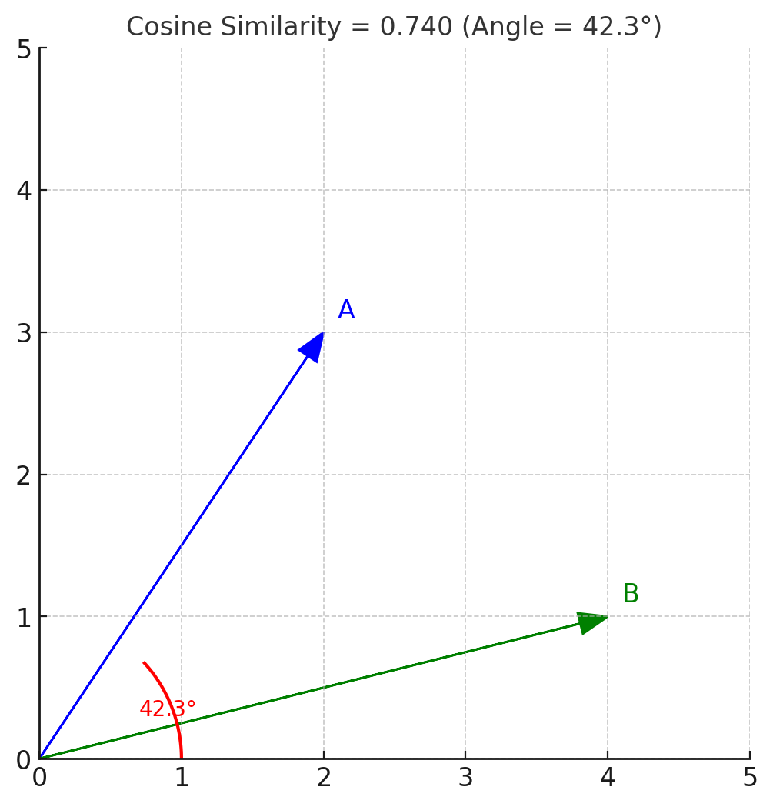

# Deep Learning - NLP Workshop

----

## Deep Learning &rarr; Day-1 &rarr; 08-09-2025

----

## 1. Why Deep Learning ?

Deep Learning (DL) is a subfield of Machine Learning (ML) that uses multi-layered artificial neural networks to model complex patterns in data.

### Key Reasons for Popularity
* Handles raw, unstructured data: Images, audio, text — without heavy manual feature engineering.
* Automatic feature extraction: Learns hierarchical features directly from data.
* Scales with data and compute: Performance improves significantly with more data and GPU/TPU power.
* Breakthrough results: Outperformed traditional ML in computer vision, NLP, speech recognition, recommendation systems, etc.
* End-to-end learning: Goes from raw input → prediction without intermediate handcrafted features.

### Real-world examples:

* Face recognition in smartphones
* Google Translate’s neural machine translation
* ChatGPT and generative AI models
* Autonomous vehicle perception systems

----

## 2. DL vs ML: Technical Differences and Use Cases**

| **Aspect**              | **Machine Learning (ML)**                                | **Deep Learning (DL)**                                           |
| ----------------------- | -------------------------------------------------------- | ---------------------------------------------------------------- |
| **Data requirement**    | Works well with small/medium datasets                    | Requires large datasets for good performance                     |
| **Feature engineering** | Manual feature extraction is crucial                     | Learns features automatically                                    |
| **Model complexity**    | Simpler models (e.g., linear regression, decision trees) | Multi-layer neural networks with millions/billions of parameters |
| **Computation**         | Can run on CPUs easily                                   | Often requires GPUs/TPUs                                         |
| **Interpretability**    | Easier to interpret                                      | More of a “black box”                                            |
| **Performance**         | Can saturate on complex tasks                            | Can scale performance with data and depth                        |

**Use Cases**

* **ML**: Credit scoring, churn prediction, time series forecasting (small data), recommendation with tabular data
* **DL**: Image classification, NLP (chatbots, translation), audio transcription, large-scale recommender systems

---

## **3. Steps Involved in a Deep Learning Workflow**

1. **Define the Problem**

   * Is it classification, regression, segmentation, generation, etc.?

2. **Gather & Prepare Data**

   * Collect datasets (images, text, audio, etc.).
   * Split into training, validation, test sets.
   * Preprocess (normalization, tokenization, data augmentation).

3. **Choose a Model Architecture**

   * CNNs for images, RNN/LSTM/Transformers(Encoder-Decoder Architecture) for sequences(Time Series data, Text Sequences), GANs for generative tasks. Auto Encoders &rarr; Variational Auto Encoders &rarr;  GAN (Generative Adversarial Network).
   * FCNN / DNN &rarr; Fully Connected Neural networks.
   * GRU (Gated Recurrent Units) 
   
    **Rearranged / Reclassified based on Architecture**
    * DNN / FCNN
    * RNN / LSTM
    * Transformers 
    * GANs
    * Auto Encoders / Variational Auto Encoders
    * GRUs

4. **Define the Loss Function**

   * E.g., Cross-Entropy Loss for classification, MSE for regression. KLD &rarr; KL Divergence
   * [Keras Loss Functions](https://keras.io/api/losses/)

5. **Select the Optimizer**

   * SGD, Adam, RMSprop — update weights to minimize loss.

6. **Train the Model**

   * Forward pass → compute loss → backward pass (backpropagation) → update weights.

7. **Validate & Tune Hyperparameters**

   * Learning rate, batch size, number of layers, dropout rate.

8. **Test the Model**

   * Measure generalization on unseen data.

9. **Deploy**

   * Package the model into an application, API, or edge device.

---

## **4. Popular Frameworks for Deep Learning**

| Framework      | Language      | Key Features                                                 | Popular Use                          |
| -------------- | ------------- | ------------------------------------------------------------ | ------------------------------------ |
| **TensorFlow** | Python, C++   | Large ecosystem, production-ready, integrates with Keras     | Google-scale deployments             |
| **PyTorch**    | Python        | Dynamic computation graphs, easy to debug, research-friendly | Academic research, production (Meta) |
| **Keras**      | Python        | High-level API (can run on TensorFlow, Theano, CNTK)         | Fast prototyping                     |
| **JAX**        | Python        | Autograd + XLA compilation for speed                         | High-performance research            |
| **MXNet**      | Python, Scala | Efficient distributed training                               | AWS SageMaker backend                |

📌 **Current trend**: PyTorch dominates research; TensorFlow/Keras still strong in production.

---

## **5. What are Neurons in Deep Learning?**

A **neuron** is the basic computational unit in a neural network — inspired by biological neurons.

### **Structure**

* **Inputs** ($x_1, x_2, ..., x_n$)
* **Weights** ($w_1, w_2, ..., w_n$) → determines importance of each input
* **Bias** ($b$) → shifts activation threshold
* **Summation** → $z = w_1x_1 + w_2x_2 + ... + w_nx_n + b$
* **Activation function** → non-linear transformation (ReLU, sigmoid, tanh, etc.)

📌 **Mathematical representation**:

$$
y = \phi \left( \sum_{i=1}^{n} w_i x_i + b \right)
$$

where $\phi$ is the activation function.

---

## **6. What Do Neurons Learn and How Do They Learn?**

### **What they learn**

* In early layers → **low-level patterns** (edges, curves in images; word associations in text).
* In deeper layers → **high-level concepts** (faces, objects, sentence meaning).

### **How they learn**

* **Forward pass**: Input flows through the network → prediction is made.
* **Loss computation**: Compare prediction to actual label using loss function.
* **Backward pass (Backpropagation)**:

  * Compute gradients of loss w\.r.t. weights (∂Loss/∂w).
  * Update weights using **gradient descent**:

    $$
    w_{\text{new}} = w_{\text{old}} - \eta \cdot \frac{\partial L}{\partial w}
    $$

    where $\eta$ is the learning rate.
* Repeat for many **epochs** until convergence.

---

### **Mini Python Example**: A Tiny Neural Network in PyTorch

---- 

## Important Pointers 

----
- Loss functions (function of this error which the model is making during the training phase)
 is the actual loss/cost function used to minimize the error made by the model during training process

- Optimizers (in ML solvers) >>> Actual algo which is used to find the minima in the loss function

Most ML Algo use hard-coded Loss functions and optimizers/solver

----

- What is Deep Leaning: all learning happen using neural networks
- Why/When is DL superior to ML?

- Diff neural networks >> are diff configurations/architectures of neurons, specialized for a given task.

- Activation functions

----
- What is Deep Learning, when to use DL vs ML?
- What is Forward Pass? 
- What is Backpropagation? What is it used for ?
- How to decide the number of nodes in the input layer?
- How to decide the number of neurons in the output layer?
- What are activation functions? and where/why are they used?
- How to decide which activation function to be used for what kind of layers 
 	- for hidden layers (best: relu)
	- for o/p layers >>> regression > relu, otherwise linear
	- for o/p layers >>> binary classification >> sigmoid (1 neuron o/p layer) or softmax (2 neurons o/p layer)
	- for o/p layers >>> multiclass classification >> softmax

- what is epoch in model training?
- what batch size in training? how does it affect the training process?
- How to count the total number of parameters defining a NN?
- What are Parameters vs Hyperparameters of a Model (ML/DL)?
- What are Hidden layers? 
- Why do we need HL?
- How do you decide how many HL to be used in a NN?
- How do you decide how many neurons to be used in a HL?
- What is Gradient Descent Algo? Where does it fit in NN discussion?
- What are diff variants of GD? Why do we need diff variants?

-----

- [Python-Machine-Learning-Book](https://github.com/rasbt/python-machine-learning-book-3rd-edition)
- [HandsOn-Machine-Learning](https://www.amazon.com/Hands-Machine-Learning-Scikit-Learn-TensorFlow/dp/1491962291)
- [Machine-Learning Book](https://github.com/rasbt/machine-learning-book)
- [Deep-Learning](https://www.amazon.com/Deep-Learning-Python-Francois-Chollet/dp/1617294438)

---- 

### Activation Functions and Optmizers Links

----

https://www.analyticsvidhya.com/blog/2017/10/fundamentals-deep-learning-activation-functions-when-to-use-them/

https://www.learnopencv.com/understanding-activation-functions-in-deep-learning/

https://towardsdatascience.com/activation-functions-neural-networks-1cbd9f8d91d6

http://www.machineintellegence.com/different-types-of-activation-functions-in-keras/


----


### Optimizers:


https://blog.algorithmia.com/introduction-to-optimizers/

https://towardsdatascience.com/types-of-optimization-algorithms-used-in-neural-networks-and-ways-to-optimize-gradient-95ae5d39529f

https://towardsdatascience.com/learning-rate-schedules-and-adaptive-learning-rate-methods-for-deep-learning-2c8f433990d1

https://blog.paperspace.com/intro-to-optimization-momentum-rmsprop-adam/

----

### Back Propagation:

https://mattmazur.com/2015/03/17/a-step-by-step-backpropagation-example/

http://blog.manfredas.com/backpropagation-tutorial/

https://www.guru99.com/backpropogation-neural-network.html

https://www.edureka.co/blog/backpropagation/

http://neuralnetworksanddeeplearning.com/chap2.html

-----

## Deep Learning &rarr; Day-2 &rarr; 08-10-2025

-----


- NLP 
- NLU
- NLG

# NLP vs NLU vs NLG — what’s what?

Think of **NLP** as the *broad field* of getting computers to work with human language. Inside it, **NLU** is about *understanding* language (reading/comprehending), and **NLG** is about *producing* language (writing/speaking). They overlap, but their goals, techniques, and evaluation differ.

---

## Quick snapshot

| Aspect          | NLP (umbrella)                                    | NLU (understanding)                                 | NLG (generation)                                  |
| --------------- | ------------------------------------------------- | --------------------------------------------------- | ------------------------------------------------- |
| Goal            | Process & analyze language data                   | Extract meaning & intent                            | Produce fluent, accurate text                     |
| Typical inputs  | Raw text (or speech after ASR)                    | Sentences, documents, dialogs                       | Meaning representation, facts, prompts            |
| Typical outputs | Tokens, tags, structures, embeddings, analytics   | Labels, slots, parses, answers                      | Summaries, translations, responses, reports       |
| Example tasks   | Tokenization, POS, parsing, embeddings, retrieval | Sentiment, intent/slot filling, NER, QA, entailment | MT, summarization, data-to-text, dialog responses |
| Metrics         | Per-task (e.g., tagging F1)                       | Accuracy/F1/EM, MCC, span-F1                        | BLEU/ROUGE/METEOR/BERTScore + human eval          |

---

## 1) NLP — the toolbox and plumbing

**What it covers**

* Core preprocessing: tokenization, sentence splitting, normalization.
* Linguistic analysis: part-of-speech tagging, lemmatization, syntactic/semantic parsing, coreference.
* Representations: TF-IDF, word2vec/GloVe, contextual embeddings (BERT/Transformer encoders).
* Search/retrieval: BM25, dense retrieval with embeddings.
* Datasets/pipelines and infra that both NLU and NLG sit on.

**Why it matters**

* Good NLP “plumbing” (clean text, robust tokenization, strong embeddings) raises the ceiling for both NLU and NLG systems.

---

## 2) NLU — turning words into meaning

**Typical tasks**

* **Classification:** sentiment, topic, toxicity, intent.
* **Sequence labeling:** **NER** (names, places), slot filling for assistants.
* **Structured prediction:** dependency/semantic parsing, coreference.
* **Reasoning/QA:** extractive/abstractive QA, natural language inference (entailment/contradiction).
* **Information extraction:** relations, events, knowledge graph population.

**Inputs/outputs**

* Input: text (often with context/dialog history).
* Output: semantic structure—labels, spans, key-value slots, answers.

**Techniques**

* Classical: rules, CRFs, SVMs with n-grams.
* Neural: BiLSTMs + CRF, CNNs, and now **Transformer encoders** (BERT/RoBERTa/DeBERTa) fine-tuned for classification/sequence tagging/QA.
* Prompting/RAG with LLMs for open-domain understanding.

**Evaluation**

* Accuracy, Precision/Recall/**F1**, MCC for classification.
* Span-level F1 for NER/QA.
* Exact Match (EM) for QA.
* Calibration and robustness checks (spurious cues, domain shift).

---

## 3) NLG — turning meaning into text

**Typical tasks**

* **Machine translation**, **summarization**, **paraphrasing**.
* **Data-to-text**: dashboards → narratives, tables → reports.
* **Dialogue response generation**, email drafting, code generation.

**Inputs/outputs**

* Input: a meaning representation (slots/facts/schema), a source text (for MT/summarization), or a prompt/instructions.
* Output: coherent, factual, audience-appropriate text.

**Techniques**

* Classic pipeline:

  1. **Content selection** (what to say)
  2. **Document planning** (order/structure)
  3. **Microplanning** (word choice, referring expressions)
  4. **Surface realization** (grammar/inflection)
* Modern neural: **seq2seq Transformers** (e.g., T5, BART) and **LLMs** (GPT-style) that do this end-to-end; can be controlled with prompts, constraints, or planners.

**Evaluation**

* Automatic: **BLEU**, **ROUGE**, METEOR, **BERTScore**, COMET—useful but imperfect.
* Human: fluency, coherence, **faithfulness/factuality**, style, task success.
* For safety-critical use, do factuality and toxicity checks; prefer RAG/grounding.

---

## How they work together in a real system

**Example: Customer-support assistant**

1. **NLP plumbing:** clean text, segment messages, build embeddings for retrieval.
2. **NLU:** detect **intent** (“refund request”), extract **entities** (order id), classify **sentiment/urgency**.
3. **NLP retrieval:** fetch relevant policy snippets (RAG).
4. **NLG:** generate a response that cites retrieved policies, with placeholders filled from NLU slots.
5. **Post-NLG checks:** style constraints, length limits, factuality guardrails.

**Example: Analytics → Narrative**

* Data schema → (NLP optional for column names) → **NLG** creates a weekly KPI narrative; **NLU** can read user follow-ups (“why did churn rise?”) and route to deeper analyses.

---

## Modern LLM context (why distinctions still matter)

* LLMs blur lines: a single model can both **understand** (NLU) and **generate** (NLG).
* Still, **design concerns differ**:

  * For **NLU**, prioritize **faithful extraction**, calibration, and robustness; you may constrain outputs to schemas (JSON, function-calling).
  * For **NLG**, prioritize **fluency + factuality**; use **grounding** (RAG), constraints, and post-generation verification to curb hallucinations.
* **Evaluation differs**: NLU uses crisp, label-based metrics; NLG needs both automatic and **human** judgments.

---

## Interview-ready takeaways

* **NLP** = the umbrella of techniques for processing language; provides the infrastructure (tokenization, parsing, embeddings, retrieval).
* **NLU** = extracting **meaning/intent/structure** from text; outputs labels, spans, parses, or answers; think **BERT-style encoders** and label-centric metrics.
* **NLG** = producing **coherent, factual text** from meaning or prompts; think **seq2seq/LLMs**, with **BLEU/ROUGE** and human eval, plus grounding for truthfulness.
* In production, you often **chain NLU → retrieval → NLG**, with validations around both sides.

---

## **Demo Plan: NLU + NLG in One Pipeline**

### **Step 1 — NLU: Intent Classification**

* **Goal:** Take a customer message and detect intent (e.g., *refund*, *order status*, *complaint*).
* **Model:** `distilbert-base-uncased` fine-tuned on a small synthetic dataset.
* **Output:** Predicted label (intent).

---

### **Step 2 — Retrieval**

* Use **NLU output** (intent + extracted keywords) to search a small knowledge base (simulated with a Python dictionary).
* Retrieve relevant context for NLG.

---

### **Step 3 — NLG: Response Generation**

* **Goal:** Generate a natural-language response grounded in retrieved policy.
* **Model:** `facebook/bart-large-cnn` (or `google/flan-t5-base` for instruction following).
* **Output:** Polished reply.

---

### **Step 4 — Evaluation**

* **NLU evaluation:** Accuracy / F1 score on test set.
* **NLG evaluation:** ROUGE-L vs. reference responses (plus you can eyeball fluency/factuality).

---

## **Colab Notebook Outline**

Here’s the notebook workflow I can prepare:

```python
# 1. Install Hugging Face Transformers
!pip install transformers datasets evaluate

# 2. NLU: Intent Classification
from datasets import Dataset
from transformers import DistilBertTokenizerFast, DistilBertForSequenceClassification, Trainer, TrainingArguments
import torch

# Synthetic dataset
data = {
    "text": ["I want a refund", "Where is my order?", "This product is bad", "Can I change my address?"],
    "label": [0, 1, 2, 3]  # refund, order_status, complaint, change_address
}
dataset = Dataset.from_dict(data)
tokenizer = DistilBertTokenizerFast.from_pretrained("distilbert-base-uncased")
dataset = dataset.map(lambda e: tokenizer(e['text'], truncation=True, padding='max_length'), batched=True)

model_nlu = DistilBertForSequenceClassification.from_pretrained("distilbert-base-uncased", num_labels=4)

# Training setup (small quick training)
training_args = TrainingArguments(output_dir="./results", num_train_epochs=2, per_device_train_batch_size=2)
trainer = Trainer(model=model_nlu, args=training_args, train_dataset=dataset, eval_dataset=dataset)
trainer.train()

# Predict intent
inputs = tokenizer("I'd like to return my item", return_tensors="pt", truncation=True, padding=True)
pred = torch.argmax(model_nlu(**inputs).logits, dim=1)
label_map = {0: "refund", 1: "order_status", 2: "complaint", 3: "change_address"}
intent = label_map[pred.item()]
print("Predicted intent:", intent)

# 3. Retrieval
knowledge_base = {
    "refund": "You can request a refund within 30 days of purchase. Refunds are processed within 5 business days.",
    "order_status": "Orders can be tracked using the tracking number sent to your email.",
    "complaint": "We are sorry to hear that. Please provide details so we can assist.",
    "change_address": "You can change your delivery address before the item ships."
}
context = knowledge_base[intent]

# 4. NLG: Response Generation
from transformers import pipeline
generator = pipeline("text2text-generation", model="google/flan-t5-base")
prompt = f"Respond to the customer request politely using this policy: {context}"
response = generator(prompt, max_length=80, do_sample=False)
print("Generated reply:", response[0]['generated_text'])
```

---

### **How This Demonstrates the Difference**

* **NLU stage:** Model interprets meaning (intent) from raw text → structured label.
* **Retrieval:** NLU result selects the right knowledge snippet.
* **NLG stage:** Model crafts human-readable, polite response using retrieved info.

----

Let’s unpack **word embeddings** from concept → implementation → math, and then walk through **Word2Vec** as an example.

---

## **1. What is a Word Embedding?**

* **Definition:**
  A word embedding is a **dense, fixed-length vector** representation of a word or token, where:

  * Semantically similar words have vectors close to each other in the embedding space.
  * Dissimilar words are far apart.

* **Why use them?**

  * Words in raw text are just discrete symbols.
  * Neural networks can’t process raw strings — they need numeric inputs.
  * **Embeddings** give us a way to map words → numbers that capture meaning.

---

## **2. The Idea Behind Embeddings**

* You want `"king"` to be close to `"queen"`, and `"paris"` close to `"london"`, but far from `"banana"`.
* The vector space should capture relationships like:

  $$
  \text{vec}(\text{king}) - \text{vec}(\text{man}) + \text{vec}(\text{woman}) \approx \text{vec}(\text{queen})
  $$
* This is achieved by training vectors so that words appearing in **similar contexts** end up with similar embeddings.

---

## **3. How Word2Vec Achieves This**

Word2Vec (Mikolov et al., 2013) has two main architectures:

1. **CBOW** (Continuous Bag of Words):
   Predict the center word given surrounding context words.
2. **Skip-gram**:
   Predict surrounding context words given the center word.

---

### **3.1. Skip-gram Example**

Sentence: `"The cat sat on the mat"`

If `"cat"` is the center word, the context (window size = 2) is:

```
["The", "sat", "on", "the"]
```

Skip-gram tries to maximize the probability of these context words given `"cat"`.

---

### **3.2. Model Structure**

* **Input:** One-hot vector of the center word.
* **Hidden layer:** A weight matrix $W$ of size `[V, D]` where:

  * $V$ = vocabulary size
  * $D$ = embedding dimension (e.g., 300)
* **Output layer:** Another weight matrix $W'$ of size `[D, V]`.

---

## **4. Math: One-hot → Embedding**

Let:

* $x$ = one-hot vector of the input word (size $V \times 1$)
* $W$ = input weight matrix ($V \times D$)

**Step 1: Lookup**

$$
h = W^T x
$$

Since $x$ is one-hot, this just **selects one row** of $W$:

* That row **is the embedding vector** for the word.

---

**Step 2: Predict Context Words**
We pass $h$ through the output matrix $W'$ to get scores for all words:

$$
u = W'^T h \quad (\text{size: } V \times 1)
$$

Then apply **softmax** to get probabilities:

$$
p(w_o | w_c) = \frac{\exp(u_o)}{\sum_{v=1}^V \exp(u_v)}
$$

Where:

* $w_c$ = center word
* $w_o$ = a context word

---

**Step 3: Loss Function**
We want to **maximize** probability of actual context words:

$$
\mathcal{L} = - \sum_{(w_c, w_o) \in \text{pairs}} \log p(w_o | w_c)
$$

---

**Step 4: Training**

* We use **stochastic gradient descent** (SGD) or Adam to update $W$ and $W'$ so that:

  * Embeddings for words with similar contexts move closer.
  * Unrelated words move apart.

---

## **5. Optimizations in Word2Vec**

* **Negative Sampling**: Instead of updating all $V$ outputs in softmax, update only the true context word and a few “negative” samples → much faster.
* **Subsampling frequent words**: Downsample common words ("the", "is") to prevent them dominating.

---

## **6. End Result**

* After training, the matrix $W$ contains word embeddings:

  * Row $i$ = embedding vector for word $i$.
* You can use these vectors in any downstream task: classification, similarity search, etc.

---

## **7. Quick Visualization**

Imagine a **300-dimensional space** where:

* "cat", "dog", "puppy" cluster together.
* "car", "truck", "bus" cluster elsewhere.
* Arithmetic relationships emerge:

  * $\text{vec}(\text{Paris}) - \text{vec}(\text{France}) + \text{vec}(\text{Italy}) \approx \text{vec}(\text{Rome})$


----


Corpus &rarr; Datasets 

Documents &rarr; Datapoints

Corpora &rarr; Collection of Corpus 

Vocabulary &rarr; Collections of unique tokens from each of documents.

BPE --> Byte Pair Encodings

Tokenization 

Contractions --> convert the short form to actual words --> E.g. I'hve --> I have

Bag Of Words 
Document Term Matrix &rarr; NXP &rarr; N --> No. of documents; P --> No. of unique tokens in each document.
- Binary
- count
- tfidf --> Term Frequency & Inverse Document Frequency 
  - TF = # of time terms t appears in the documetnt / 
  - IDF = # of 
- freq

Word Embeddings 
- Word2Vec --> Understanding Local context
- Glove --> understanding global context

----

## Cosine Similarity

Alright — let’s go step-by-step and unpack **Cosine Similarity search**, both conceptually and mathematically, with an example so it sticks.

---

## **1. What Cosine Similarity Measures**

* **Definition:** A measure of **how similar two vectors are**, based on the **angle** between them — *not* their magnitude.
* **Why "cosine"?** It uses the cosine of the angle between vectors:

$$
\text{cosine\_sim}(A, B) = \cos(\theta) = \frac{A \cdot B}{\|A\| \, \|B\|}
$$

* **Range:**

  * $+1$ → vectors point in exactly the same direction (max similarity)
  * $0$ → vectors are orthogonal (no similarity)
  * $-1$ → vectors point in opposite directions (complete dissimilarity) — rare in embeddings unless centered.

---

## **2. The Math Step-by-Step**

Let $A = (a_1, a_2, \dots, a_n)$ and $B = (b_1, b_2, \dots, b_n)$.

**Step 1 — Dot Product**

$$
A \cdot B = \sum_{i=1}^n a_i b_i
$$

This gives a scalar measuring directional alignment without considering magnitude.

**Step 2 — Norm (Length)**

$$
\|A\| = \sqrt{\sum_{i=1}^n a_i^2}, \quad \|B\| = \sqrt{\sum_{i=1}^n b_i^2}
$$

**Step 3 — Normalize**

$$
\text{cosine\_sim}(A,B) = \frac{\sum_{i=1}^n a_i b_i}{\sqrt{\sum_{i=1}^n a_i^2} \, \sqrt{\sum_{i=1}^n b_i^2}}
$$

This “divides out” the effect of vector length, focusing only on direction.

---

## **3. Why It’s Used in Embedding Search**

* Embeddings (from Word2Vec, BERT, etc.) can differ in **magnitude** due to frequency, training noise, etc.
* Cosine similarity ignores magnitude, focusing on **relative orientation** in the embedding space — a proxy for semantic similarity.

---

## **4. Example Calculation**

Say we have 3-dimensional vectors:

$$
A = (1, 2, 3), \quad B = (4, 5, 6)
$$

**Dot product:**

$$
A \cdot B = (1)(4) + (2)(5) + (3)(6) = 4 + 10 + 18 = 32
$$

**Norms:**

$$
\|A\| = \sqrt{1^2 + 2^2 + 3^2} = \sqrt{14} \approx 3.742
$$

$$
\|B\| = \sqrt{4^2 + 5^2 + 6^2} = \sqrt{77} \approx 8.775
$$

**Cosine similarity:**

$$
\cos(\theta) = \frac{32}{(3.742)(8.775)} \approx \frac{32}{32.863} \approx 0.9746
$$

Interpretation: The vectors are **very similar** (small angle between them).

---

## **5. Cosine Similarity Search**

In a **search** setting:

1. **Store** all your embeddings in a matrix.
2. **Normalize** them (so each vector has length 1).
3. **Given a query embedding** $q$, compute $q \cdot v_i$ for all $v_i$ in the database.
4. **Rank** results by highest cosine similarity.

If embeddings are pre-normalized, cosine similarity reduces to **just the dot product** — much faster in vector databases (FAISS, Milvus, Pinecone).

---

## **6. Quick Python Demo**

```python
import numpy as np

# Two vectors
A = np.array([1, 2, 3])
B = np.array([4, 5, 6])

# Cosine similarity function
def cosine_similarity(a, b):
    return np.dot(a, b) / (np.linalg.norm(a) * np.linalg.norm(b))

print(cosine_similarity(A, B))  # ~0.9746
```

Here’s the visual:


* **Blue vector (A)** and **green vector (B)** originate at the same point.
* The **red arc** shows the angle $\theta$ between them.
* **Cosine similarity** is just $\cos(\theta)$ — the closer the vectors are in direction (smaller angle), the closer the cosine similarity is to **1**.

---


