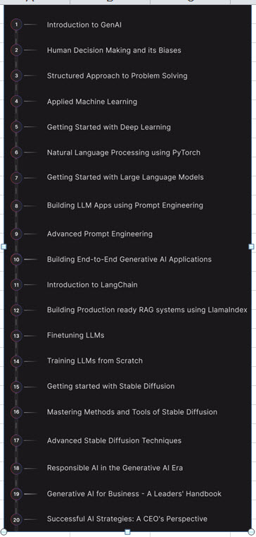
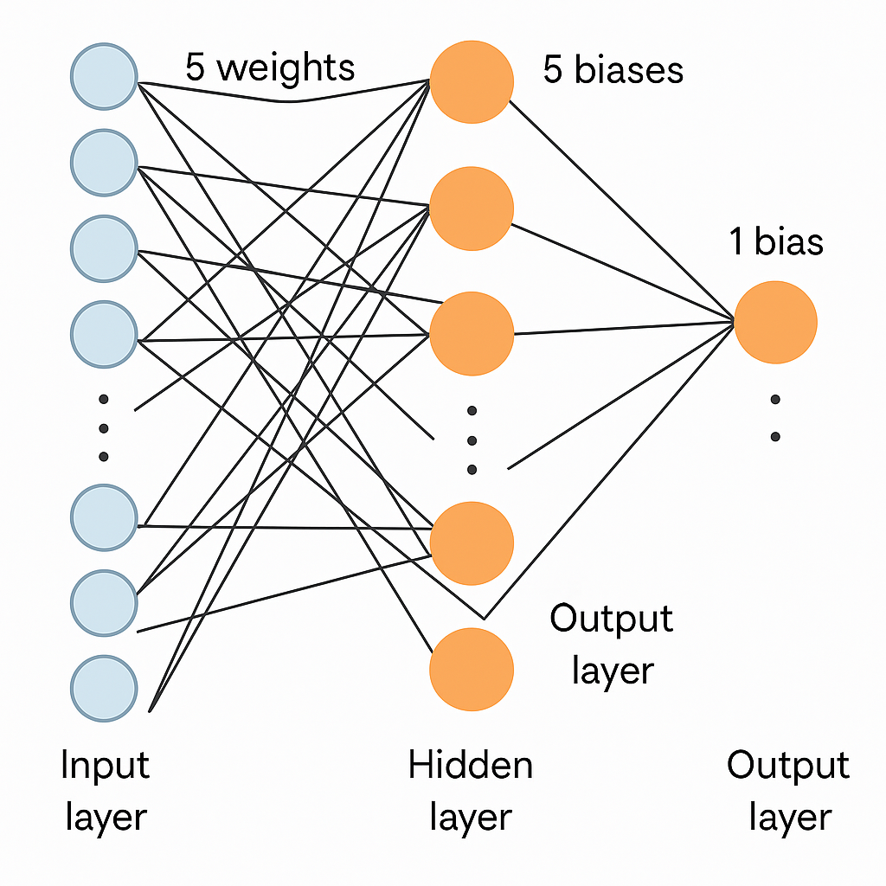

<h1 style="text-align:center"> GenAI Pinnacle - Analytics Vidhya</h1>

## Course URL

[Analytics Vidhya - Course Login](https://courses.analyticsvidhya.com/)

---

## Course Pathway

<p>

</p>

---

## Text Generation Models

- OpenAI - GPT2 & GPT3
- Meta - Llama-2
- Google - Palm-2
- Hugging Face - Bloom

---

## Image Generation Models

- Variational Autoencoder (VAE)
- Diffusion Model
- Generative Adversarial Network(GAN)

## Diffusion Models - How it works

Input Image &rarr; Add Noise &rarr; Noisy Image Generated &rarr; De-Noising the Image &rarr; Required Image

----

## Training LLM From Scratch

**Chinchilla Scaling laws**

- Training data size Vs Model Size
- No. of training tokens and model size should increase at the same rate. 
- Token to Parameters Ratio &rarr; 20:1 

In Large Language Models (LLMs), **parameters**, **tokens**, and **model size** are often confused, but they refer to different (yet related) concepts. Here's a breakdown with examples and code to clarify:

---

### 🔹 1. **Parameters**

**Definition**:
Parameters are the learnable weights in a neural network. In LLMs like GPT or BERT, these are the values that get updated during training to help the model predict the next word or understand language.

**Example**:
A simple feed-forward neural network with:

* 10 input features
* 1 hidden layer with 5 neurons
* 1 output neuron
  Will have:
* $10 \times 5 = 50$ weights + 5 biases in the first layer
* $5 \times 1 = 5$ weights + 1 bias in the second layer
  **Total = 61 parameters**

In LLMs:

* GPT-2 Small has \~117M parameters
* GPT-3 has 175B parameters

**Code Example (Tiny MLP Model):**

```python
import torch
import torch.nn as nn

model = nn.Sequential(
    nn.Linear(10, 5),
    nn.ReLU(),
    nn.Linear(5, 1)
)

total_params = sum(p.numel() for p in model.parameters())
print("Total Parameters:", total_params)
```

---

### 🔹 2. **Tokens**

**Definition**:
Tokens are chunks of text (words, subwords, or characters) that the model processes. Tokenization splits input into these units. LLMs operate on **tokens**, not raw text.

**Example**:
Text: `"I love ChatGPT!"`
Tokenized (using GPT tokenizer): `["I", " love", " Chat", "G", "PT", "!"]` → 6 tokens

**Note**: The number of tokens in a model's input or output directly affects:

* **Processing cost**
* **Context window (e.g., 4096 tokens in GPT-3.5)**

**Code Example:**

```python
from transformers import GPT2Tokenizer

tokenizer = GPT2Tokenizer.from_pretrained("gpt2")
tokens = tokenizer.tokenize("I love ChatGPT!")
print("Tokens:", tokens)
print("Number of Tokens:", len(tokens))
```

---

### 🔹 3. **Model Size**

**Definition**:
Model size usually refers to:

1. **Number of parameters** (primary measure)
2. Memory/storage footprint (e.g., GBs of weights on disk)
3. Compute cost to train or run the model

**Example**:

* **GPT-2 Small**: 117M params → \~0.5 GB
* **GPT-3**: 175B params → \~700 GB

**Why model size matters**:

* Larger models capture more nuanced language patterns
* But they are more expensive to run and require more VRAM/compute

---

### ✅ Summary Table

| Concept    | What it means                         | Example                        |
| ---------- | ------------------------------------- | ------------------------------ |
| Parameters | Learnable weights in the model        | GPT-2 Small: 117M, GPT-3: 175B |
| Tokens     | Input/output units of text processing | "ChatGPT is great" → 5 tokens  |
| Model Size | Parameter count or storage footprint  | GPT-3 \~700 GB of weights      |

---

### How parameters are calculated
**Question:**
```text
Explain in detail how the parameter is determined example 10 input features and with a hidden layer with 5 neurons gives 50 weights + 1 bias 
```

Great question! Let's walk through **exactly how parameters are calculated** in a neural network — focusing on **weights** and **biases**.

We’ll use a simple **feedforward neural network** as our example.

---

### 🔷 1. **Basic Definitions**

* **Input layer**: Passes features to the first hidden layer. It has **no parameters**.
* **Hidden layer**: Each neuron in the hidden layer has:

  * A **weight** for each input from the previous layer
  * A **bias** term
* **Output layer**: Similar to the hidden layer, has weights and biases too.

---

### 🔷 2. **Example: One Hidden Layer**

Suppose you have the following architecture:

```
Input: 10 features
Hidden Layer: 5 neurons
Output: 1 neuron
```

We’ll calculate parameters in two parts:
👉 from input → hidden
👉 from hidden → output

---

### 🔹 A. Input Layer → Hidden Layer

* **Input features** = 10
* **Hidden layer neurons** = 5

Each hidden neuron gets **10 inputs** → needs **10 weights**

* So total weights: $10 \text{ inputs} \times 5 \text{ neurons} = 50$
* Each of the 5 neurons also has **1 bias** → 5 biases

✅ **Parameters from Input → Hidden = 50 weights + 5 biases = 55**

---

### 🔹 B. Hidden Layer → Output Layer

* **Hidden layer has 5 neurons** → Output neuron takes 5 inputs
* So output neuron needs:

  * 5 weights (one per hidden neuron)
  * 1 bias

✅ **Parameters from Hidden → Output = 5 weights + 1 bias = 6**

---

### 🔷 🔢 Total Parameters

$$
\text{Total parameters} = (10 \times 5 + 5) + (5 \times 1 + 1) = 55 + 6 = \boxed{61}
$$

---

### 🧠 General Formula

For any layer $L$ with:

* $n_{in}$: inputs (from previous layer)
* $n_{out}$: neurons (in current layer)

The number of parameters is:

$$
\text{Parameters} = (n_{in} \times n_{out}) + n_{out}
$$

> (weights + biases)

---

### ✅ Code to Compute This

```python
import torch
import torch.nn as nn

# Define simple model: 10 inputs, 5 hidden units, 1 output
model = nn.Sequential(
    nn.Linear(10, 5),  # input to hidden
    nn.ReLU(),
    nn.Linear(5, 1)    # hidden to output
)

# Count total parameters
total_params = sum(p.numel() for p in model.parameters())
print("Total Parameters:", total_params)  # Output: 61
```



---

### Graidents Vs Optimizers

```text
Explain in detail the gradients and optimizers
```

Absolutely — understanding **gradients** and **optimizers** is key to mastering how neural networks learn.

---

## 🔶 1. What Are **Gradients**?

### 🔸 Definition:

A **gradient** is the partial derivative of a loss function with respect to a model’s parameters (weights and biases). It tells us how much the loss will change if we tweak a particular parameter.

### 🔸 Purpose:

Gradients are used to **update the model’s parameters** so that the loss (error) is minimized.

---

### 🧠 Intuition:

Imagine you're hiking down a hill (minimizing the loss). The **slope (gradient)** tells you which direction to step in (and how steep). You always move in the direction that **decreases the height (loss)** the fastest.

---

### 🔹 Example:

Suppose the loss function is:

$$
L(w) = (wx - y)^2
$$

Then the gradient with respect to $w$ is:

$$
\frac{dL}{dw} = 2(wx - y)x
$$

---

### 🔹 In Neural Networks:

Backpropagation is used to compute **gradients** of the loss w\.r.t. each weight in the network.

* For each layer:

  * Compute the gradient of the loss with respect to the weights
  * Pass the error backward through the network (chain rule)

---

## 🔶 2. What Are **Optimizers**?

### 🔸 Definition:

An **optimizer** is an algorithm that uses gradients to **adjust weights** to minimize the loss.

---

### 🔹 How it Works:

After computing the gradient, an optimizer updates the weight like this:

$$
w = w - \eta \cdot \frac{dL}{dw}
$$

Where:

* $w$: weight
* $\eta$: learning rate
* $\frac{dL}{dw}$: gradient

---

### 🔹 Popular Optimizers:

| Optimizer                             | Description                                   | Pros                 | Cons                          |
| ------------------------------------- | --------------------------------------------- | -------------------- | ----------------------------- |
| **SGD (Stochastic Gradient Descent)** | Basic form using single or mini-batch updates | Simple, widely used  | Can be slow to converge       |
| **Momentum**                          | Adds velocity to updates to speed up learning | Faster convergence   | Needs tuning                  |
| **Adam (Adaptive Moment Estimation)** | Combines RMSProp and Momentum                 | Fast, widely used    | More memory, can overfit      |
| **RMSProp**                           | Scales learning rate per parameter            | Good for RNNs        | May require tuning            |
| **Adagrad**                           | Adaptive learning rate per parameter          | Good for sparse data | Learning rate decays too fast |

---

### 🔹 Code Example (Using PyTorch):

```python
import torch
import torch.nn as nn
import torch.optim as optim

model = nn.Linear(10, 1)  # Simple model
criterion = nn.MSELoss()
optimizer = optim.Adam(model.parameters(), lr=0.01)

# Dummy data
inputs = torch.randn(16, 10)
targets = torch.randn(16, 1)

# Training step
outputs = model(inputs)
loss = criterion(outputs, targets)

# Backward pass
loss.backward()

# Optimizer step
optimizer.step()
optimizer.zero_grad()  # Reset gradients for next iteration
```

---

## ✅ Summary

| Term          | Role in Learning                                   |
| ------------- | -------------------------------------------------- |
| **Gradient**  | Direction & rate of loss change w\.r.t. parameters |
| **Optimizer** | Algorithm that uses gradients to update weights    |


-----
### LLM training - important concepts 

- **Parallel and Distributed paradigm**

- **Data Parallelism**

- **Model Parallelism**

- **Pipeline Parallelism**

- **Fully Sharded Data Parallelism/Zero3**

- **Tensor Parallelism**

- **2D and 3D Parallelism**

-----
```text
Different parallelism mechanism in training LLM models

Data, model, pipeline, fully sharded data parallelism zero3, tensor, 2D & 3D parallelism techniques.

Explain in detail on all the mechanisms with an example and code

```

Training Large Language Models (LLMs) requires distributing computations across multiple GPUs or nodes due to the sheer size of the models and datasets. Here’s a **comprehensive breakdown** of the major **parallelism strategies** used in modern LLM training, including conceptual explanations, practical examples, and code patterns using libraries like PyTorch and DeepSpeed.

---

## 🔷 1. Data Parallelism

### 🔸 Concept:

Each GPU gets a **copy of the model**, but processes a **different mini-batch** of data. After computing gradients, they are **synchronized** across devices.

### 🔸 Libraries:

* PyTorch DistributedDataParallel
* TensorFlow MirroredStrategy

### 🔸 Example:

```python
import torch
import torch.nn as nn
import torch.distributed as dist
from torch.nn.parallel import DistributedDataParallel as DDP

# Initialize process group
dist.init_process_group(backend="nccl")
model = nn.Linear(1000, 100).cuda()
model = DDP(model)

# Forward pass on local shard of data
output = model(input_tensor)
loss = loss_fn(output, labels)
loss.backward()
optimizer.step()
```

---

## 🔷 2. Model Parallelism

### 🔸 Concept:

The **model itself is split** across multiple GPUs. E.g., layer 1 on GPU 0, layer 2 on GPU 1, etc.

### 🔸 Challenge:

Requires careful manual management of tensors across devices.

### 🔸 Example:

```python
class ModelParallelNN(nn.Module):
    def __init__(self):
        super().__init__()
        self.layer1 = nn.Linear(1000, 512).to('cuda:0')
        self.layer2 = nn.Linear(512, 100).to('cuda:1')
        
    def forward(self, x):
        x = self.layer1(x.to('cuda:0'))
        return self.layer2(x.to('cuda:1'))
```

---

## 🔷 3. Pipeline Parallelism

### 🔸 Concept:

Model is split across GPUs **like model parallelism**, but each GPU works on a **different batch in a pipeline fashion**.

### 🔸 Benefit:

Keeps all GPUs busy.

### 🔸 Libraries:

* PyTorch Pipeline Parallelism
* DeepSpeed Pipeline Engine

### 🔸 Example:

Using `torch.distributed.pipeline.sync.Pipe`:

```python
from torch.distributed.pipeline.sync import Pipe
import torch.nn as nn

model = nn.Sequential(
    nn.Linear(1000, 512),
    nn.ReLU(),
    nn.Linear(512, 100)
)
model = Pipe(model, devices=['cuda:0', 'cuda:1'], chunks=4)
```

---

## 🔷 4. Fully Sharded Data Parallelism (ZeRO-3)

### 🔸 Concept:

* **ZeRO-1**: Shard optimizer state
* **ZeRO-2**: Also shard gradients
* **ZeRO-3**: Also shard **model weights**

Each GPU holds only a fraction of:

* Weights
* Gradients
* Optimizer states

### 🔸 Library:

* [DeepSpeed ZeRO](https://www.deepspeed.ai/docs/)

### 🔸 Example:

```python
import deepspeed
model_engine, optimizer, _, _ = deepspeed.initialize(
    model=model,
    model_parameters=model.parameters(),
    config="ds_config_zero3.json"
)
```

#### `ds_config_zero3.json`:

```json
{
  "zero_optimization": {
    "stage": 3,
    "offload_optimizer": {
      "device": "cpu"
    }
  }
}
```

---

## 🔷 5. Tensor Parallelism (TP)

### 🔸 Concept:

Tensors within a **single layer are split** across multiple GPUs.
Example: matrix multiplication is split across devices.

Used in:

* NVIDIA Megatron-LM
* HuggingFace `transformers` + `accelerate`

### 🔸 Example (conceptually):

* For a weight matrix $W \in \mathbb{R}^{1024 \times 1024}$

  * Split into 4 GPUs: each stores a $1024 \times 256$ slice
  * Computation done in parallel, then aggregated

---

## 🔷 6. 2D Parallelism

### 🔸 Concept:

Combines **tensor parallelism (horizontal)** and **pipeline parallelism (vertical)**.

```
        Model Layers
           │
TP1 ───────┼───────▶ TP2
           │
        (pipeline)
```

Used in large-scale setups to maximize GPU utilization.

---

## 🔷 7. 3D Parallelism

### 🔸 Concept:

Combines **data**, **tensor**, and **pipeline** parallelism in a **3D grid**.

* Example:

  * 64 GPUs = 4 (tensor) × 4 (pipeline) × 4 (data)
* Used in GPT-3 / Megatron / PaLM training

---

## ✅ Summary Table

| Parallelism Type     | Description                                     | GPU Usage         | Library                 |
| -------------------- | ----------------------------------------------- | ----------------- | ----------------------- |
| Data Parallelism     | Same model on all GPUs, different data shards   | Easy to scale     | PyTorch DDP             |
| Model Parallelism    | Split model layers across GPUs                  | Memory efficient  | Manual                  |
| Pipeline Parallelism | Split model across GPUs, batch-wise pipelining  | Efficient         | PyTorch Pipe, DeepSpeed |
| ZeRO-3 (FSDP)        | Fully shard weights, grads, and optimizer state | Max efficiency    | DeepSpeed               |
| Tensor Parallelism   | Split tensors across GPUs within each layer     | Efficient compute | Megatron-LM             |
| 2D Parallelism       | Pipeline + Tensor                               | Very scalable     | Megatron                |
| 3D Parallelism       | Pipeline + Tensor + Data                        | Extreme scale     | Megatron + DDP          |

----

### Steps involved in training LLMS from scratch
- **Training Data Curation**
  - Common Crawl &rarr; Open source free large datasets
  - Refined web dataset &rarr; [Redefined Web dataset](https://huggingface.co/datasets/tiiuae/falcon-redefinedweb)
  - Pile 
  - The stack
  - Math Pile &rarr; [Math Pile](https://huggingface.co/datasets/GAIR/MathPile)
  - Mechanical Turk
- **Data Preprocessing**
  - Data de-duplication
  - Jaccard Similarity
  - MinHash
    - shingles / n-gram
    - tokenization
    - Fingerprinting
    - locality-sensitivity hashing
    - duplicate removal
- **Tokenization**
  - Word level tokenization
    - Space-based tokenization
    - Rule-based tokenization
    - Punctuation-based tokenization
  - Character level tokenization
  - Sub word Tokenization
    - Sentence piece 
    - unigram
    - wordpiece
    - Byte-pair encoding
  


