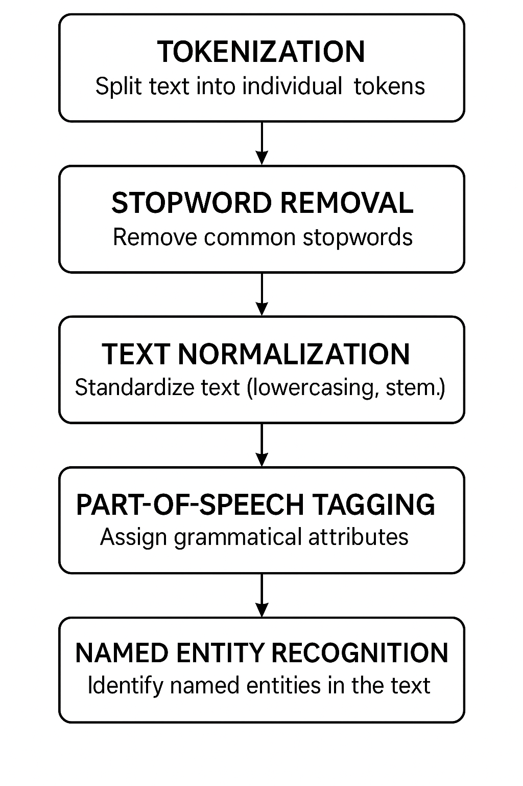

# NLP using Transformers - Workshop 04/26/2025

----

## [Arpit-Jain-ML-workshop](https://github.com/jainarpit21/ML-Workshop/tree/main)

----

## Topics

----

### What is Deep learning
- RNN (Recurrent Neural Network)
- LSTM (Long Short Term Memory)
- GRU (Gated Recurrent Unit)
- Seq2Seq Model
  
### Use cases 
- Weather Prediction
- Gold Pricing

### Advanced NLP
- Vectorizations
- Word Embeddings 

### Transformers
- Intro and Core improvements
- GPT
- BERT

----

## Deep Learning 

- ANN, CNN & RNN 
- ANN - more practical towards tabular data.
- RNN - focussed towards `Text` data.
- CNN - focussed towards `Images`.
- What determines no. of nodes 
- What determines number of hidden layers 
- Feed Forward &rarr; L to R (L &rarr; R)
- Back Propagation &rarr; R to L (R &rarr; L)
- Gradient Descent

- Number of input nodes depends on the number of input features 

$$
Weight Assignment Rule = 1 /\sqrt n 
$$

- Epochs &rarr; Iterations 

- CNN &rarr; images 

- Convulational layers extracts features from the images (RGB &rarr; -255 to 255)
- Pooling Layer &rarr; Reduce the features (Dot Matrix multiplication etc.)
- Flattenning the image &rarr; One image is broken down into individual columns (data)

### RNN
Important thing to note in RNN is maintaining the sequence and identifying the `Context`; which is achieved by using maintaining the memory.

#### RNN Applications 
- Language translation
- Chatbots & Virtual Assistants
- Predictive Text & Auto-Completion
- Stock Market Prediction 
- Medical Diagnostics
- Video Analysis

#### Types of RNN
- Vanilla RNN &rarr; simple sequential data processing.
- LSTM &rarr; Handles long term dependencies by solving the vanishing gradient problem.
- GRU &rarr; Simplified LSTM variant with fewer gates for efficient computation.

----


## 🧠 1. What is ANN (Artificial Neural Network)?

- **ANN** is the **basic** form of neural network.
- It's made up of **layers of neurons** (nodes).
- Each neuron is **connected** to every neuron in the next layer (**fully connected**).
- Works well for **general tabular data**, **simple regression**, and **basic classification**.

### Visual:
```
Input Layer → Hidden Layer(s) → Output Layer
```

- Each layer simply transforms the input data by multiplying weights and adding biases, then applying an activation function.

---

## 🔁 2. What is RNN (Recurrent Neural Network)?

- **RNN** is designed for **sequential data** — like time series, sentences, speech.
- It has **loops** inside the network:  
  **Current output depends not just on the current input, but also on previous outputs.**
- RNNs have a "memory" — they remember **past information** to influence the current prediction.

### Visual:
```
Input (t-1) → Input (t) → Input (t+1) 
         ↓          ↓          ↓
      Hidden → Hidden → Hidden → Output
```

- Think of **RNN** as a **"chain"** passing information across time steps.

---

## 📷 3. What is CNN (Convolutional Neural Network)?

- **CNN** is specially designed for **spatial data** — mainly **images** or anything with a grid-like structure (2D/3D data).
- Instead of connecting every neuron to every other, CNNs use **filters/kernels** that "slide" over the data to detect **features** like edges, shapes, patterns.
- CNNs are **great for image recognition, computer vision, and video analysis**.

### Visual:
```
Input Image → Convolution Layer → Pooling Layer → Fully Connected Layer → Output
```

- It **detects features** hierarchically:
  - Early layers detect **edges**.
  - Middle layers detect **patterns**.
  - Deeper layers detect **objects**.

---

# 📋 Quick Comparison Table

| Feature | ANN | RNN | CNN |
|:--------|:----|:----|:----|
| **Purpose** | General modeling | Sequence modeling (time/words) | Image/Spatial data modeling |
| **Connections** | Fully connected layers | Layers with loops (recurrent) | Convolutional and pooling layers |
| **Memory of past** | ❌ No | ✅ Yes (short-term) | ❌ No (but spatial locality) |
| **Best for** | Simple prediction tasks | Text, Time Series, Audio | Images, Videos, Spatial Data |
| **Example** | Predict house prices | Predict next word in a sentence | Classify a cat in a photo |

---

## ✨ Quick Intuitive Examples:

- **ANN**: Predict stock price based on today’s factors.
- **RNN**: Predict tomorrow’s stock price **based on today's and yesterday’s prices**.
- **CNN**: Analyze a satellite image and detect rivers, buildings, trees.

---

## 🔥 Summary in One Line:

> - **ANNs** are good for simple, independent data.  
> - **RNNs** are for sequence/time-related tasks with memory.  
> - **CNNs** are for extracting spatial features, mainly from images.

---


----

# Day-two

----

- Advanced NLP
  - Vectorization
  - Word Embeddings 
- Transformers
  - Intro and core improvements 
  - GPT
  - Bert

----

## Auto Encoders (Base for transformers - evolved from RNN, LSTM & GRU)

- Encoders
  - Encoder reads and process the input sequence, creating a compressed representation(context vector).
- Decoder 
  - Decoder takes this context vector and generates the output sequence. 


----

## NLP Pipeline 

- Data Collection 
  - Gathering raw text data from various sources
- Text cleaning 
  - Removing noise and irrelevant information from text
- Pre-processing
  - Transforming text into suitable format for analysis
- Feature Engineering 
  - Extracting and selecting features to improve model performance
- Modeling
  - Building and training NLP models using the processed data
- Evaluation
  - Assessing the peformance and accuracy of the models

----

## 📚 Text Pre-Processing Steps

```text
Tokenization &rarr; Stopword Removal &rarr; Text Normalization &rarr; Part-of-Speech Tagging &rarr; Named Entity Recognition
```


- **Stemming:**
- **Lemmatization:**
---

## 1. **Tokenization**

### What it is:
- Breaking down a text **into smaller units** (usually words or sentences).
- "Hello world!" → ["Hello", "world", "!"]

**Goal:** Structure text into manageable chunks for further processing.

---

### Libraries:
- `nltk`
- `spacy`
- `transformers` (in tokenizers for LLMs)

---

### Example:

```python
import nltk
nltk.download('punkt')
from nltk.tokenize import word_tokenize

text = "Hello world! How are you?"
tokens = word_tokenize(text)
print(tokens)
```
**Output:**
```
['Hello', 'world', '!', 'How', 'are', 'you', '?']
```

Or using `spaCy`:

```python
import spacy

nlp = spacy.load("en_core_web_sm")
doc = nlp("Hello world! How are you?")
tokens = [token.text for token in doc]
print(tokens)
```

---

## 2. **Stopword Removal**

### What it is:
- **Stopwords** are common words (like "and", "the", "is") that don't carry important meaning.
- We often **remove them** to focus on the important words.

---

### Libraries:
- `nltk`
- `spacy`

---

### Example:

```python
from nltk.corpus import stopwords
nltk.download('stopwords')

stop_words = set(stopwords.words('english'))
filtered_tokens = [word for word in tokens if word.lower() not in stop_words]
print(filtered_tokens)
```
**Output:**
```
['Hello', 'world', '?']
```

Or using `spaCy`:

```python
filtered_tokens = [token.text for token in doc if not token.is_stop]
print(filtered_tokens)
```

---

## 3. **Text Normalization**

### What it is:
- Making text uniform by:
  - Lowercasing
  - Removing punctuation
  - Stemming (cutting words down to root form) or Lemmatization (reducing words to their base form)

---

### Libraries:
- `nltk`
- `spacy`
- `re` (for regex-based cleaning)

---

### Example (lowercase + regex clean):

```python
import re

text = "Hello World!!! How are you?"
text = text.lower()
text = re.sub(r'[^a-zA-Z\s]', '', text)  # Remove punctuation
print(text)
```
**Output:**
```
'hello world how are you'
```

---

### Example (Lemmatization with spaCy):

```python
lemmatized = [token.lemma_ for token in doc]
print(lemmatized)
```
**Output:**
```
['hello', 'world', '!', 'how', 'be', 'you', '?']
```
(Notice: "are" → "be" after lemmatization.)

---

## 4. **Part-of-Speech (POS) Tagging**

### What it is:
- Labeling each word in a sentence with its **grammatical role** (noun, verb, adjective, etc).

Example:  
"Dog barks loudly" → [("Dog", noun), ("barks", verb), ("loudly", adverb)]

---

### Libraries:
- `nltk`
- `spacy`

---

### Example:

```python
# Using NLTK
nltk.download('averaged_perceptron_tagger')
pos_tags = nltk.pos_tag(tokens)
print(pos_tags)
```

**Output:**
```
[('Hello', 'NNP'), ('world', 'NN'), ('!', '.'), ('How', 'WRB'), ('are', 'VBP'), ('you', 'PRP'), ('?', '.')]
```

Or using `spaCy`:

```python
pos_tags = [(token.text, token.pos_) for token in doc]
print(pos_tags)
```

**Output:**
```
[('Hello', 'INTJ'), ('world', 'NOUN'), ('!', 'PUNCT'), ('How', 'ADV'), ('are', 'AUX'), ('you', 'PRON'), ('?', 'PUNCT')]
```

---

## 5. **Named Entity Recognition (NER)**

### What it is:
- **NER** identifies and categorizes named entities in text, like:
  - Person names
  - Locations
  - Organizations
  - Dates, etc.

Example:  
"Barack Obama was born in Hawaii." → PERSON: Barack Obama, LOCATION: Hawaii

---

### Libraries:
- `spacy`
- `nltk` (small support)
- `transformers` (BERT-based models like `bert-large-cased-finetuned-conll03`)

---

### Example:

```python
for ent in doc.ents:
    print(ent.text, ent.label_)
```

**Output:**
```
('Barack Obama', 'PERSON')
('Hawaii', 'GPE')
```

(*GPE = Geo-Political Entity*)

---

# 📋 Final Quick Library Summary:

| Task | Libraries |
|:----|:----------|
| Tokenization | `nltk`, `spacy` |
| Stopword Removal | `nltk`, `spacy` |
| Normalization (lowercase, stemming, lemmatization) | `nltk`, `spacy`, `re` |
| POS Tagging | `nltk`, `spacy` |
| Named Entity Recognition | `spacy`, `transformers` |

---

# 🚀 Full Mini-Pipeline Example:

```python
import nltk
import spacy
import re

nltk.download('punkt')
nltk.download('stopwords')
nltk.download('averaged_perceptron_tagger')

from nltk.corpus import stopwords
from nltk.tokenize import word_tokenize

text = "Barack Obama was born in Hawaii in 1961."

# Step 1: Lowercase and clean text
text = text.lower()
text = re.sub(r'[^a-zA-Z\s]', '', text)

# Step 2: Tokenization
tokens = word_tokenize(text)

# Step 3: Stopword removal
stop_words = set(stopwords.words('english'))
tokens = [word for word in tokens if word not in stop_words]

# Step 4: POS tagging
pos_tags = nltk.pos_tag(tokens)

# Step 5: Named Entity Recognition (using spaCy)
nlp = spacy.load("en_core_web_sm")
doc = nlp(text)
named_entities = [(ent.text, ent.label_) for ent in doc.ents]

print("Tokens:", tokens)
print("POS Tags:", pos_tags)
print("Named Entities:", named_entities)
```

---

# 🎯 TL;DR:
> Text pre-processing cleans and structures raw text to prepare it for deep learning and NLP models — using tokenization, cleaning, tagging, and entity recognition tools like NLTK, SpaCy, and Transformers.

---




----

## 📚 What is Vectorization in Text Preprocessing?

> **Vectorization** is the process of **converting text into numerical vectors** so that machine learning models can understand and work with the text.

Since ML models only work with numbers (not raw text), vectorization is **essential**!

---

## ✨ Main Types of Text Vectorization

| Type | Example Libraries | Key Idea |
|:----|:------------------|:---------|
| 1. **Bag of Words (BoW)** | `CountVectorizer` from `sklearn` | Represent text as the **count** of words |
| 2. **TF-IDF (Term Frequency - Inverse Document Frequency)** | `TfidfVectorizer` from `sklearn` | Weight words by importance across documents |
| 3. **Word Embeddings** (Word2Vec, GloVe, FastText) | `gensim`, `spacy` | Capture **semantic meaning** (context) in dense vectors |
| 4. **Sentence Embeddings** (Doc2Vec, BERT, Sentence-Transformers) | `transformers`, `sentence-transformers` | Represent **entire sentences/documents** as vectors |
| 5. **One-hot Encoding** | Manual/`sklearn` | Basic binary presence of words |

---

## 1. 🛍️ Bag of Words (BoW)

### What:
- Each document is represented by a **vector of word counts**.
- **Order doesn't matter**, only the **presence and frequency** of words matter.

---

### Example:

Text 1: "I love NLP"  
Text 2: "I love Machine Learning"

Vocabulary: `[I, love, NLP, Machine, Learning]`

Vectors:
- Text 1 → `[1, 1, 1, 0, 0]`
- Text 2 → `[1, 1, 0, 1, 1]`

---

### Code:

```python
from sklearn.feature_extraction.text import CountVectorizer

texts = ["I love NLP", "I love Machine Learning"]
vectorizer = CountVectorizer()
X = vectorizer.fit_transform(texts)

print(vectorizer.get_feature_names_out())
print(X.toarray())
```

---

# 2. 📊 TF-IDF (Term Frequency - Inverse Document Frequency)

### What:
- It **penalizes** common words (like "the", "is") that appear everywhere.
- **Boosts** rare, informative words.


$$
Formula:
\text{TF-IDF} = \text{TF} \times \text{IDF}
$$

Where:
- TF = Term Frequency (how often a term appears in a document)
- IDF = Inverse Document Frequency (log penalty for common terms)

---

### Code:

```python
from sklearn.feature_extraction.text import TfidfVectorizer

texts = ["I love NLP", "I love Machine Learning"]
vectorizer = TfidfVectorizer()
X = vectorizer.fit_transform(texts)

print(vectorizer.get_feature_names_out())
print(X.toarray())
```

---

## 3. 🧠 Word Embeddings (Word2Vec, GloVe, FastText)

### What:
- Instead of just frequency, **embed words** into **dense vectors** that capture **meaning and context**.
- Similar words are **closer** in vector space.

Example:
- "king" - "man" + "woman" ≈ "queen"

---

### Code (Word2Vec with gensim):

```python
from gensim.models import Word2Vec

sentences = [["I", "love", "NLP"], ["I", "love", "Machine", "Learning"]]
model = Word2Vec(sentences, vector_size=50, window=5, min_count=1, workers=4)

print(model.wv['NLP'])  # Dense 50-dimensional vector for "NLP"
```

- You can **download pre-trained** GloVe or FastText embeddings too!

---

## 4. 📜 Sentence Embeddings (Doc2Vec, BERT, Sentence-Transformers)

### What:
- Instead of word-level embeddings, get a **vector for the whole sentence** or document.
- Very useful for **semantic search**, **sentence classification**, **question answering**.

---

### Code (Sentence-Transformers with BERT):

```python
from sentence_transformers import SentenceTransformer

model = SentenceTransformer('all-MiniLM-L6-v2')

sentences = ["I love NLP", "Machine Learning is amazing"]
embeddings = model.encode(sentences)

print(embeddings.shape)  # (2, 384) — 2 sentences, 384-dim vectors
```

---

## 5. 🔲 One-hot Encoding

### What:
- Create a **binary vector** for each word based on vocabulary.
- 1 if the word exists in the sentence, 0 otherwise.

- It’s **simple**, but **does not capture frequency** or **semantic meaning**.

---

### Manual Code Example:

```python
vocab = {'i': 0, 'love': 1, 'nlp': 2, 'machine': 3, 'learning': 4}
sentence = "I love NLP"
one_hot_vector = [0]*len(vocab)

for word in sentence.lower().split():
    index = vocab.get(word)
    if index is not None:
        one_hot_vector[index] = 1

print(one_hot_vector)
```

---

## 📋 Quick Comparison Table

| Method | Captures Frequency? | Captures Context/Meaning? | Output Size | Best For |
|:------|:---------------------|:-------------------------|:------------|:---------|
| BoW | ✅ Yes | ❌ No | Large (vocab size) | Simple tasks |
| TF-IDF | ✅ (weighted) | ❌ No | Large (vocab size) | More focus on important words |
| Word Embedding | ❌ | ✅ Yes | Small (e.g., 100-300 dims) | Word understanding |
| Sentence Embedding | ❌ | ✅ Yes | Small (e.g., 384 dims) | Sentence/document understanding |
| One-hot | ✅ | ❌ | Large (vocab size) | Very simple tasks |

---

# 🎯 TL;DR:

> Vectorization is how we translate text into numbers.  
> Some methods capture just **frequency** (BoW, TF-IDF), while some capture **meaning and relationships** (Word2Vec, BERT).

---


## Transformers 

Alright — this is a **big** but **beautiful** topic!  
Let’s break down **Transformer architecture** **step-by-step** very **clearly**, so you feel confident with it. 🚀

---

# 📚 What is Transformer Architecture?

**Transformers** are a type of neural network model designed to **handle sequential data**, but **without using recurrence** (no loops like RNNs).  
Instead, they use a mechanism called **Self-Attention** to **look at the entire sequence at once**.

Originally introduced in the 2017 paper:  
**"Attention is All You Need"** by Vaswani et al.

---

# 🔥 High-Level Structure

| Main Block | Purpose |
|:-----------|:--------|
| Input Embedding | Convert tokens into vectors |
| Positional Encoding | Add order information (since no recurrence) |
| Encoder Blocks | Process inputs and capture features |
| Decoder Blocks | Generate outputs by attending to encoder outputs |
| Output Layer | Convert final vectors into words/tokens |

---

# 🏛️ Transformer Full Architecture:

### 1. **Input Embedding**
- Each word/token → converted into a dense vector.

### 2. **Positional Encoding**
- Adds information about **word position** (since model processes words in parallel).

### 3. **Encoder**
- Multiple identical **Encoder Layers** stacked.
- Each Encoder Layer:
  - **Self-Attention Layer** (how much each word should attend to other words)
  - **Feed-Forward Neural Network** (MLP)
  - **Residual Connection** + **Layer Normalization** (stabilizes training)

### 4. **Decoder**
- Multiple identical **Decoder Layers** stacked.
- Each Decoder Layer:
  - **Masked Self-Attention** (can't look ahead in future words)
  - **Cross-Attention** (looks at Encoder outputs)
  - **Feed-Forward Neural Network**

### 5. **Output Linear + Softmax Layer**
- Final outputs transformed back to word probabilities.

---

# ⚙️ Key Concept: Attention Mechanism

The **core magic** is **Self-Attention**:
- Every word can **attend** (focus) on other words in the input to gather context.

Example:
- In "The cat sat on the mat", when predicting "sat", it attends heavily to "cat".

Formula (Scaled Dot-Product Attention):

$$
\text{Attention}(Q, K, V) = \text{softmax}\left( \frac{QK^T}{\sqrt{d_k}} \right)V
$$

Where:
- \(Q\) = Query matrix
- \(K\) = Key matrix
- \(V\) = Value matrix
- \(d_k\) = dimension of keys

---

# 📦 Multi-Head Attention

- Instead of performing one attention function, **the Transformer does multiple in parallel**.
- Helps the model **focus on different parts** of the sentence **simultaneously**.

---

# 🎯 Putting It All Together - Flowchart:

```
Input Tokens
    ↓
Word Embeddings + Positional Encoding
    ↓
[ENCODER LAYERS]
    ↓
[DECODER LAYERS] (attends to Encoder output)
    ↓
Output Tokens
```

---

# 🧩 Simple Example Code

Let's use HuggingFace `transformers` library — it hides most of the complexity but lets us see it in action!

```python
from transformers import AutoTokenizer, AutoModel

# Load a small pretrained model
tokenizer = AutoTokenizer.from_pretrained("distilbert-base-uncased")
model = AutoModel.from_pretrained("distilbert-base-uncased")

# Example sentence
sentence = "Transformers are amazing!"

# Tokenize input
inputs = tokenizer(sentence, return_tensors="pt")

# Pass through Transformer
outputs = model(**inputs)

# outputs is a tuple: (last_hidden_state, pooled_output)
print(outputs.last_hidden_state.shape)
```

**Explanation:**
- `tokenizer` breaks the sentence into tokens + embeddings.
- `model` applies the Transformer encoder layers.
- `outputs.last_hidden_state` gives embeddings for each token.

If the input had **7 tokens**, and the model hidden size is **768**, output will be shaped **(batch_size=1, sequence_length=7, hidden_size=768)**.

---

# 📋 Summary Table:

| Component | Description |
|:---------|:------------|
| Embedding Layer | Converts tokens to dense vectors |
| Positional Encoding | Adds order information |
| Encoder | Self-attention + FFN layers |
| Decoder | Masked self-attention + cross-attention |
| Attention | Captures relationships between tokens |
| Output Layer | Generates final predictions |

---

# 🧠 TL;DR:

> **Transformers** use **self-attention** to let every word "talk" to every other word — no matter how far apart they are — and process entire sequences **in parallel**, **without RNNs**.

---
