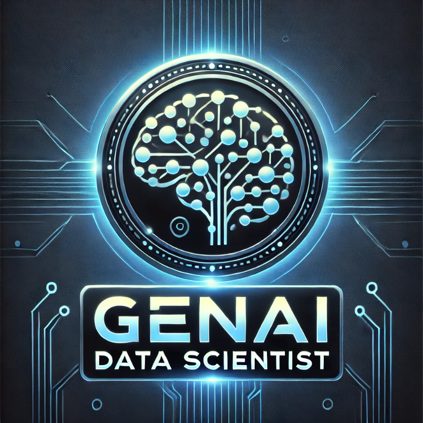

  <a href="https://github.com/business-science/awesome-generative-ai-data-scientist">
    <picture>
      
  </picture>
  </a>

  <em>100+ Free Resources On Generative AI for Data Scientists</em>

# Awesome Generative AI Data Scientist 

> The Future is using AI and ML Together

## 🚀🚀 100+ Free Resources On Generative AI for Data Scientists

A curated list of 100+ resources to help you become a Generative AI Data Scientist. This repository includes resources on building GenAI Data Science applications with Large Language Models (LLMs) and deploying LLMs and Generative AI/ML with Cloud-based solutions.

[**Please ⭐ us on GitHub (it takes 2 seconds and means a lot).**](awesome-generative-ai-data-scientist)
## Contents:

- [Awesome Real World AI Use Cases](#awesome-real-world-ai-use-cases)
- [Python Libraries](#python-libraries)
- [Examples and Cookbooks](#examples-and-cookbooks)
- [Newsletters](#newsletters)
- [Courses and Training](#courses-and-training)

# Awesome Real-World AI Use Cases

- 🚀🚀 [AI Data Science Team In Python](https://github.com/business-science/ai-data-science-team): An AI-powered data science team of copilots that uses agents to help you perform common data science tasks 10X faster. [Examples](https://github.com/business-science/ai-data-science-team/tree/master/examples) | [Github](https://github.com/business-science/ai-data-science-team)
- 🚀 [Awesome LLM Apps](https://github.com/Shubhamsaboo/awesome-llm-apps): LLM RAG AI Apps with Step-By-Step Tutorials
- [AI Hedge Fund](https://github.com/virattt/ai-hedge-fund): Proof of concept for an AI-powered hedge fund
- [AI Financial Agent](https://github.com/virattt/ai-financial-agent): A financial agent for investment research
- [Strutured Report Generation (LangGraph)](https://www.youtube.com/watch?v=E04rFNtwFcA): How to build an agent that can orchestrate the end-to-end process of report planning, web research, and writing. We show that this agent can produce reports of varying and easily configurable format. [Video](https://www.youtube.com/watch?v=E04rFNtwFcA) | [Blog](https://blog.langchain.dev/structured-report-generation-blueprint/) | [Code](https://github.com/langchain-ai/langchain-nvidia/blob/main/cookbook/structured_report_generation.ipynb)
- [Uber QueryGPT](https://www.uber.com/en-TW/blog/query-gpt/): Uber's QueryGPT uses large language models (LLM), vector databases, and similarity search to generate complex queries from English (Natural Language) questions that are provided by the user as input. The tool enhances the productivity of engineers, operations managers, and data scientists at Uber.
- [Nir Diamant GenAI Agents](https://github.com/NirDiamant/GenAI_Agents): Tutorials and implementations for various Generative AI Agent techniques, from basic to advanced. It serves as a comprehensive guide for building intelligent, interactive AI systems. [GitHub](https://github.com/NirDiamant/GenAI_Agents)
- [AI Engineering Hub](https://github.com/patchy631/ai-engineering-hub/tree/main): Real-world AI agent applications, LLM and RAG tutorials, with examples to implement. [GitHub](https://github.com/patchy631/ai-engineering-hub/tree/main)

# Python Libraries

## Data Science And AI Agents

- 🚀🚀 [AI Data Science Team In Python](https://github.com/business-science/ai-data-science-team): AI Agents to help you perform common data science tasks 10X faster. [Examples](https://github.com/business-science/ai-data-science-team/tree/master/examples) | [Github](https://github.com/business-science/ai-data-science-team)
- 🚀 [PandasAI](https://pandas-ai.com/): Open Source AI Agents for Data Analysis. [Documentation](https://docs.pandas-ai.com/) | [Github](https://github.com/sinaptik-ai/pandas-ai)

## Coding Agents

- [Qwen-Agent](https://github.com/QwenLM/Qwen-Agent): A framework for developing LLM applications based on the instruction following, tool usage, planning, and memory capabilities of Qwen. It also comes with example applications such as Browser Assistant, Code Interpreter, and Custom Assistant. [Documentation](https://github.com/QwenLM/Qwen-Agent/tree/main/docs) | [Examples](https://github.com/QwenLM/Qwen-Agent/tree/main/examples) | [Github](https://github.com/QwenLM/Qwen-Agent)

## AI Frameworks (Build Your Own)

- [LangChain](https://www.langchain.com/): A framework for developing applications powered by large language models (LLMs). [Documentation](https://python.langchain.com/) | [Github](https://github.com/langchain-ai/langchain) [Cookbook](https://github.com/langchain-ai/langchain/tree/master/cookbook)
- [LangGraph](https://github.com/langchain-ai/langgraph): A library for building stateful, multi-actor applications with LLMs, used to create agent and multi-agent workflows. [Documentation](https://langchain-ai.github.io/langgraph/) [Tutorials](https://github.com/langchain-ai/langgraph/tree/main/docs/docs/tutorials)
- [LangSmith](https://smith.langchain.com/): LangSmith is a platform for building production-grade LLM applications. It allows you to closely monitor and evaluate your application, so you can quickly and confidently ship. [Documentation](https://docs.smith.langchain.com/) | [Github](https://github.com/langchain-ai/langsmith-sdk)
- [LlamaIndex](https://www.llamaindex.ai/): LlamaIndex is a framework for building context-augmented generative AI applications with LLMs. [Documentation](https://docs.llamaindex.ai/) | [Github](https://github.com/run-llama/llama_index)
- [LlamaIndex Workflows](https://www.llamaindex.ai/blog/introducing-workflows-beta-a-new-way-to-create-complex-ai-applications-with-llamaindex): LlamaIndex workflows is a mechanism for orchestrating actions in the increasingly-complex AI application we see our users building.
- [CrewAI](https://www.crewai.com/): Streamline workflows across industries with powerful AI agents. [Documentation](https://docs.crewai.com/) | [Github](https://github.com/crewAIInc/crewAI)
- [AutoGen](https://github.com/microsoft/autogen): Microsoft's programming framework for agentic AI.
- [Pydantic AI](https://ai.pydantic.dev/): Python agent framework designed to make building production-grade applications with Generative AI less painful. [Github](https://github.com/pydantic/pydantic-ai)
- [ControlFlow](https://controlflow.ai/): Prefect's Python framework for building agentic AI workflows. [Documentation](https://controlflow.ai/welcome) | [Github](https://github.com/PrefectHQ/ControlFlow)
- [FlatAI](https://github.com/mindsdb/flat-ai): Frameworkless LLM Agents. 

## AI Frameworks (Drag and Drop)

- [LangGraph Studio](https://github.com/langchain-ai/langgraph-studio): IDE that enables visualization, interaction, and debugging of complex agentic applications
- [Langflow](https://www.langflow.org/): A low-code tool that makes building powerful AI agents and workflows that can use any API, model, or database easier. [Documentation](https://docs.langflow.org/) | [Github](https://github.com/langflow-ai/langflow)
- [Pyspur](https://www.pyspur.dev/): Graph-Based Editor for LLM Workflows [Documentation]() | [Github](https://github.com/PySpur-Dev/PySpur)
- [LangWatch](https://langwatch.ai/): Monitor, Evaluate & Optimize your LLM performance with 1-click. Drag and drop interface for LLMOps platform. [Documentation](https://docs.langwatch.ai/) | [GitHub](https://github.com/langwatch/langwatch)
- [AutoGen Studio](https://microsoft.github.io/autogen/stable/user-guide/autogenstudio-user-guide/index.html): AutoGen Studio is a low-code interface built to help you rapidly prototype AI agents, enhance them with tools, compose them into teams and interact with them to accomplish tasks. It is built on AutoGen AgentChat - a high-level API for building multi-agent applications. 

## LLM Providers

- [OpenAI](https://github.com/openai/openai-python): The official Python library for the OpenAI API
- [Hugging Face Models](https://huggingface.co/models): Open LLM models by Meta, Mistral, and hundreds of other providers
- [Anthropic Claude](https://github.com/anthropics/anthropic-sdk-python): The official Python library for the Anthropic API
- [Meta Llama Models](https://llama.meta.com/): The open source AI model you can fine-tune, distill and deploy anywhere.
- [Google Gemini](https://github.com/google-gemini/generative-ai-python): The official Python library for the Google Gemini API
- [Ollama](https://github.com/ollama/ollama): Get up and running with large language models locally.
- [Grok](https://github.com/groq/groq-python): The official Python Library for the Groq API

## Open Source LLM Models

- [DeepSeek-R1](https://github.com/deepseek-ai/DeepSeek-R1): 1st generation reasoning model that competes with OpenAI o1.
- [Qwen](https://github.com/QwenLM/Qwen): Alibaba's Qwen models
- [Llama](https://www.llama.com/): Meta's foundational models

## LangChain Platform

- [LangChain](https://www.langchain.com/): A framework for developing applications powered by large language models (LLMs). [Documentation](https://python.langchain.com/) | [Github](https://github.com/langchain-ai/langchain) [Cookbook](https://github.com/langchain-ai/langchain/tree/master/cookbook)
- [LangGraph](https://github.com/langchain-ai/langgraph): A library for building stateful, multi-actor applications with LLMs, used to create agent and multi-agent workflows. [Documentation](https://langchain-ai.github.io/langgraph/) [Tutorials](https://github.com/langchain-ai/langgraph/tree/main/docs/docs/tutorials)
- [LangSmith](https://smith.langchain.com/): LangSmith is a platform for building production-grade LLM applications. It allows you to closely monitor and evaluate your application, so you can quickly and confidently ship. [Documentation](https://docs.smith.langchain.com/) | [Github](https://github.com/langchain-ai/langsmith-sdk)

## Huggingface Platform

- [Huggingface](https://huggingface.co/): An open-source platform for machine learning (ML) and artificial intelligence (AI) tools and models.  [Documentation](https://huggingface.co/docs)
- [Transformers](https://huggingface.co/docs/transformers): Transformers provides APIs and tools to easily download and train state-of-the-art pretrained models.
- [Tokenizers](https://huggingface.co/docs/tokenizers): Tokenizers provides an implementation of today’s most used tokenizers, with a focus on performance and versatility [Documentation] | [Github](https://github.com/huggingface/transformers)
- [Sentence Transformers](https://sbert.net/): Sentence Transformers (a.k.a. SBERT) is the go-to Python module for accessing, using, and training state-of-the-art text and image embedding models.
- [smolagents](https://huggingface.co/docs/smolagents): The simplest framework out there to build powerful agents [Documentation](https://huggingface.co/docs/smolagents) | [Github](https://github.com/huggingface/smolagents)

## Vector Databases (RAG)

- [ChromaDB](https://github.com/chroma-core/chroma): The fastest way to build Python or JavaScript LLM apps with memory!
- [FAISS](https://github.com/facebookresearch/faiss): A library for efficient similarity search and clustering of dense vectors.
- [Qdrant](https://qdrant.tech/): High-Performance Vector Search at Scale
- [Pinecone](https://github.com/pinecone-io/pinecone-python-client): The official Pinecone Python SDK.
- [Milvus](https://github.com/milvus-io/milvus): Milvus is an open-source vector database built to power embedding similarity search and AI applications. 

## Pretraining

- [PyTorch](https://pytorch.org/): PyTorch is an open-source machine learning library based on the Torch library, used for applications such as computer vision and natural language processing.
- [TensorFlow](https://www.tensorflow.org/): TensorFlow is an open-source machine learning library developed by Google.
- [JAX](https://github.com/jax-ml/jax): Google’s library for high-performance computing and automatic differentiation.
- [tinygrad](https://github.com/tinygrad/tinygrad): A minimalistic deep learning library with a focus on simplicity and educational use, created by George Hotz.
- [micrograd](https://github.com/karpathy/micrograd): A simple, lightweight autograd engine for educational purposes, created by Andrej Karpathy.

## Fine-tuning

- [Transformers](https://huggingface.co/docs/transformers): Hugging Face Transformers is a popular library for Natural Language Processing (NLP) tasks, including fine-tuning large language models.
- [Unsloth](https://github.com/unslothai/unsloth): Finetune Llama 3.2, Mistral, Phi-3.5 & Gemma 2-5x faster with 80% less memory!
- [LitGPT](https://github.com/Lightning-AI/litgpt): 20+ high-performance LLMs with recipes to pretrain, finetune, and deploy at scale.
- [AutoTrain](https://github.com/huggingface/autotrain-advanced): No code fine-tuning of LLMs and other machine learning tasks.

## Testing and Monitoring (Observability)

- [LangSmith](https://smith.langchain.com/): LangSmith is a platform for building production-grade LLM applications. It allows you to closely monitor and evaluate your application, so you can quickly and confidently ship. [Documentation](https://docs.smith.langchain.com/) | [Github](https://github.com/langchain-ai/langsmith-sdk)
- [LangWatch](https://langwatch.ai/): Monitor, Evaluate & Optimize your LLM performance with 1-click. Drag and drop interface for LLMOps platform. [Documentation](https://docs.langwatch.ai/) | [GitHub](https://github.com/langwatch/langwatch)
- [Opik](https://github.com/comet-ml/opik): Opik is an open-source platform for evaluating, testing and monitoring LLM applications
- [MLflow Tracing and Evaluation](https://mlflow.org/docs/latest/llms): MLflow has a suite of features for LLMs. [MLflow LLM Documentation](https://mlflow.org/docs/latest/llms) | [Model Tracing](https://mlflow.org/docs/latest/llms/tracing/index.html) | [Model Evaluation](https://mlflow.org/docs/latest/model-evaluation/index.html) | [GitHub](https://github.com/mlflow/mlflow)

## Document Parsing

- [LangChain Document Loaders](https://python.langchain.com/docs/concepts/document_loaders/): LangChain has hundreds of integrations with various data sources to load data from: Slack, Notion, Google Drive, etc.
- [Embedchain](https://embedchain.ai/): Create an AI app on your own data in a minute [Documentation](https://docs.embedchain.ai/get-started/quickstart) [Github Repo](https://github.com/mem0ai/mem0/tree/main/embedchain)
- [Docling by IBM](https://ds4sd.github.io/docling/): Parse documents and export them to the desired format with ease and speed. [Github](https://github.com/DS4SD/docling)
- [Markitdown by Microsoft](https://github.com/microsoft/markitdown): Python tool for converting files and office documents to Markdown.

## Web Parsing (HTML) and Crawlers

- [Gitingest](https://gitingest.com/): Turn any Git repository into a simple text ingest of its codebase. This is useful for feeding a codebase into any LLM. [Github](https://github.com/cyclotruc/gitingest)
- [Crawl4AI](https://crawl4ai.com/mkdocs/): Open-source, blazing-fast, AI-ready web crawling tailored for LLMs, AI agents, and data pipelines. [Documentation](https://crawl4ai.com/mkdocs/) | [Github](https://github.com/unclecode/crawl4ai)
- [GPT Crawler](https://www.builder.io/blog/custom-gpt): Crawl a site to generate knowledge files to create your own custom GPT from a URL. [Documentation](https://www.builder.io/blog/custom-gpt) | [Github](https://github.com/BuilderIO/gpt-crawler)

## Agents and Tools (Build Your Own)

- [LangChain Agents](https://python.langchain.com/docs/tutorials/agents/): Build agents with LangChain.
- [LangChain Tools](https://python.langchain.com/docs/concepts/tools/): Integrate Tools (Function Calling) with LangChain.
- [smolagents](https://huggingface.co/docs/smolagents): The simplest framework out there to build powerful agents [Documentation](https://huggingface.co/docs/smolagents) | [Github](https://github.com/huggingface/smolagents)
- [Agentarium](https://github.com/Thytu/Agentarium): open-source framework for creating and managing simulations populated with AI-powered agents. It provides an intuitive platform for designing complex, interactive environments where agents can act, learn, and evolve. [GitHub](https://github.com/Thytu/Agentarium)
- [AutoGen AgentChat](https://microsoft.github.io/autogen/stable/user-guide/agentchat-user-guide/quickstart.html): Build applications quickly with preset agents.

## Agents and Tools (Prebuilt)

- [Phidata](https://www.phidata.com/): An open-source platform to build, ship and monitor agentic systems. [Documentation](https://docs.phidata.com/) | [Github](https://github.com/phidatahq/phidata)
- [Composio](https://composio.dev/): Integration Platform for AI Agents & LLMs (works with LangChain, CrewAI, etc). [Documentation](https://docs.composio.dev/) | [Github](https://github.com/ComposioHQ/composio)

## LLM Memory

- [Mem0](https://mem0.ai/): Mem0 is a self-improving memory layer for LLM applications, enabling personalized AI experiences that save costs and delight users. [Documentation](https://docs.mem0.ai/) | [Github](https://github.com/mem0ai/mem0)
- [Memary](https://github.com/kingjulio8238/Memary): Open Source Memory Layer For Autonomous Agents

## LLMOps

- [LangWatch](https://langwatch.ai/): Monitor, Evaluate & Optimize your LLM performance with 1-click. Drag and drop interface for LLMOps platform. [Documentation](https://docs.langwatch.ai/) | [GitHub](https://github.com/langwatch/langwatch)
- [MLflow](https://mlflow.org/docs/latest/llms/tracing/index.html): MLflow Tracing for LLM Observability [Documentation](https://mlflow.org/docs/latest/llms/tracing/index.html)
- [Agenta](https://github.com/Agenta-AI/agenta): Open-source LLMOps platform: prompt playground, prompt management, LLM evaluation, and LLM Observability all in one place. [Documentation](https://docs.agenta.ai/) 
- [LLMOps](https://github.com/callmesora/llmops-python-package): Best practices designed to support your LLMOps initiatives
- [Helicone](https://www.helicone.ai/): Open-source LLM observability platform for developers to monitor, debug, and improve production-ready applications. [Documentation](https://docs.helicone.ai/) | [Github](https://github.com/Helicone/helicone)

## Code Sandbox (Security)

- [E2B](https://e2b.dev/): E2B is an open-source runtime for executing AI-generated code in secure cloud sandboxes. Made for agentic & AI use cases. [Documentation](https://e2b.dev/docs) | [Github]([https://github.com/e2b-dev](https://github.com/e2b-dev/e2b))
- [AutoGen Docker Code Executor](https://microsoft.github.io/autogen/stable/reference/python/autogen_ext.code_executors.docker.html#autogen_ext.code_executors.docker.DockerCommandLineCodeExecutor): Executes code through a command line environment in a Docker container

## Browser Control Agents

- [Browser-Use](https://browser-use.com/): Make websites accessible for AI agents [Documentation](https://docs.browser-use.com/) | [GitHub](https://github.com/browser-use/browser-use)

## Miscellaneous

- [AI Suite](https://github.com/andrewyng/aisuite): Simple, unified interface to multiple Generative AI providers.
- [AdalFlow](https://github.com/SylphAI-Inc/AdalFlow): The library to build & auto-optimize LLM applications, from Chatbot, RAG, to Agent by SylphAI.
- [dspy](https://github.com/stanfordnlp/dspy): DSPy: The framework for programming—not prompting—foundation models.
- [AutoPrompt](https://github.com/Eladlev/AutoPrompt): A framework for prompt tuning using Intent-based Prompt Calibration.
- [PromptFify](https://github.com/promptslab/Promptify): A library for prompt engineering that simplifies NLP tasks (e.g., NER, classification) using LLMs like GPT.
- [LiteLLM](https://github.com/BerriAI/litellm): Python SDK, Proxy Server (LLM Gateway) to call 100+ LLM APIs in OpenAI format.
- [Jupyter Agent](https://huggingface.co/spaces/data-agents/jupyter-agent): Let a LLM agent write and execute code inside a notebook
- [Jupyter AI](https://github.com/jupyterlab/jupyter-ai): A generative AI extension for JupyterLab [Documentation](https://jupyter-ai.readthedocs.io/en/latest/)
- [AI Agent Service Toolkit](https://github.com/JoshuaC215/agent-service-toolkit): Full toolkit for running an AI agent service built with LangGraph, FastAPI and Streamlit [App](https://agent-service-toolkit.streamlit.app/) | [GitHub](https://github.com/JoshuaC215/agent-service-toolkit)

# LLM Deployment (Cloud Services)

- [AWS Bedrock](https://aws.amazon.com/bedrock/): Amazon Bedrock is a fully managed service that offers a choice of high-performing foundation models (FMs) from leading AI companies like AI21 Labs, Anthropic, Cohere, Meta, Mistral AI, Stability AI, and Amazon
- [Microsoft Azure AI Services](https://azure.microsoft.com/en-us/products/ai-services): Azure AI services help developers and organizations rapidly create intelligent, cutting-edge, market-ready, and responsible applications with out-of-the-box and prebuilt and customizable APIs and models. 
- [Google Vertex AI](https://cloud.google.com/vertex-ai): Vertex AI is a fully-managed, unified AI development platform for building and using generative AI.
- [NVIDIA NIM](https://www.nvidia.com/en-us/ai): NVIDIA NIM™, part of NVIDIA AI Enterprise, provides containers to self-host GPU-accelerated inferencing microservices for pretrained and customized AI models across clouds, data centers, and workstations.

# Examples and Cookbooks

## Building AI

- [LangChain Cookbook](https://github.com/langchain-ai/langchain/blob/master/cookbook/README.md): Example code for building applications with LangChain, with an emphasis on more applied and end-to-end examples.
- [LangGraph Examples](https://github.com/langchain-ai/langgraph/tree/main/examples): Example code for building applications with LangGraph
- [Llama Index Examples](https://github.com/run-llama/llama_index/tree/main/docs/docs/examples): Example code for building applications with Llama Index
- [Streamlit LLM Examples](https://github.com/streamlit/llm-examples): Streamlit LLM app examples for getting started

## Deploying AI

### Amazon Web Services (AWS)

- [Azure Generative AI Examples](https://github.com/Azure/azureml-examples/tree/main/sdk/python/generative-ai): Prompt Flow and RAG Examples for use with the Microsoft Azure Cloud platform
- [Amazon Bedrock Workshop](https://github.com/aws-samples/amazon-bedrock-workshop): Introduces how to leverage foundation models (FMs) through Amazon Bedrock

### Microsoft Azure

- [Microsoft Generative AI for Beginners](https://microsoft.github.io/generative-ai-for-beginners/#/) 21 Lessons teaching everything you need to know to start building Generative AI applications [Github](https://github.com/microsoft/generative-ai-for-beginners)
- [Microsoft Intro to Generative AI Course](https://learn.microsoft.com/en-us/training/paths/introduction-generative-ai/) 

### Google Cloud Platform (GCP)

- [Google Vertex AI Examples](https://github.com/GoogleCloudPlatform/vertex-ai-samples): Notebooks, code samples, sample apps, and other resources that demonstrate how to use, develop and manage machine learning and generative AI workflows using Google Cloud Vertex AI
- [Google Generative AI Examples](https://github.com/GoogleCloudPlatform/generative-ai): Sample code and notebooks for Generative AI on Google Cloud, with Gemini on Vertex AI

### NVIDIA 

- [NVIDIA NIM Anywhere](https://github.com/NVIDIA/nim-anywhere): An entry point for developing with NIMs that natively scales out to full-sized labs and up to production environments.
- [NVIDIA NIM Deploy](https://github.com/NVIDIA/nim-deploy): Reference implementations, example documents, and architecture guides that can be used as a starting point to deploy multiple NIMs and other NVIDIA microservices into Kubernetes and other production deployment environments.

# Newsletters

- [Python AI/ML Tips](https://github.com/business-science/free-ai-tips): Free newsletter on Generative AI and Data Science.
- [unwind ai](https://www.theunwindai.com/): Latest AI news, tools, and tutorials for AI Developers

# Courses and Training

## Free Training

- [Generative AI Data Scientist Workshops](https://learn.business-science.io/ai-register) Get free training on how to build and deploy Generative AI / ML Solutions. [Register for the next free workshop here.](https://learn.business-science.io/ai-register)

## Paid Courses

- [8-Week AI Bootcamp To Become A Generative AI-Data Scientist](https://learn.business-science.io/generative-ai-bootcamp-enroll): Focused on helping you become a Generative AI Data Scientist. Learn How To Build and Deploy AI-Powered Data Science Solutions using LangChain, LangGraph, Pandas, Scikit Learn, Streamlit, AWS, Bedrock, and EC2.