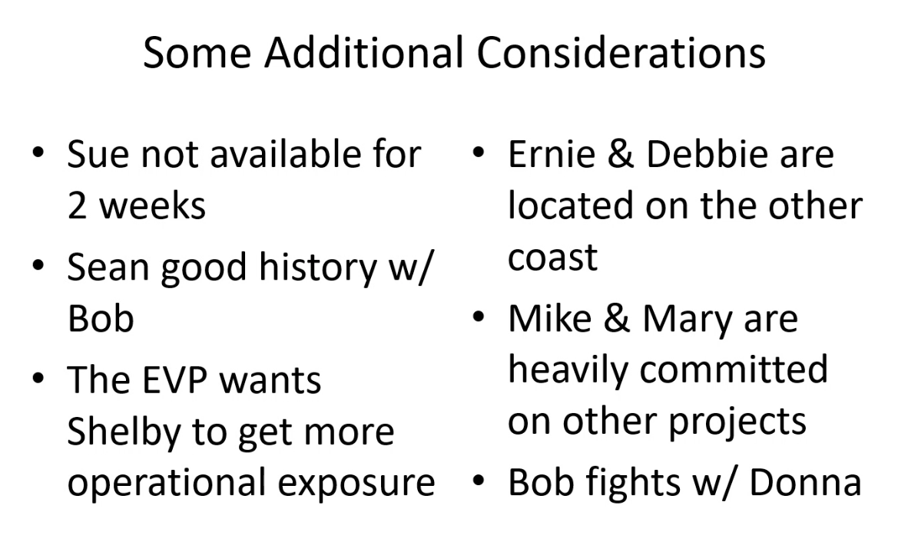
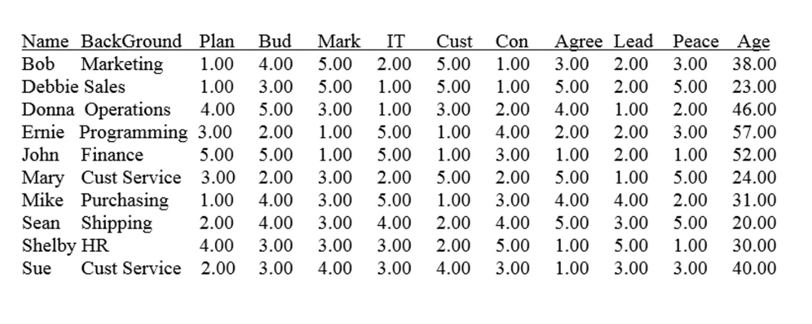
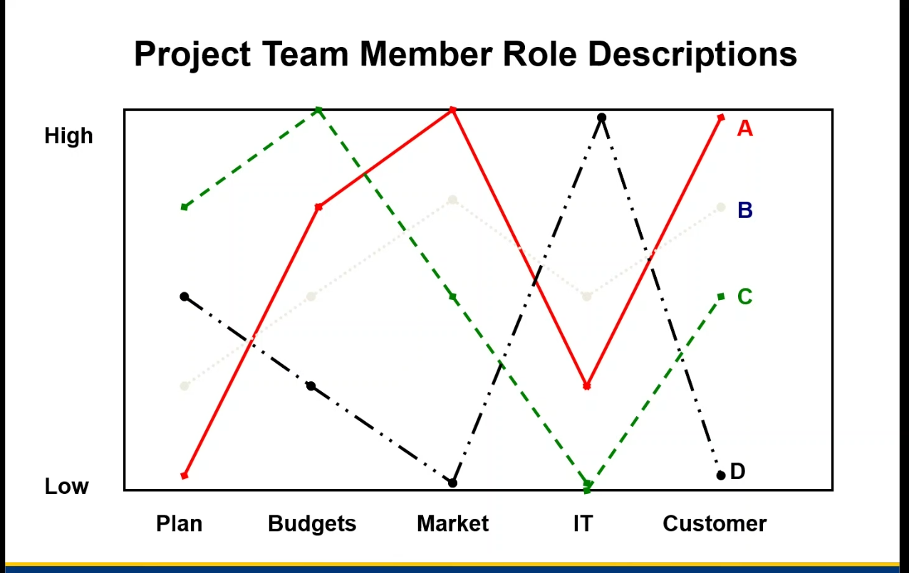
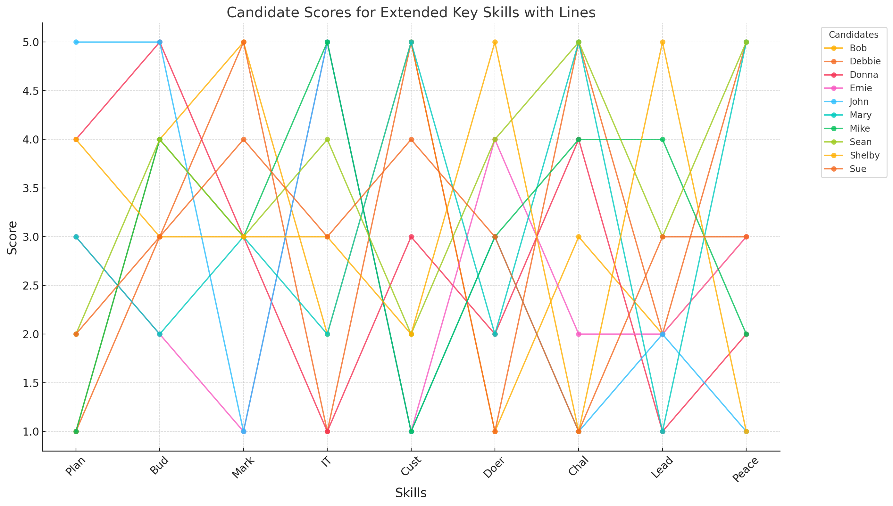

<h1 style="text-align:center;"> Leading virtual Teams - Learning Journal</h1>

----

## Activities: 

### Activity-1:

----

### Name of Team Activity: Team Staffing Task - Group A

You are a management team for a business solutions information technology company. You have to assign four members to your next project team. You will have 20 minutes to assign one person to each of the four roles. Assign one member to each of the four roles so as to achieve the best profile fit for each position. Research has shown that teams with the most task-related KSAs perform best. Therefore, assign one member to each of the four roles so as to simultaneously: 1) achieve the best profile fit for each role; while 2) maximizing the overall task-related KSAs in the team.  From the Human Resource Information System, you have retrieved the following information.

**Additional Condition:**

----

### Team memebers present: Andy, Laura, Madhu & Yuvi

----

1. **Facts:** 

**Exisiting definition for the roles**

3. **Tools/Concepts:** 
    - Used the existing defintion for each role 
    - Utilized the scores to pick the candidates whoever fit the roles definition based on the max scores in the individual skills.
    - After first iteration - factored in the additional condition to eleminate / replace candidate to make sure we have the canddiate right fit for the role.
   
3. **Successes:**
    Utilizing the data to plot it against the existing role definition enabled us to arrive at the decision swiftly backed by the facts.  
4. **Hiccups:**
    Factoring in the additional conditions and to identify the cadidates best fit for the role is little challenging especially when we cannot compromise on the `Skills` but also to keep the team's environment healthy. 
5. **Insights:** 
    Skills alone doesn't help you construct a team but there other factors and abilities that get factored in when you want to pick the candidates for a team and for a specific task. 

----

### Activity-2:

----

### Name of Team Activity: Project Management simulation - Scenario C
You are a senior project manager at Delphi Printers & Peripherals, a small electronics and computer peripheral manufacturer. You have been tasked with assembling and directing a product design team to develop a new and innovative consumer printer. Delphi has intelligence suggesting that a competitor is launching a printer with similar features and capabilities in six months, putting pressure on you and your team to develop a new printer that can compete effectively.

- What's different about the project contexts ?
- How have casual relationships been affected or changed? Why ?
- What strategies did you use ? Did those change across scenarios? Why/ Why not?
- Take-a-ways - project management advice ?

**Scenario Objective:**
Scenario Objectives: Scenario C
Senior management expects you to release a new printer that will allow you to upstage your competitor's expected new printer announcement. The target schedule is shortened to allow you to ramp up manufacturing and marketing soon enough to preempt the competitor announcement with an announcement of your own. The budget will support a cost structure that permits a printer profit margin which is slightly better than that of the current printer.

Your own analysis of the work required and subsequent work breakdown structure has led you to conclude that these targets are difficult but achievable. You're concerned, however, that the market intelligence gathered about your competitor's plans might not be reliable. Management has committed to providing stable access to resources during the project.

Specific Objectives
Target Scope: Level 3
You will be able to upstage the competitor's expected new product announcement. You will receive 200 points for delivering a printer with the scope requested and up to 100 additional points for delivering a printer with a more sophisticated scope.

Target Schedule: Week 12
This schedule will allow you to ramp up manufacturing and marketing soon enough to quickly match the competitor new product announcement with one of your own. You will receive 250 points for meeting your schedule goals and up to 100 additional points for completing ahead of schedule.

Target Cost: $40,700
This will support a cost structure that will enable you to release the new printer with a profit margin higher than the competitor. You will receive 200 points for meeting your budget/resources goals and up to 100 additional points for completing under budget.

You may also receive up to 100 points for team process by maintaining a consistent morale of 85–95%.

----

### Team memebers present: Patrick Kenehan, Joseph Schisselbauer & Yuvi 

----

1.**Facts:** 
Week-1:

2.**Tools/Concepts:** 

3.**Successes:**
    Utilizing the data to plot it against the existing role definition enabled us to arrive at the decision swiftly backed by the facts.  

4.**Hiccups:**
    Factoring in the additional conditions and to identify the cadidates best fit for the role is little challenging especially when we cannot compromise on the `Skills` but also to keep the team's environment healthy. 

5.**Insights:** 
    Skills alone doesn't help you construct a team but there other factors and abilities that get factored in when you want to pick the candidates for a team and for a specific task. 

----

### Activity-3:

----

### Name of Team Activity: Project Management simulation - Scenario G
You are a senior project manager at Delphi Printers & Peripherals, a small electronics and computer peripheral manufacturer. You have been tasked with assembling and directing a product design team to develop a new and innovative consumer printer. Delphi has intelligence suggesting that a competitor is launching a printer with similar features and capabilities in six months, putting pressure on you and your team to develop a new printer that can compete effectively.

**Scenario Objective:**
Scenario Objectives: Scenario G
Senior management sends an organization-wide email: forest fires in your office building's vicinity are proving difficult to control and are causing concern across the city. You're told to take what you need from your office as a preemptive measure and to go home and work remotely until further notice.

The new project you had just begun preparing for will begin on time. As it happens, the fires continue to spread and all employers—including schools and government buildings—are immediately closed indefinitely.

Specific Objectives
Target Scope: Level 2
Senior management has indicated that you must release a multifunction printer containing the specified advanced feature. You will receive 200 points for delivering a printer with the scope requested and up to 100 additional points for delivering a printer with a more sophisticated scope.

Target Schedule: Week 18
This aggressive schedule is necessary since your competitors are also working on refining this new technology and releasing their own version. As a result, you should strive to hit this goal. You will receive 200 points for meeting your schedule goals and up to 100 additional points for completing ahead of schedule.

Target Cost: $42,500
Senior management realizes that there is inherent risk in this development, so you have been granted a larger budget to work with. You will receive 200 points for meeting your budget/resources goals and up to 100 additional points for completing under budget.

You may also receive up to 100 points for team process by maintaining a consistent morale of 85–95%.

----

### Team memebers present: Patrick Kenehan, Joseph Schisselbauer & Yuvi 

----

1.**Facts:** 
Week-1:

2.**Tools/Concepts:** 

3.**Successes:**
    Utilizing the data to plot it against the existing role definition enabled us to arrive at the decision swiftly backed by the facts.  

4.**Hiccups:**
    Factoring in the additional conditions and to identify the cadidates best fit for the role is little challenging especially when we cannot compromise on the `Skills` but also to keep the team's environment healthy. 

5.**Insights:** 
    Skills alone doesn't help you construct a team but there other factors and abilities that get factored in when you want to pick the candidates for a team and for a specific task. 

----

### Activity-4:

----

### Name of Team Activity: Change Management simulation - Scenario 2
You are the CEO and founder of Spectrum Sunglass Company.

While you generally feel good about the state of the business, you are beginning to think about your legacy. You are reading more and more professional articles emphasizing the importance of sustainable development for business and linking the themes of sustainability and innovation, such as “Why Sustainability Is Now the Key Driver of Innovation.” You are frustrated that you don’t have any new sunglass products to offer to the vocal customers who increasingly express concerns about Spectrum’s environmental impact. Not only does sustainable development make sense to you personally, from both a moral and an economic standpoint, you also see this as an opportunity to differentiate Spectrum’s products and company from your competitors, which focus primarily on price and design. You have a potential new product design that has received positive focus group feedback as well as some exciting branding deals with Hollywood celebrities in the works. Even still, you are preoccupied with sustainability.

During Spectrum Sunglass Company’s annual strategy retreat, you decide to pitch the idea of forming a task force to make the company and its products more environmentally sustainable. Your vision for Spectrum consists of three specific goals:
Eliminate 25 percent of waste by redesigning the manufacturing process.
Reduce the current level of greenhouse gas emissions by 15 percent, and
Create a new product line based entirely on environmentally benign materials.

You argue that these goals, while aggressive, are achievable within the next two years.

Andrew Chen (general counsel): In my professional opinion, the sustainability project might open up the company to unnecessary legal risks. If we go ahead with this, I advise we narrow the scope somewhat, and that we are very careful with how we publicly announce it.

Aisha Farook (VP of operations): We should first conduct careful due diligence around a product and process change that might increase raw material costs and disrupt existing production flows.

Louise Orysh (benefits administrator): Spectrum is still recovering, and has only recently begun rehiring workers; isn’t a dramatic shift in focus to sustainability premature?

You acknowledge your colleagues’ objections, and as a solution propose that you lead a five-person, interdisciplinary task force to look into the issues. As the task force chair, you will commit to devoting 50 percent of your time to this sustainability initiative while juggling your responsibilities as CEO. The remaining four task force members will devote 75 percent of their time to the project.

You add that, based on your current understanding, the task force will need to pursue the following activities:
Conduct energy audits and set aggressive milestones for improvement on the three goals.
Redesign processes and products to be more environmentally sustainable (and scale up successful experiments quickly).
Analyze environmental life cycles throughout the entire value chain inside the firm and with its suppliers.
Replace fossil-fuel energy sources with renewable energy sources.
Replace petroleum-based materials with biodegradable materials.

Mari Gopinath (VP of human resources): We need to give this initiative serious thought. I for one fully endorse your task force to find a compromise solution.

Eventually, everyone agrees to support your proposal. With your reputation on the line, you realize that success will be measured according to your team’s ability to achieve these three goals within the next two years. As the retreat ends and everyone heads to dinner, you start pondering the potentially numerous issues and obstacles you may need to overcome in implementing your sustainability vision.

Your central challenge is to convince your colleagues that a dramatic change in the organization’s strategy and products is necessary and that environmental sustainability is one of the keys to the company’s future. Fortunately, you have the requisite formal authority and widespread respect throughout the organization to tackle this challenge.

**Scenario Objective:**
Scenario Objectives: Scenario G
Senior management sends an organization-wide email: forest fires in your office building's vicinity are proving difficult to control and are causing concern across the city. You're told to take what you need from your office as a preemptive measure and to go home and work remotely until further notice.

The new project you had just begun preparing for will begin on time. As it happens, the fires continue to spread and all employers—including schools and government buildings—are immediately closed indefinitely.

Specific Objectives
Target Scope: Level 2
Senior management has indicated that you must release a multifunction printer containing the specified advanced feature. You will receive 200 points for delivering a printer with the scope requested and up to 100 additional points for delivering a printer with a more sophisticated scope.

Target Schedule: Week 18
This aggressive schedule is necessary since your competitors are also working on refining this new technology and releasing their own version. As a result, you should strive to hit this goal. You will receive 200 points for meeting your schedule goals and up to 100 additional points for completing ahead of schedule.

Target Cost: $42,500
Senior management realizes that there is inherent risk in this development, so you have been granted a larger budget to work with. You will receive 200 points for meeting your budget/resources goals and up to 100 additional points for completing under budget.

You may also receive up to 100 points for team process by maintaining a consistent morale of 85–95%.

----

### Team memebers present: Laura Holloway, Madhu Magesh & Yuvi 

----

1.**Facts:** 
Week-1:

2.**Tools/Concepts:** 

3.**Successes:**
    Utilizing the data to plot it against the existing role definition enabled us to arrive at the decision swiftly backed by the facts.  

4.**Hiccups:**
    Factoring in the additional conditions and to identify the cadidates best fit for the role is little challenging especially when we cannot compromise on the `Skills` but also to keep the team's environment healthy. 

5.**Insights:** 
    Skills alone doesn't help you construct a team but there other factors and abilities that get factored in when you want to pick the candidates for a team and for a specific task. 

----

### Activity-4:

----

### Name of Team Activity: Change Management simulation - Scenario 1
Scenario 1
Download Foreground Reading
No file chosen
You are the director of product innovation within the research & development (R&D) unit of Spectrum Sunglass Company.

You have recently noticed that sustainable economic development and the link between sustainability and innovation is featured in many of the professional articles you read, such as “Why Sustainability Is Now the Key Driver of Innovation.” While you generally feel very positive about Spectrum, you are frustrated that you don’t have any new sunglass products to offer to the vocal customers who increasingly express concerns about Spectrum’s environmental impact. Not only does sustainable development make sense to you personally, from both a moral and an economic standpoint, you also see this as an opportunity to differentiate Spectrum’s products from your competitors, which focus exclusively on design and price.

During Spectrum Sunglass Company’s annual strategy retreat, you decide to pitch the idea of forming a task force to make the company and its products more environmentally sustainable. Your vision for Spectrum consists of three specific goals:
Eliminate 25 percent of waste by redesigning the manufacturing process.
Reduce the current level of greenhouse gas emissions by 15 percent.
Create a new product line based entirely on environmentally benign materials.

You argue that these goals, while aggressive, are achievable within the next two years. Based on your current understanding, the task force will need to pursue the following activities:
Conduct energy audits and set aggressive milestones for improvement on the three goals.
Redesign processes and products to be more environmentally sustainable (and scale up successful experiments quickly).
Analyze environmental life cycles throughout the entire value chain inside the firm and with its suppliers.
Replace petroleum-based materials with biodegradable materials.

After politely listening to your proposal, the team present begins to respond.

Andrew Chen (general counsel): In my professional opinion, the sustainability project opens up the company to unnecessary legal risks. If we go ahead with this, I would advise we pursue only one of the three goals, and that we not publicly announce or promise it until after a careful internal due diligence process.

Paul Diaz (CFO): Instead of focusing on a pie-in-the-sky sustainability project, the task force’s time and money would be better spent on finding innovative ways for Spectrum to reduce raw material costs and counteract the seasonality of its business.

Aisha Farook (VP of operations): I’m concerned about a product and process change that is likely to increase raw material costs and disrupt existing production flows.

Leslie Harris (VP of sales and marketing): This idea has considerable promise and it would be foolish to reject it prematurely.

After an hour-long discussion, Hasan Ashraf, the CEO, and the rest of the management team agree to support your proposal, with the condition that the measure of success be your team’s ability to achieve the proposed three goals within the next two years. The CEO agrees to allow you and your task force to spend 75 percent of your time on this change initiative over the next two years.

Your central challenge is to convince your colleagues that a dramatic change in the organization’s strategy and products is necessary and that environmental sustainability is one of the keys to the company’s future. This challenge is somewhat complicated by the fact that you must influence the rest of the organization without the formal authority to command employees’ attention, and there is no generally perceived need to change at this moment because of the company’s return to normal profitability. You do have a reputation for being competent and trustworthy, however, and this reputational capital will be invaluable to you as you take on this new challenge.

----

### Team memebers present: Laura Holloway, Madhu Magesh & Yuvi 

----

1.**Facts:** 
Week-1:

2.**Tools/Concepts:** 

3.**Successes:**
    Utilizing the data to plot it against the existing role definition enabled us to arrive at the decision swiftly backed by the facts.  

4.**Hiccups:**
    Factoring in the additional conditions and to identify the cadidates best fit for the role is little challenging especially when we cannot compromise on the `Skills` but also to keep the team's environment healthy. 

5.**Insights:** 
    Skills alone doesn't help you construct a team but there other factors and abilities that get factored in when you want to pick the candidates for a team and for a specific task. 

----

### Activity-5:

----

### Name of Team Activity: Doctor - who lives ?

----

### Team memebers present: Andy D, Robert Gregor, Joseph Schisselbauer, Paul Truskolaski & Yuvi 

---- 
Communication and Behavior
Respectful Interaction: Treat the input of others with respect and focus on issues, not personalities1 [airuniversity.af.edu].
One Speaker at a Time: Allow only one person to speak at a time to ensure clear communication1 [airuniversity.af.edu].
Active Listening: Encourage members to listen attentively and ask questions to understand others' perspectives2 [nigp.org].
Positive Language: Use positive statements and reframe anxiety as excitement to maintain a constructive atmosphere2 [nigp.org].
Meeting Structure
Agenda Setting: Create a detailed agenda for each meeting to guide discussions effectively2 [nigp.org].
Time Management: Establish start and stop times, as well as break schedules1 [airuniversity.af.edu].
Decision-Making Process: Clearly define how decisions will be made (e.g., majority rule, consensus)8 [pon.harvard.edu].
Role Assignment: Designate specific roles, including a chairperson to moderate discussions and a minute-taker5 [lcpathways.web.illinois.edu].
Information Handling
Confidentiality: Agree on the confidentiality of information shared during meetings1 [airuniversity.af.edu].
Documentation: Keep factual, unbiased minutes of meetings to avoid rehashing previous conversations5 [lcpathways.web.illinois.edu].
Resource Sharing: Establish protocols for introducing external information or expert opinions1 [airuniversity.af.edu].
Negotiation Process
Package Discussions: Address all issues together as a package rather than settling on one issue at a time4 [blog.candid.org].
Concession Protocol: Agree on how and when concessions will be made during negotiations4 [blog.candid.org].
Reopening Agreements: Decide whether tentatively agreed items can be revisited and under what circumstances3 [necanet.org].
Conflict Resolution
Ground Rules Review: Allow for periodic review of the ground rules to address any issues that arise1 [airuniversity.af.edu].
Break Protocol: Establish when and how breaks can be called to regroup or diffuse tension2 [nigp.org].
Dispute Resolution: Create a process for resolving disagreements or deadlocks within the committee8 [pon.harvard.edu].

1.**Facts:** 
Week-1:

2.**Tools/Concepts:** 

3.**Successes:**
    Utilizing the data to plot it against the existing role definition enabled us to arrive at the decision swiftly backed by the facts.  

4.**Hiccups:**
    Factoring in the additional conditions and to identify the cadidates best fit for the role is little challenging especially when we cannot compromise on the `Skills` but also to keep the team's environment healthy. 

5.**Insights:** 
    Skills alone doesn't help you construct a team but there other factors and abilities that get factored in when you want to pick the candidates for a team and for a specific task. 

----