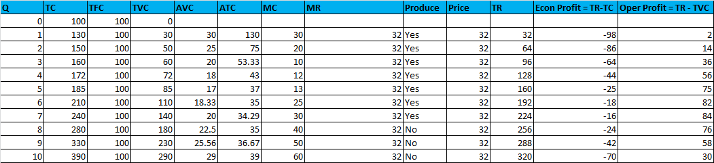
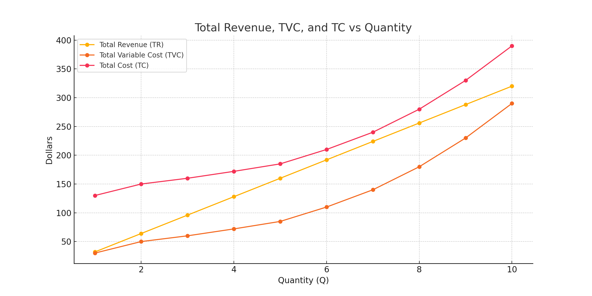
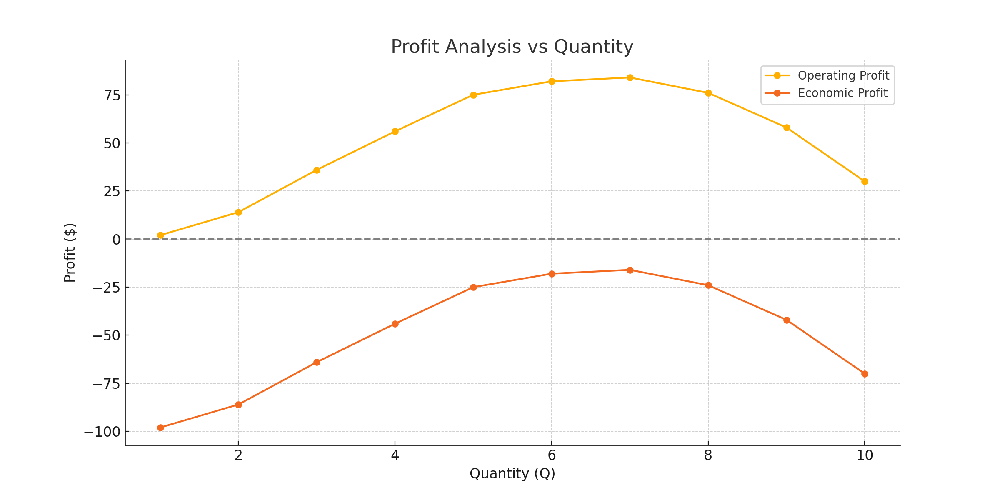

# Manageraial Economics

----

## Day-1 &rarr; 04-10-2025
- Opporunity cost - Cost of giving up something to achieve(gain) something else.
- We can have opportunity cost for both Fixed and Variable cost 
- Thinking on the margin - cannot fix the decisions of the past rather move forward to avoid/mitigate
- Elasticities
  - Cross-price elasticity
    - Substitutes
    - Complements
  - Income Elasticity
    - Normal Good
    - Inferoior Good
  - Supply Elasticity
  - Benchmark at 1
    -  `>1` &rarr; Elastic &rarr; A lot responsive
    -  `<1` &rarr; Inelastic &rarr; Less responsive
    - `=1` &Rarr; Unit Elastic &rarr; 
- Marginal Cost 
- Fixed Cost Vs Sunk Costs 
  - Fixed - No matter what you will still have to pay
  - Sunk - Fixed costs that can't be recovered
- Economies of scale / Increasing retunrs to scale(IRS) 
- Diseconomies of scale / Decreasing returns to scale (DRS)
-  Economies of scope - its about long run
- EOS - its beneficial to have firm-A to produce / manufacture product-a and produt-b => Tc1(Q1,0) + Tc2(o,Q2) > Tc(Q1,Q2)
- EOS - its purely about the supply side 
----

When price decreases and quantity increases, what happens to **total revenue** depends on whether the product is **elastic** or **inelastic**:

---

### 🔹 **Elastic Demand (Elasticity > 1)**
- **Definition**: Quantity demanded responds **strongly** to a change in price.
- **Price ↓ ⇒ Quantity ↑ (by a lot)**
- **Result**: Total Revenue **increases**

✅ This happens because the gain in quantity sold more than offsets the loss in price per unit.

---

### 🔹 **Inelastic Demand (Elasticity < 1)**
- **Definition**: Quantity demanded responds **weakly** to a change in price.
- **Price ↓ ⇒ Quantity ↑ (but not much)**
- **Result**: Total Revenue **decreases**

❌ This is because the drop in price per unit outweighs the small gain in quantity sold.

---

### Quick Summary:

| Demand Type | Price ↓ | Quantity ↑ | Total Revenue |
|-------------|---------|-------------|----------------|
| **Elastic**   | ↓       | ↑↑↑        | **Increases**     |
| **Inelastic** | ↓       | ↑ (a little) | **Decreases**     |

Want a visual example or a simple calculation to illustrate this?

----

## Day-2 &rarr; 04-11-2025

----

## Firm Analysis 

Let's walk through a **complete firm analysis** using the data you provided, and we’ll tie in the **key economic concepts**. This will help you understand not just the numbers, but also the **why behind the decisions** a firm makes in the short run and long run.

---

## 📊 **Firm’s Cost & Revenue Analysis (Based on Your Table)**

---

### 🧾 **Key Economic Concepts to Know:**

| Term | Meaning |
|------|--------|
| **Total Cost (TC)** | Sum of all costs (Fixed + Variable) |
| **Total Fixed Cost (TFC)** | Costs that don’t vary with output (e.g. rent) |
| **Total Variable Cost (TVC)** | Costs that change with output (e.g. labor, materials) |
| **Average Variable Cost (AVC)** | TVC ÷ Q |
| **Average Total Cost (ATC)** | TC ÷ Q |
| **Marginal Cost (MC)** | Additional cost of producing one more unit |
| **Marginal Revenue (MR)** | Additional revenue from selling one more unit |
| **Total Revenue (TR)** | Price × Quantity |
| **Economic Profit** | TR − TC (includes both explicit & implicit/opportunity costs) |
| **Operating Profit** | TR − TVC (used in short-run decisions) |

---- 

### Sample Data 

----

### 💡 **Short-Run Decision Rule:**

In the short run, **fixed costs are sunk**. So the firm’s decision is based on:

- ✅ **Produce if**: **TR ≥ TVC** → Firm covers variable costs and some fixed
- ❌ **Shut down if**: **TR < TVC** → Firm can’t even cover variable costs

> So the **shutdown point** is when **Price < AVC**

From your data:
- Price = $32
- Shutdown point is between **Q = 7** and **Q = 8**
  - At Q = 7: AVC = $20 → **Still profitable**
  - At Q = 8: AVC = $22.5 → **Still producing, but MC > MR**
  - Past Q = 8: Firm chooses **not to produce**

✅ **Short-run optimal output = Q = 7**

---

### 💼 **Long-Run Decision Rule:**

In the **long run**, **all costs are variable**, and the firm must cover **total costs (TC)** to stay in business.

- ✅ **Stay in market** if **TR ≥ TC** (i.e. Economic Profit ≥ 0)
- ❌ **Exit market** if **TR < TC** in the long run

From your data:
- Economic profit is **negative at all levels** (TR < TC across all Q)
- So in the **long run**, the firm would **exit the market**

---

### 🚪 **Entry & Exit Decisions:**

| Situation | Firm’s Action |
|-----------|----------------|
| **Short Run, TR > TVC** | ✅ **Produce**, even if profit is negative |
| **Short Run, TR < TVC** | ❌ **Shut down temporarily** |
| **Long Run, TR < TC** | ❌ **Exit the market permanently** |
| **Long Run, TR > TC** | ✅ **Enter (new firms)** or **stay (existing firms)** |

---

### 📈 **Example from Your Table:**

| Q | TR | TVC | TC | Oper Profit | Econ Profit |
|----|-----|------|------|--------------|---------------|
| 7 | 224 | 140 | 240 | **84** | **–16** |
| 8 | 256 | 180 | 280 | 76 | –24 |
| 9 | 288 | 230 | 330 | 58 | –42 |

- **Best short-run outcome** = Q = 7 → highest **operating profit**
- But since **economic profit is negative** even here, in the **long run the firm exits**

---

### 🧠 **Final Summary:**

- **Short run**: Firm produces up to **Q = 7** to **minimize loss**, since **TR > TVC**
- **Long run**: Firm **exits the industry** because **TR < TC** (i.e., negative economic profit)
- **Key Concepts**: AVC for shutdown decision, ATC for long-run decisions, MR=MC for optimal output

---

### Visualize using chart 

Here are the visualizations of your firm's performance:

---

### 📈 **Chart 1: Total Revenue vs Total Costs**

- **Yellow (TR)**: Total Revenue increases steadily as output increases.
- **Orange (TVC)** and **Red (TC)**: Total costs rise at an increasing rate due to rising marginal costs.
- Notice: **TR never exceeds TC**, meaning **economic profit is always negative**.

---

### 💰 **Chart 2: Profit Analysis**

- **Operating Profit (Yellow)** peaks at **Q = 7**, which is the **short-run optimal output**.
- **Economic Profit (Red)** is **always negative**, meaning the firm is not covering **total costs**.
- The gap between the two lines is the **fixed cost** (here: $100), explaining the persistent economic loss.

---

### 🧠 Summary:

- In the **short run**, the firm should produce **up to Q = 7** to **maximize operating profit**.
- In the **long run**, the firm should **exit**, as it never earns a **positive economic profit**.

----

## Monopoly

- Characteristics
- Myth busters - A monopolist can charge any price they want? 
  - True / False &rarr; False
    - Really mean: firm has market powe; ability to set prices
- Implies downward sloping
- MR = MC; 

### Example 

4 unit @ $5 each 

5 unit @ $4.9 each 

|Price| Quant| TR| MR|Comment|
|-----|------|---|---|----|
|5|4|20|-|-|
|4.9|5|24.50|4.5(24.50 - 2)|MC = cost to produce 1 additional unit|

Since, Price > Mariginal Revenue(MR), the firm still making profit.

---- 

## Industry Structure 

- Michael Porter model (Five Forces)
  - High barriers to entry
  - Low buyer power &rarr; Inelastic - Less price sensitive
  - Low supplier power &rarr; Inelastic - Less price sensitive
  - Low threat from substitutes
  - Low levels of rivalry between existing firms
  - (Cooperation from complementary products)
- High profits doesn't imply high levels of market share and vice versa 

----

## Pricing Decision 

  - Focus on marginal analysis 
  - Price discrimination

----

## Day-3 &rarr; 04-12-2025

----

## What do we know about Uncertainty - Nicholas Bloom - Youtube presenation
Nicholas Bloom, a professor of economics at Stanford University, has extensively researched economic uncertainty and its implications. His work, often in collaboration with Scott Baker and Steven Davis, has introduced innovative methods to measure and analyze uncertainty's impact on the economy.

**Key Insights from Bloom's Research on Economic Uncertainty:**

1. **Measuring Economic Policy Uncertainty (EPU):**
   - Bloom and his colleagues developed the Economic Policy Uncertainty Index, which quantifies uncertainty by analyzing the frequency of specific terms—such as "economic," "policy," and "uncertainty"—in major newspapers. This index has become a standard tool for assessing policy-related economic uncertainty. citeturn0search0

2. **Impact of Uncertainty on Economic Activity:**
   - Elevated uncertainty can lead to significant reductions in investment and employment. For instance, during periods of high uncertainty, firms may delay hiring and investment decisions, leading to slower economic growth. citeturn0search6

3. **Uncertainty During the COVID-19 Pandemic:**
   - The COVID-19 pandemic caused unprecedented levels of economic uncertainty. Bloom's research indicates that this surge in uncertainty amplified the economic downturn and hindered the recovery process. Factors contributing to this included health-related uncertainties and policy responses to the pandemic. citeturn0search9

4. **Global Perspective on Uncertainty:**
   - Bloom extended his analysis globally, developing the World Uncertainty Index, which measures uncertainty across various countries. This work highlights that uncertainty is a global phenomenon with widespread economic implications. citeturn0search7

5. **Policy Implications:**
   - Understanding and measuring uncertainty is crucial for policymakers. By recognizing the effects of uncertainty on economic behavior, policymakers can design strategies to mitigate its adverse impacts, such as providing clear guidance and reducing policy unpredictability.

For a comprehensive overview of Bloom's presentation on economic uncertainty, you can refer to his slides from the Swedish House of Finance Annual Conference 2023. citeturn0search0

----

## Pricing uncertainty
- Expected Value
- Two expected outcomes - High Type and Low type
- EV = P(H)*Value(H) + P(L)*Value(L)

----

Let's break down **pricing uncertainty** and the concept of **expected value** in a way that’s clear and intuitive, with a practical example.

---

## 📉 **What is Pricing Uncertainty?**

**Pricing uncertainty** occurs when a business isn’t sure what price it can charge — or will have to pay — for a product or service in the future.

This could be due to:
- Market volatility
- Demand fluctuations
- Competitor pricing
- Currency or input cost changes
- Regulatory decisions (like tariffs)

It introduces **risk into decision-making**, particularly when forecasting revenue, costs, or profits.

---

## 🎯 **What is Expected Value? (EV)**

In economics and probability, the **expected value** is a way to **average out all possible outcomes**, weighted by their **probabilities**.

It helps firms make decisions under uncertainty by answering the question:

> *"On average, what result should we expect if this situation were repeated many times?"*

---

### 🧮 **Expected Value Formula:**

$$
\text{Expected Value (EV)} = \sum ( \text{Outcome} \times \text{Probability of that outcome} )
$$

---

## 📦 **Example: Pricing Uncertainty in Selling a Product**

Let’s say you’re launching a new fitness tracker. You're unsure how the market will respond, so you're considering three pricing outcomes:

| Scenario | Price You Can Charge | Probability |
|----------|----------------------|-------------|
| High demand | $120 | 0.3 (30%) |
| Medium demand | $100 | 0.5 (50%) |
| Low demand | $80 | 0.2 (20%) |

Let’s calculate the **expected price** you could charge:
$$
EV = (120 \times 0.3) + (100 \times 0.5) + (80 \times 0.2)
$$

$$
EV = 36 + 50 + 16 = \boxed{102}
$$

### ✅ So, your **expected price** is **$102**.

Even though you might hope to charge $120, on average — considering market uncertainty — $102 is your best estimate.

---

## 💡 Why It Matters:

- **Business Planning**: Helps you plan revenue and budgeting more realistically.
- **Risk Management**: EV tells you what to expect — but doesn’t tell you about **volatility**. Two options can have the same EV but very different risk profiles.
- **Decision Making**: You can compare the expected value of **different strategies** to choose the one with the best return.

---

## 🧠 Bonus: What If Costs Are Involved?

Suppose your **cost per unit is $90**. Now compare:

- **Expected Profit per unit** = $102 (EV) – $90 = **$12**
- You can now decide if the expected return justifies the investment.

----

## Information Economics

Great question — these are core concepts in **information economics** that help explain why **pricing uncertainty** arises and how it affects market outcomes. Let’s break down:

- **Asymmetric Information**
- **Adverse Selection**
- **Moral Hazard**

and their role in **pricing uncertainty**, with examples in plain, practical terms.

---

## 📘 1. **Asymmetric Information**  
> One party in a transaction has **more or better information** than the other.

In the context of pricing:
- The **seller** might know more about the quality of the product than the **buyer**.
- Or the **buyer** might know more about their own intentions or risk than the seller.

### 🎯 Example:
A company launches a subscription-based fitness app.  
- **Consumers** don’t know if the app will actually help them or if it’s just a flashy front.
- As a result, **some customers won’t be willing to pay a premium price**, increasing uncertainty for the firm on how to price it.

---

## ⚠️ 2. **Adverse Selection**  
> When **asymmetric information exists before a transaction**, and **the wrong people** self-select into the market.

### 💡 Example in Pricing:
An insurance company offers one flat price for health coverage.  
- People who are **sick or high-risk** are more likely to buy the insurance.
- **Healthy people opt out**, thinking it’s overpriced for their needs.
- This **drives up average costs** for the insurer, making pricing highly uncertain and forcing premiums up further.

### 🛍️ Product Market Example:
Imagine you’re selling **refurbished iPhones**. You know which ones are in good shape — but customers don’t.  
- Buyers assume the worst and are only willing to pay a **lower price**.
- So sellers with **higher-quality phones exit** the market.
- Only lower-quality phones remain — this is known as the **“market for lemons”**, a classic adverse selection outcome.

---

## 🎭 3. **Moral Hazard**  
> When one party takes **more risks after the transaction**, because the **costs are borne by someone else**.

### 💡 In Pricing and Business:
Say you sell a SaaS product with **tiered pricing** based on usage.  
- After subscribing, some users **abuse the service** or **overuse resources**, knowing they’re on a fixed-price plan.
- This **raises costs unpredictably** for the seller — adding to pricing uncertainty.

### 🎓 Financial Example:
A bank lends money to a startup.  
- After getting funded, the founders **pursue a riskier strategy** than originally disclosed.
- The **lender bears the downside**, and may have underpriced the risk.

---

## 🧠 **How These Affect Pricing Uncertainty:**

| Concept              | Impact on Pricing                                    |
|----------------------|------------------------------------------------------|
| **Asymmetric Info**  | Firms can’t tell how much customers are really willing to pay or what value they see. |
| **Adverse Selection**| Wrong segment of customers buys the product → distorted demand → incorrect pricing. |
| **Moral Hazard**     | After purchase, customer behavior changes → future cost to serve becomes unpredictable. |

---

## 🧾 **Why This Matters in Economics:**
- These concepts **explain why markets don’t always reach efficient outcomes**.
- They **justify the need for warranties, insurance risk pooling, credit checks**, and even **dynamic pricing models**.
- Firms deal with these risks through **screening, signaling, product differentiation, and contracts**.

---- 

Absolutely! Let's dive into **screening** and **signaling** — two powerful tools in **information economics** used to manage **pricing uncertainty** when there is **asymmetric information** between buyers and sellers.

---

## 🎯 First, a Quick Recap on Asymmetric Information:

- One party knows **more than the other**.
- This imbalance makes **pricing tricky and uncertain**.
- The two parties must **find ways to reduce uncertainty** so transactions can happen efficiently.

That’s where **screening** and **signaling** come in.

---

## 🧪 **1. Screening**  
> **Definition:** Screening is when the **less-informed party** (usually the buyer) takes steps to uncover the information they don’t know.

### 💡 Example in Pricing:

Let’s say you're buying a **used iPhone** online.
- You're not sure if it’s in good condition.
- To reduce your risk, you **ask for a diagnostic report**, or **only buy from sellers with high ratings**.
- This is **you screening the market** to identify higher-quality sellers.

### 🏢 Business Example:
An insurance company doesn’t know how healthy you are, but wants to avoid adverse selection.
- So they **screen applicants** with medical tests, age brackets, or lifestyle questions.
- Based on your responses, they **adjust pricing accordingly**.

### 📌 Why it reduces pricing uncertainty:
Screening helps firms **charge closer to the customer’s true risk or value**, rather than applying a broad one-size-fits-all price.

---

## 📣 **2. Signaling**  
> **Definition:** Signaling is when the **more-informed party** (usually the seller or producer) voluntarily reveals credible information to reduce buyer uncertainty.

### 💡 Example in Pricing:

Apple wants to convince buyers that its iPhones are **worth $1,000+**.  
- So it **signals quality** through:
  - Premium design
  - Long software support
  - High production value launches
  - Strong resale value

These signals **justify a high price**, even when customers can’t verify everything up front.

### 🧑‍🎓 Classic Economic Example:
A job applicant knows their skill level, but employers don’t.  
- To signal competence, they earn a **college degree** or industry certification.
- This helps justify a **higher salary** and reduces the employer’s risk of hiring someone unqualified.

### 🛠️ Signaling Tools in Markets:
- Warranties (signal quality confidence)
- Free trials or freemium models (signal user value)
- Brand reputation and logos
- Transparent pricing breakdowns or third-party ratings

---

## 🧠 **How Screening & Signaling Reduce Pricing Uncertainty:**

| Tool       | Who Uses It?         | What It Solves                  | How It Helps Pricing              |
|------------|----------------------|----------------------------------|-----------------------------------|
| **Screening** | Buyer or less-informed side | Identifies true quality or risk | Enables price differentiation based on revealed info |
| **Signaling** | Seller or informed side     | Builds trust and credibility    | Justifies premium pricing or builds demand |

---

## 🧾 **Application to Real-World Pricing:**

| Scenario | Screening | Signaling |
|----------|-----------|-----------|
| Online shopping | Checking seller reviews | Verified buyer badge, high-res images |
| Insurance | Health tests, questionnaires | Offering coverage tiers with clear terms |
| SaaS pricing | Usage-based pricing filters low-usage customers | Free trials, testimonials, case studies |
| Education/Jobs | Aptitude tests | Degrees, certifications, portfolios |

---

### 🔑 **Key Takeaway:**
In markets where trust and information are uneven, screening and signaling are **essential tools** for reducing uncertainty — and getting pricing **right**.

---

