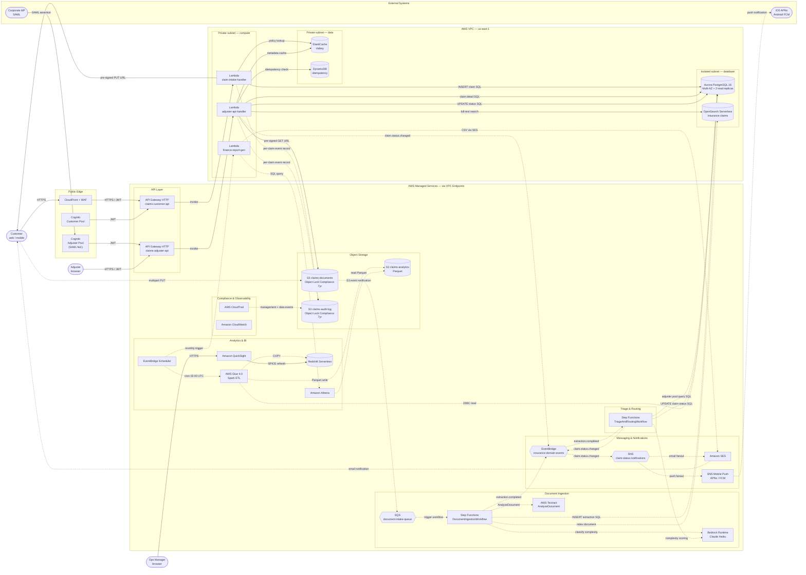

# Insurance Claim Intake & Adjuster Workspace — Container Architecture

C4 Container-level view of all deployable units, trust boundaries, and primary data flows.
Solid edges = sync; dashed edges = async / batch.

## Diagram

## Notes

- **Scope**: All AWS-deployed containers and AWS managed services. Primary data flows between trust boundaries. C4 Container level — each box is a separately deployable or managed service unit.
- **Deliberate omissions**: DLQ (document-intake-dlq), VPC NAT Gateways (no compute there), KMS / Secrets Manager cross-cutting connections (implied by security design), individual Lambda task functions inside Step Functions (consolidated into workflow boxes), Aurora read-replica distinction (implied by label).
- **Assumptions**: All Lambda functions execute in VPC private subnets and reach AWS managed services via VPC Interface Endpoints; OpenSearch Serverless is provisioned with VPC-based access policy; Step Functions Standard is the durable workflow engine for both orchestrations.
- **DrawIO file**: Open `insurance_claim_intake.drawio` in [app.diagrams.net](https://app.diagrams.net) for the AWS-icon version with zone containers.
